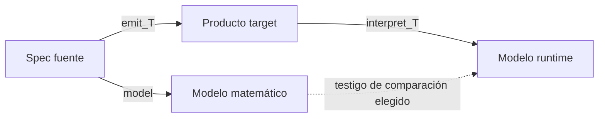
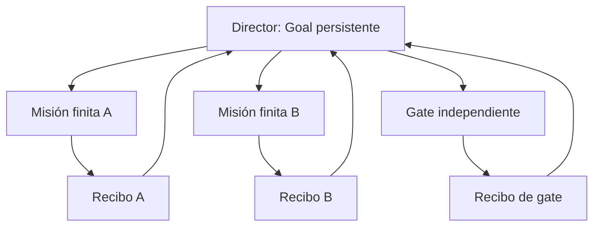

# Nota editorial KORA

## Autoría

**Autor de la adaptación** — Félix Sanhueza Luna. Autoría confirmada mediante
declaración directa del propio autor el 2026-08-03.

## Corrección de lectura

La monografía fuente se conserva byte-idéntica desde su título. KORA añade
esta corrección porque el registro primario de arXiv 2410.08373 marca
*Dynamic task delegation for hierarchical agents* como retirado por Sophie
Libkind y declara el defecto técnico: su definición 3.7 presupone una
categoría de Kleisli monoidal respecto de `∨`, cuando la construcción es solo
premonoidal.

Consecuencias de lectura:

- la afirmación del §11.5 sobre operads enriquecidos para delegación dinámica,
  y la referencia correspondiente en D.3, quedan en clase `X`; no sostienen un
  resultado formal ni una arquitectura runtime;
- *Pattern Runs on Matter* sí sostiene, dentro de `Poly`, la mónada libre, la
  comónada cofree y su acción de módulo, pero no repara el resultado retirado;
- para ingeniería de delegación siguen siendo válidos como contratos de
  modelado las interfaces, session types, misiones finitas, wiring, autoridad
  y receipts, cada uno con sus testigos propios.

# Teoría de categorías para la programación agéntica autónoma

## Composición, efectos, observación y gobierno de sistemas que actúan

**Edición candidata fundacional 0.2.0 — 2026**

Inspirada por *Category Theory for Programmers*, de Bartosz Milewski. Texto,
arquitectura y formalización agéntica originales. Distribuida bajo
[Creative Commons Attribution-ShareAlike 4.0](https://creativecommons.org/licenses/by-sa/4.0/).

---

## Prefacio: programar lo que seguirá actuando

Un programa ordinario recibe una entrada, calcula y devuelve. Un agente
autónomo percibe, conserva contexto, elige, usa herramientas, observa
resultados, revisa su curso y decide cuándo terminar o pedir ayuda. No por eso
deja de ser programa. Al contrario: exige una noción de programación más
precisa.

La industria suele empezar por el prompt. Luego agrega memoria, tools,
subagentes, retries, evals, permisos y un Goal persistente. Cada adición parece
local; la conducta resultante no lo es. Los efectos se mezclan, la autoridad
se amplifica, los protocolos se vuelven implícitos y el éxito de una prueba se
confunde con seguridad general.

Este libro sostiene tres tesis de ingeniería:

1. **La unidad agéntica es la transición tipada con efectos, no el prompt.**
2. **La unidad multiagente es el cableado interpretado entre interfaces, no la
   lista de agentes.**
3. **La unidad de confianza es el testigo que conecta especificación, modelo y
   runtime, no la declaración.**

Son tesis de diseño (`H`), no teoremas categoriales. La matemática comienza
cuando definimos categorías, objetos, morfismos y leyes. La ingeniería comienza
cuando preguntamos si esas definiciones describen el sistema que corre.

La teoría de categorías estudia composición y preservación. Por eso sirve:
no porque contenga una teoría mágica de la inteligencia, sino porque fuerza a
decir qué puede conectarse, bajo qué tipos, con qué efectos y qué propiedades
sobreviven a la conexión.

### El pacto de honestidad

Usaremos cinco **clases de afirmación**:

- `F`: afirmación formal sobre una estructura matemática, con prueba local o
  fuente primaria precisa;
- `E`: afirmación empírica reproducible, acotada al artefacto, ejecución y
  entorno observados;
- `M`: afirmación de modelado que relaciona un sistema con una estructura bajo
  hipótesis explícitas;
- `H`: heurística de ingeniería, útil sin garantía teoremática;
- `X`: analogía, conjetura o programa de investigación.

Estas clases no son peldaños ni niveles de fuerza. Una prueba sobre un modelo,
una observación runtime y la adecuación a un dominio pertenecen a dimensiones
distintas. Cuando una oración mezcle más de una clase, la separaremos en
claims enlazados con testigos propios.

Una fórmula elegante no aumenta por sí sola la evidencia. Un test verde no se
convierte en teorema. Un archivo idéntico no implica conducta idéntica. Y una
allowlist no demuestra safety si el runtime no la hace efectiva.

### Cómo leer

Cada capítulo recorre una doble hélice:

1. **núcleo formal:** definición, ley, construcción o contraejemplo;
2. **realización agéntica:** qué dato habría que construir para aplicar ese
   núcleo a un agente real.

Quien busque orientación práctica puede leer la tesis y la sección
«Intervención». Quien quiera auditar el formalismo debe seguir las
«Obligaciones de prueba».

### Alcance exacto

«Teoría de categorías para la programación agéntica» nombra la aplicación de
una teoría matemática existente a un nuevo campo de ingeniería. No afirma
haber completado una teoría matemática ni empírica de todos los agentes.

Los resultados `F` valen para las estructuras construidas. Ninguno se
transfiere a un runtime agéntico sin una interpretación y un testigo de
adecuación. La contribución propia es un núcleo formal reutilizable, una
gramática de obligaciones y un método para construir instancias verificables.

### Mapa de la obra

| Tramo | Pregunta rectora | Capítulos |
|---|---|---|
| Parte I | ¿Qué significa componer y preservar? | 1–4 |
| Parte II | ¿Qué estructura mínima modela a un agente? | 5–9 |
| Parte III | ¿Cómo se conectan y coordinan agentes sin perder tipos, autoridad, control temporal ni evidencia? | 10–14 |
| Parte IV | ¿Cómo gobernar, certificar y aplicar la teoría? | 15–20 |
| Apéndices | ¿Cómo auditar símbolos, términos, ejercicios y fuentes? | A–D |

---

# Parte I — La gramática de la composición

## 1. Categorías: cuándo una cadena se vuelve estructura

### 1.1 Definición

`F` Una categoría \(\mathcal C\) consta de:

1. una colección de objetos \(\mathrm{Ob}(\mathcal C)\);
2. para cada par \(A,B\), una colección de morfismos
   \(\mathcal C(A,B)\);
3. para cada \(A\), una identidad
   \(\mathrm{id}_A:A\to A\);
4. para \(f:A\to B\) y \(g:B\to C\), una composición
   \(g\circ f:A\to C\);

sujeta a:

\[
h\circ(g\circ f)=(h\circ g)\circ f,
\qquad
f\circ\mathrm{id}_A=f=\mathrm{id}_B\circ f.
\]

Estas leyes no son decoración. Permiten sustituir un tramo compuesto por otro
igual sin revisar el resto del sistema.

### 1.2 Un grafo todavía no es una categoría

Un workflow dibujado como

\[
\textsf{solicitud}\to\textsf{plan}\to\textsf{ejecución}\to\textsf{recibo}
\]

es un grafo dirigido. Para obtener una categoría podemos construir su
**categoría libre**:

- los nodos son objetos;
- los caminos finitos son morfismos;
- el camino vacío es identidad;
- concatenar caminos es composición.

`F` La concatenación de caminos es asociativa y el camino vacío es unidad.
Por ello la construcción forma una categoría.

Podemos después imponer ecuaciones entre caminos. Por ejemplo, si una ruta
directa de validación debe equivaler a validar y normalizar:

\[
\textsf{validarDirecto}
=
\textsf{normalizar}\circ\textsf{validar}.
\]

El cociente por las ecuaciones congruentes produce una categoría presentada
por generadores y relaciones.

### 1.3 Misiones como flechas verificadas

`M` Consideremos snapshots verificables de un programa como nodos:

\[
S=(\text{fuente},\text{configuración},\text{estado},\text{claims}).
\]

Un recibo de ejecución puede generar una flecha \(r:S_i\to S_j\) si contiene:

- precondición exacta;
- acción autorizada;
- postcondición;
- evidencia que vincula ambas;
- identidad del ejecutor y del entorno pertinente.

Las secuencias de recibos forman caminos. Dos misiones se componen solo cuando
el snapshot final de la primera coincide con el inicial de la segunda bajo el
criterio de identidad declarado.

Esto no demuestra que el mundo real sea una categoría de snapshots. Es un
modelo útil cuando la identidad y la composición pueden verificarse.
El §6.4 construye la semántica finita derivada de \(\mathsf{step}\); el
§16.4 formula las obligaciones adicionales para relacionarla con ejecuciones
y caminos de recibos efectivos.

### 1.4 La identidad no significa «un turno inútil»

Si una lectura no modifica ningún observable del modelo, podemos **elegir**
representarla por una identidad. Pero una lectura que consume presupuesto,
renueva un lease, escribe un log o cambia conocimiento no es identidad en una
categoría que observe esos efectos.

`H` En orquestación, muchas ceremonias parecen identidades porque no
producen avance de producto. Antes de eliminarlas debemos decidir qué efectos
contables importan. La teoría no dice que sean gratuitas; obliga a tipar el
costo que antes era invisible.

### 1.5 Composición no es conmutatividad

Asociatividad permite reagrupar:

\[
h\circ(g\circ f)=(h\circ g)\circ f.
\]

No permite permutar:

\[
g\circ f \neq f\circ g
\]

en general, y muchas veces uno de los lados ni siquiera está tipado.

Dos agentes que escriben archivos disjuntos pueden ejecutarse en paralelo
solo si sus dependencias, efectos y recursos admiten una semántica de
paralelismo. «No veo conflicto» es evidencia preliminar, no una ley.

### Intervención

Antes de encadenar tareas, escriba:

```text
objeto inicial:
morfismo autorizado:
objeto final:
criterio de identidad:
efectos observados:
```

Si no puede completar esa ficha, posee un workflow, no todavía una
composición categorial.

### Obligaciones de prueba

- identificar objetos y morfismos;
- demostrar identidad y asociatividad;
- declarar qué efectos quedan fuera del modelo;
- distinguir caminos del workflow de ejecuciones exitosas.

**Trazabilidad:** `urn:fxsl:kb:icas-composicion`,
`urn:kora:kb:cat-foundations`.

---

## 2. Tipos e interfaces: la frontera que hace posible conectar

### 2.1 Los tipos no son etiquetas

En \(\mathbf{Set}\), los objetos son conjuntos y los morfismos son funciones
totales. Una firma \(f:A\to B\) dice que cada entrada admisible de \(A\)
produce un valor de \(B\).

Para agentes, «texto entra, texto sale» suele ser un tipo demasiado débil.
No distingue:

- mensaje de usuario de resultado de tool;
- respuesta final de solicitud de aprobación;
- éxito de error;
- acción reversible de operación destructiva;
- dato público de secreto.

Un tipo útil excluye composiciones inválidas antes de ejecutarlas.

### 2.2 Producto: tener ambos

`F` Un producto de \(A\) y \(B\) es un objeto \(A\times B\) con
proyecciones \(\pi_1,\pi_2\) tal que, para todo \(X\) con
\(f:X\to A\) y \(g:X\to B\), existe un único
\(\langle f,g\rangle:X\to A\times B\) que hace conmutar:

\[
\pi_1\circ\langle f,g\rangle=f,
\qquad
\pi_2\circ\langle f,g\rangle=g.
\]

Un estado agéntico puede modelarse como:

\[
U=U_{\mathrm{task}}\times U_{\mathrm{memory}}
\times U_{\mathrm{authority}}\times U_{\mathrm{budget}}.
\]

`M` El producto permite almacenar y proyectar componentes. No demuestra
que sean independientes. La transición puede leerlos todos.

### 2.3 Coproducto: tener una alternativa etiquetada

`F` Un coproducto \(A+B\) tiene inyecciones
\(\iota_A:A\to A+B\), \(\iota_B:B\to A+B\) y satisface la propiedad
universal dual.

Una salida agéntica puede tiparse:

```text
Output =
    Final(Answer)
  | ToolCall(ToolRequest)
  | Delegate(Mission)
  | Escalate(Reason)
  | Fail(Error)
```

La etiqueta importa. Un JSON sin discriminante puede admitir estados
ambiguos; un coproducto no.

### 2.4 Exponenciales y currificación

En una categoría cartesiana cerrada existe un objeto exponencial \(B^A\) con:

\[
\mathcal C(X\times A,B)\cong\mathcal C(X,B^A)
\]

natural en \(X\) y \(B\), para \(A\) fijo. Al variar \(A\), la
functorialidad contravariante del exponente aporta la coherencia
correspondiente.

En \(\mathbf{Set}\), \(B^A\) es el conjunto de funciones \(A\to B\). Por
currificación:

\[
(U\times I\to R)\cong(U\to R^I).
\]

Esta equivalencia será la bisagra del modelo coalgebraico del agente.

### 2.5 Interfaces agénticas mínimas

Una interfaz operacional necesita al menos:

\[
\mathsf{Interface}=(I,O,\mathsf{Protocol},\mathsf{Errors}).
\]

- \(I\): entradas admitidas;
- \(O\): salidas observables;
- `Protocol`: secuencias válidas;
- `Errors`: fallos distinguidos.

`M` Dos agentes con entrada y salida «String» no tienen necesariamente la
misma interfaz. Los schemas, el protocolo, la autoridad y los errores son
parte de lo observable.

### 2.6 Los tipos no prueban semántica

Un campo llamado `safe: true` no hace seguro un valor. Un tipo de respuesta
`Approved` no prueba que la aprobación sea humana. El type checker garantiza
las reglas del cálculo elegido; la adecuación entre nombre y mundo es una
obligación diferente.

### Intervención

Reemplace:

```text
agentA -> agentB
```

por:

```text
agentA : I -> O_A
adapter : O_A -> I_B
agentB : I_B -> O_B
errors : E_A + E_adapter + E_B
protocol : secuencia válida
```

### Obligaciones de prueba

- demostrar la propiedad universal si se usa «producto» o «coproducto»;
- no inferir independencia de una descomposición por producto;
- tipar errores, escalamiento y aprobación;
- separar validez sintáctica de verdad semántica.

**Trazabilidad:** `urn:fxsl:kb:icas-universales`,
`urn:fxsl:kb:icas-composicion-estructura`.

---

## 3. Efectos y Kleisli: hacer visible lo que una acción puede causar

### 3.1 La firma que miente

Una función declarada como \(f:A\to B\) puede:

- fallar;
- no terminar;
- leer o escribir estado;
- producir logs;
- invocar red o filesystem;
- elegir estocásticamente;
- requerir aprobación.

Si esos efectos importan para la composición, deben entrar en el modelo.

### 3.2 Mónada

`F` Una mónada sobre una categoría \(\mathcal C\) es
\((M,\eta,\mu)\), donde:

- \(M:\mathcal C\to\mathcal C\) es un endofuntor;
- \(\eta:\mathrm{Id}\Rightarrow M\) es la unidad;
- \(\mu:M^2\Rightarrow M\) es la multiplicación;

y se cumplen:

\[
\mu\circ M\mu=\mu\circ\mu_M,
\qquad
\mu\circ M\eta=\mathrm{id}_M=
\mu\circ\eta_M.
\]

No todo wrapper, pipeline o API con `.then` es una mónada. Las leyes son parte
de la estructura.

### 3.3 Categoría de Kleisli

`F` Para una mónada \(M\), la categoría \(\mathbf{Kl}(M)\) tiene:

- los mismos objetos que \(\mathcal C\);
- flechas \(A\rightsquigarrow B\) dadas por flechas \(A\to M B\) en
  \(\mathcal C\);
- identidad \(\eta_A:A\to MA\);
- composición:

\[
g\star f
=
\mu_C\circ M g\circ f
:
A\to MC.
\]

Las leyes de mónada implican las leyes de categoría para \(\star\).

### 3.4 Ejemplos de efectos

En \(\mathbf{Set}\):

| Efecto | \(M(A)\) | Lectura |
|---|---|---|
| Excepción | \(A+E\) | éxito o error tipado |
| No determinismo | \(\mathcal P(A)\) | conjunto de resultados posibles |
| Logging | \(A\times W\) | resultado y log, con \(W\) monoide |
| Estado | \(K\to(A\times K)\) | resultado dependiente de estado |
| Entorno | \(R\to A\) | lectura de configuración |
| Probabilidad | \(\mathcal D(A)\) | distribución sobre resultados, bajo una construcción precisa |

Una llamada LLM puede involucrar probabilidad, excepción, IO, costo y
cancelación. No existe una mónada combinada por mera yuxtaposición.

### 3.5 Ejemplo ejecutable en pseudocódigo tipado

```typescript
type Result<E, A> =
  | { tag: "ok"; value: A }
  | { tag: "error"; error: E };

const pure = <E, A>(value: A): Result<E, A> =>
  ({ tag: "ok", value });

const bind = <E, A, B>(
  ma: Result<E, A>,
  f: (a: A) => Result<E, B>,
): Result<E, B> =>
  ma.tag === "ok" ? f(ma.value) : ma;

const composeK = <E, A, B, C>(
  f: (a: A) => Result<E, B>,
  g: (b: B) => Result<E, C>,
) => (a: A): Result<E, C> => bind(f(a), g);
```

Las leyes se demuestran por casos sobre `ok/error`. El código solo modela
excepciones tipadas. No modela timeout, cancelación ni efectos de la operación
que produjo el `Result`.

### 3.6 Tools como flechas effectful

Una tool puede tiparse:

\[
\mathsf{call}_t:\mathsf{Args}_t\to M(\mathsf{Result}_t).
\]

La composición con el siguiente paso debe ocurrir en
\(\mathbf{Kl}(M)\), no fingiendo que el resultado es puro.

Si una tool usa \(M\) y otra \(N\), componerlas puede requerir:

- una mónada transformadora con semántica fijada;
- una ley distributiva
  \(\lambda:MN\Rightarrow NM\), escribiendo \(MN=M\circ N\), compatible con
  las unidades y multiplicaciones; con esta orientación, la compuesta que
  hereda estructura de mónada es \(NM\), no \(MN\);
- un efecto algebraico común;
- o una secuenciación operacional más débil.

`F` Dos mónadas no componen automáticamente.
La dirección de \(\lambda\) es parte del dato: para intentar construir \(MN\)
se necesita la orientación contraria y sus cuatro leyes de compatibilidad.

### 3.7 Orden de efectos

\[
\mathsf{StateT}\ K\ (\mathsf{Either}\ E)\ A
\]

no expresa necesariamente la misma política que:

\[
\mathsf{ExceptT}\ E\ (\mathsf{State}\ K)\ A.
\]

En una semántica, el error puede descartar el nuevo estado; en otra, conservarlo.
Para un agente, esta diferencia decide si una tool fallida consume presupuesto,
deja un lease o persiste memoria.

### Intervención

Construya una tabla por acción:

| Acción | Resultado | Error | Estado | Autoridad | Costo | Cancelación |
|---|---|---|---|---|---|---|
| llamar modelo | respuesta | provider error | contexto | red | tokens | timeout |
| escribir archivo | hash | IO error | worktree | filesystem | tiempo | parcial |
| delegar | recibo | child failure | tareas | spawn | presupuesto | interrupt |

Después elija una semántica de composición. No antes.

### Obligaciones de prueba

- exhibir \(M,\eta,\mu\) y leyes;
- distinguir composición ordinaria de Kleisli;
- justificar la combinación y el orden de efectos;
- no llamar monádica a una API solo por su forma superficial.

**Trazabilidad:** `urn:fxsl:kb:icas-efectos`.

---

## 4. Funtores y naturalidad: qué sobrevive al traducir

### 4.1 Funtor

`F` Un funtor \(F:\mathcal C\to\mathcal D\) asigna objetos y morfismos
y preserva:

\[
F(\mathrm{id}_A)=\mathrm{id}_{F A},
\qquad
F(g\circ f)=F g\circ F f.
\]

Un compilador, serializador, emisor de agentes o migrador es solo un
**candidato** a funtor. Primero hay que construir categorías fuente y destino
y definir su acción sobre morfismos.

### 4.2 Fiel, pleno y esencialmente sobreyectivo

Un funtor es:

- **fiel** si cada función
  \(\mathcal C(A,B)\to\mathcal D(FA,FB)\) es inyectiva;
- **pleno** si es sobreyectiva;
- **esencialmente sobreyectivo** si todo objeto destino es isomorfo a una
  imagen.

`F` Pleno + fiel + esencialmente sobreyectivo caracteriza una equivalencia
de categorías bajo la convención fundacional usual con elección. Sin una
elección de representantes e isomorfismos, la construcción de un
cuasi-inverso requiere explicitar datos adicionales.

«Fiel» no significa «no pierde ningún dato». Es una propiedad de hom-sets de
un funtor ya definido.

### 4.3 Transformación natural

`F` Para \(F,G:\mathcal C\to\mathcal D\), una transformación natural
\(\alpha:F\Rightarrow G\) es una familia
\(\alpha_A:FA\to GA\) tal que, para toda \(f:A\to B\):

\[
\alpha_B\circ Ff=Gf\circ\alpha_A.
\]

La naturalidad expresa uniformidad: traducir y adaptar da lo mismo que adaptar
y traducir.

Un conjunto de handlers no es transformación natural si no existen los dos
funtores paralelos y los cuadrados no están probados.

### 4.4 Tres capas que no deben colapsarse

Para un artefacto agéntico \(a\) y target \(T\):

\[
\begin{aligned}
\mathsf{Spec}(a) & &&\text{declaración fuente},\\
\mathsf{Model}(a) & &&\text{modelo matemático explícito},\\
\mathsf{Runtime}_T(a,r) & &&\text{conducta efectiva en contexto }r.
\end{aligned}
\]

Podemos tener:

\[
\mathsf{emit}_T:
\mathsf{Spec}\to\mathsf{Product}_T
\]

y comprobar que ciertos bytes se preservan. Para una afirmación conductual
falta:

\[
\mathsf{interpret}_T:
\mathsf{Product}_T\to\mathsf{RuntimeModel}_T
\]

y un criterio que compare `Model` con `RuntimeModel`.



Paridad material prueba una propiedad de `emit_T`. No completa la flecha
punteada. Esa arista no denota simultáneamente un morfismo, una bisimulación y
un refinamiento: debe reemplazarse por **una** relación o flecha bien tipada,
con sus hipótesis y leyes.

### 4.5 Preservar composición no es preservar intención

Un emisor puede ser perfectamente funtorial y traducir de manera equivocada
la noción humana de «aprobación». La functorialidad preserva la estructura que
se formalizó, no la que se omitió.

`H` La pregunta de ingeniería correcta no es «¿el funtor es bueno?», sino:

1. ¿qué categorías construimos?
2. ¿qué leyes preserva?
3. ¿qué información o semántica queda fuera?
4. ¿esa omisión es aceptable?

### Intervención

Para cada traducción source→target, complete:

```text
categoría fuente:
categoría destino:
acción sobre objetos:
acción sobre morfismos:
prueba de identidad:
prueba de composición:
propiedades adicionales:
pérdidas declaradas:
testigo runtime:
```

### Obligaciones de prueba

- no llamar funtor a un mapping sin leyes;
- no inferir equivalencia de paridad material;
- probar cada cuadrado de naturalidad;
- declarar qué semántica no observa la categoría.

**Trazabilidad:** `urn:fxsl:kb:icas-preservacion`,
`urn:fxsl:kb:icas-comparacion`,
`urn:kora:kb:cat-contrato-ingenieria-agentica`.

---

# Parte II — Anatomía categorial de un agente

## 5. Planes como sintaxis: mónadas libres e intérpretes

### 5.1 Separar programa de ejecución

Un plan no es todavía una ejecución. Es una descripción de acciones posibles
que puede inspeccionarse, transformarse o interpretar de modos distintos.

Fijemos una signatura de comandos \(\Sigma\). En programación funcional suele
representarse mediante un endofuntor. Por ejemplo:

```text
Command(X) =
    ReadFile(Path, Bytes -> X)
  + WriteFile(Path, Bytes, Unit -> X)
  + AskModel(Prompt, Answer -> X)
  + RequestApproval(Decision -> X)
```

Cada constructor contiene la continuación que recibe el resultado y determina
el siguiente paso. Este tipo es polinomial en \(X\) bajo las hipótesis
habituales de conjuntos de operaciones y aridades.

### 5.2 Mónada libre

`F` Si existe, la mónada libre \(F_\Sigma\) sobre \(\Sigma\) contiene
programas finitos construidos con esos comandos y retornos puros:

\[
F_\Sigma X \cong X+\Sigma(F_\Sigma X).
\]

Intuitivamente:

- `Pure x` termina con \(x\);
- `Op command` ejecuta una operación y continúa.

La unidad inserta una hoja:

\[
\eta_X:X\to F_\Sigma X.
\]

La multiplicación:

\[
\mu_X:F_\Sigma(F_\Sigma X)\to F_\Sigma X
\]

sustituye cada hoja-programa por el programa que contiene. Las leyes de mónada
son las leyes coherentes de sustitución.

«Árbol de tareas» no implica mónada libre. Hace falta identificar
\(\Sigma\), construir \(F_\Sigma\) y exhibir la propiedad universal.

### 5.3 Propiedad universal e interpretación

`F` Para toda mónada \(M\), una interpretación compatible de los comandos
en \(M\) se extiende de manera única a un morfismo de mónadas:

\[
\llbracket-\rrbracket:F_\Sigma\Rightarrow M,
\]

bajo la formulación estándar de la propiedad universal.

Esto separa:

- **sintaxis:** qué programas pueden expresarse;
- **semántica:** qué significa cada comando;
- **runtime:** qué ocurrió en una ejecución concreta.

El mismo plan puede interpretarse:

- en producción, ejecutando tools;
- en dry-run, acumulando una simulación;
- en auditoría, extrayendo capacidades;
- en tests, usando un runtime sintético.

### 5.4 Capabilities como sub-signatura

Sea \(\Sigma_{\mathrm{allow}}\) la signatura de operaciones permitidas y
\(j:\Sigma_{\mathrm{allow}}\Rightarrow\Sigma\) una inclusión natural.

`M` Si el planificador produce:

\[
p:X\to F_{\Sigma_{\mathrm{allow}}}Y,
\]

la sintaxis no puede nombrar comandos fuera de esa sub-signatura. Esto es una
garantía de **expresabilidad**, no todavía de autoridad runtime.

El intérprete puede estar defectuoso; una operación permitida como `Shell`
puede tener alcance ambiental enorme; y el runtime puede exponer canales que
la signatura no modela.

### 5.5 Planificar con efectos

Un planificador real puede usar muestreo, memoria o IO. Para un estado \(U\),
entrada \(I\), salida \(O\) y mónada de ejecución \(M\), un tipo posible es:

\[
p:U\times I\to M\bigl(F_\Sigma(O\times U)\bigr).
\]

Si existe un intérprete
\(\llbracket-\rrbracket:F_\Sigma\Rightarrow M\), obtenemos:

\[
\begin{aligned}
\mathsf{step}
&=
\mu^M_{O\times U}
\circ
M\!\left(\llbracket-\rrbracket_{O\times U}\right)
\circ p\\
&:U\times I\to M(O\times U).
\end{aligned}
\]

`F` La expresión está bien tipada:

1. \(p\) produce \(M(F_\Sigma(O\times U))\);
2. \(M(\llbracket-\rrbracket)\) produce \(M(M(O\times U))\);
3. \(\mu^M\) aplana a \(M(O\times U)\).

`M` Este es un modelo posible de planificación + ejecución. No todo agente
LLM separa internamente ambos pasos ni realiza una mónada libre.

### 5.6 Plan finito no implica ejecución terminante

Un término de la mónada libre puede ser bien fundado, pero:

- una tool puede no responder;
- el intérprete puede reintentar;
- el planificador puede generar planes sucesivos sin alcanzar Goal;
- una continuación puede ampliar trabajo mediante resultados externos.

Terminación sintáctica, terminación semántica y cierre operacional son tres
propiedades distintas.

### Intervención

Represente las tools como una signatura antes de construir el loop:

```text
operación:
argumentos:
resultado:
error:
continuación:
capacidad requerida:
interpretación dry-run:
interpretación real:
```

Después pregunte si necesita realmente una mónada libre. Un AST y un
intérprete ordinario pueden bastar.

### Obligaciones de prueba

- construir la signatura y verificar functorialidad;
- justificar existencia/uso de la mónada libre;
- demostrar que el intérprete respeta unidad y sustitución;
- separar expresabilidad sintáctica de autoridad efectiva;
- no deducir terminación runtime de well-foundedness del plan.

**Trazabilidad:** `urn:fxsl:kb:icas-agencia`,
`urn:fxsl:kb:icas-adjunciones`.

---

## 6. El agente reactivo como coálgebra con efectos

### 6.1 El núcleo mínimo

Fijemos:

- un conjunto de entradas \(I\);
- un conjunto de salidas \(O\);
- una mónada \(M\) en \(\mathbf{Set}\);
- un conjunto de estados \(U\).

Definamos:

\[
H(X)=\bigl(M(O\times X)\bigr)^I.
\]

Para \(h:X\to Y\):

\[
H(h)(k)(i)
=
M(\mathrm{id}_O\times h)(k(i)).
\]

### 6.2 Proposición: \(H\) es un endofuntor

`F` **Proposición.** \(H:\mathbf{Set}\to\mathbf{Set}\) es un
endofuntor.

**Demostración.**

Para la identidad:

\[
\begin{aligned}
H(\mathrm{id}_X)(k)(i)
&=M(\mathrm{id}_O\times\mathrm{id}_X)(k(i))\\
&=M(\mathrm{id}_{O\times X})(k(i))\\
&=\mathrm{id}_{M(O\times X)}(k(i))\\
&=k(i).
\end{aligned}
\]

Luego \(H(\mathrm{id}_X)=\mathrm{id}_{H X}\).

Para \(h:X\to Y\), \(g:Y\to Z\):

\[
\begin{aligned}
H(g\circ h)(k)(i)
&=M(\mathrm{id}_O\times(g\circ h))(k(i))\\
&=M((\mathrm{id}_O\times g)\circ
(\mathrm{id}_O\times h))(k(i))\\
&=M(\mathrm{id}_O\times g)\,
 M(\mathrm{id}_O\times h)(k(i))\\
&=(H g\circ H h)(k)(i).
\end{aligned}
\]

Usamos functorialidad de producto y de \(M\). \(\square\)

### 6.3 Definición del agente

`F` Una \(H\)-coálgebra es:

\[
c:U\to H(U).
\]

Por currificación en \(\mathbf{Set}\), equivale a:

\[
\mathsf{step}:U\times I\to M(O\times U).
\]

Esta es la firma central de la obra. Dados estado e input, el agente produce,
con efectos explícitos, un output observable y un nuevo estado.

### 6.4 Del paso a la ejecución

Sea \(O^\ast\) el monoide libre de palabras finitas de outputs, con palabra
vacía \(\varepsilon\) y concatenación \(\cdot\). Para una palabra finita de
inputs \(w\in I^\ast\), y escribiendo \(iw\) para anteponer
\(i\in I\), definimos:

\[
\begin{aligned}
\mathsf{run}_{\varepsilon}(u)
&=\eta(\varepsilon,u),\\
\mathsf{run}_{iw}(u)
&=
\mathsf{step}(u,i)
\mathbin{\gg\!=}
\lambda(o,u').
\mathsf{run}_{w}(u')
\mathbin{\gg\!=}
\lambda(v,u'').
\eta(\langle o\rangle\cdot v,u'').
\end{aligned}
\]

Aquí \(\mathbin{\gg\!=}\) denota el bind derivado de la mónada \(M\). Para dos
transformaciones \(f,g:U\to M(O^\ast\times U)\), definimos la composición que
acumula outputs:

\[
\begin{aligned}
(g\diamond f)(u)
=
f(u)\mathbin{\gg\!=}\lambda(v,u').
g(u')\mathbin{\gg\!=}\lambda(w,u'').
\eta(v\cdot w,u'').
\end{aligned}
\]

`F` **Proposición.** \(\diamond\) es asociativa, tiene por identidad
\(e(u)=\eta(\varepsilon,u)\), y para \(x,y\in I^\ast\):

\[
\mathsf{run}_{xy}
=
\mathsf{run}_{y}\diamond\mathsf{run}_{x}.
\]

**Demostración.** Al expandir ambos lados de la asociatividad, las leyes de la
mónada permiten eliminar las unidades y reagrupar los binds. Las dos
expresiones restantes coinciden por
\((v\cdot w)\cdot z=v\cdot(w\cdot z)\). Las leyes de identidad siguen de
\(\varepsilon\cdot v=v=v\cdot\varepsilon\). La ecuación de concatenación se
prueba por inducción sobre \(x\): el caso vacío es la identidad y el paso
inductivo usa la ecuación recursiva y la asociatividad recién probada.
\(\square\)

Esta construcción da semántica a un **replay finito con inputs ya fijados**.
No modela por sí sola una interacción donde el siguiente input depende del
output anterior. Un driver determinista mínimo podría tener, por ejemplo,
tipo

\[
d:E\to I\times(O\to E+1),
\]

y su composición con \(\mathsf{step}\) exige definir el wiring, la
terminación y la compatibilidad de efectos. Si el entorno también es
effectful, esos datos deben ampliarse; no se obtiene una ejecución interactiva
por iterar una lista.

Tampoco aparece automáticamente un recibo. `M` Sean \(\mathcal E\) una
categoría construida de ejecuciones aceptadas y \(\mathcal R\) la categoría de
caminos de recibos del §1.3. Una asignación
\(\rho:\mathcal E\to\mathcal R\) es un funtor solo si preserva fuente,
destino, identidades y composición:

\[
\rho(\mathrm{id}_S)=\mathrm{id}_{\rho S},
\qquad
\rho(e_2\circ e_1)=\rho(e_2)\circ\rho(e_1).
\]

Construir \(\mathcal E\), el normalizador de trazas y esos testigos es una
obligación de adecuación al runtime, no una consecuencia de las leyes de
\(M\).

### 6.5 Qué puede contener cada tipo

\[
\begin{aligned}
I &= \mathsf{UserMsg}+\mathsf{ToolResult}+\mathsf{Timer}
     +\mathsf{Approval},\\
O &= \mathsf{Answer}+\mathsf{ToolCall}+\mathsf{Delegation}
     +\mathsf{Escalation},\\
U &= \mathsf{Context}\times\mathsf{Memory}\times\mathsf{Budget}
     \times\mathsf{Authority}\times\mathsf{Control}.
\end{aligned}
\]

Esta descomposición es un diseño (`M`). No demuestra independencia ni
captura el estado oculto del proveedor, del modelo o del proceso.

### 6.6 Autonomía relativa a un sobre

«Autónomo» no tiene aquí una definición categorial universal. Adoptamos una
definición de ingeniería:

`M` Un sistema es **autónomo relativo a un sobre**

\[
\mathcal A=(I,O,U,M,\mathsf{step},S,G,\mathsf{Esc})
\]

cuando, para entradas admitidas y dentro de la autoridad runtime declarada,
puede seleccionar transiciones sin nueva elección humana hasta:

- alcanzar el predicado Goal \(G\subseteq U\);
- emitir una condición de escalamiento \(\mathsf{Esc}\);
- o ser interrumpido por el entorno.

\(S\subseteq U\) representa estados seguros. La autonomía es relativa:
cambiar entradas, autoridad, horizonte o observables cambia el enunciado.

### 6.7 El LLM no es toda la coálgebra

Un LLM puede participar en \(\mathsf{step}\), pero el agente incluye:

- normalización de inputs;
- prompt y políticas;
- memoria;
- tool router;
- sandbox;
- retries;
- presupuesto;
- event loop;
- human gates.

`H` Llamar «agente» solo al modelo oculta precisamente los efectos que
deciden la conducta.

### 6.8 Alternativa Kleisli y por qué no la usamos por defecto

Podríamos buscar una coálgebra para:

\[
F(X)=(O\times X)^I
\]

dentro de \(\mathbf{Kl}(M)\). Eso exige levantar \(F\) a la categoría de
Kleisli mediante datos compatibles. No existe tal lifting automáticamente.

Además:

\[
U\to M\bigl((O\times U)^I\bigr)
\]

no es en general isomorfo a:

\[
U\to\bigl(M(O\times U)\bigr)^I.
\]

Una mónada arbitraria no conmuta con exponenciación. Elegimos la segunda forma
porque ya está bien tipada en \(\mathbf{Set}\).

### 6.9 Qué no queda demostrado

La coálgebra no demuestra:

- que un artefacto concreto la realice;
- que \(U\) capture todo estado relevante;
- que \(M\) modele los efectos reales;
- que el runtime respete capabilities;
- que el agente termine;
- que sea seguro o esté alineado.

Es una gramática para formular esas obligaciones.

### Intervención

Antes de llamar autónomo a un sistema, publique:

```text
I: entradas y protocolo
O: acciones observables
U: estado persistente y oculto excluido
M: efectos
step: transición o abstracción desde trazas
S: invariante de safety
G: criterio de terminación
E: escalamiento humano
runtime: interpretación y evidencia
```

### Obligaciones de prueba

- probar functorialidad de \(H\);
- exhibir \(I,O,U,M,\mathsf{step}\);
- para runs finitos, probar composición e identidad de
  \(\mathsf{run}\);
- para interacción, exhibir driver, wiring, terminación y compatibilidad de
  efectos;
- para recibos, construir las categorías de ejecución y evidencia y probar
  preservación de identidades y composición;
- declarar estado oculto y observables omitidos;
- no promover prompt, firma o lista de estados a coálgebra;
- no confundir autonomía relativa con ausencia de gobierno.

**Trazabilidad:** `urn:fxsl:kb:icas-composicion`,
`urn:fxsl:kb:icas-efectos`,
`urn:kora:kb:cat-agent-coalgebra`,
`urn:kora:kb:cat-contrato-ingenieria-agentica`.

---

## 7. Conducta, morfismos y bisimulación

### 7.1 Morfismo coalgebraico

Para dos \(H\)-coálgebras \((U,c)\) y \((V,d)\), un morfismo
coalgebraico es \(h:U\to V\) tal que:

\[
H(h)\circ c=d\circ h.
\]

\[
\begin{array}{ccc}
U & \xrightarrow{\ c\ } & H(U)\\
{\scriptstyle h}\downarrow & & \downarrow{\scriptstyle H(h)}\\
V & \xrightarrow{\ d\ } & H(V)
\end{array}
\qquad
H(h)\circ c=d\circ h.
\]

`F` El cuadrado dice que abstraer estado antes o después de dar un paso
produce el mismo observable y estado abstracto.

No compone dos agentes en serie. Compara sistemas bajo el mismo funtor de
observación.

### 7.2 Bisimulación

`F` Una formulación de bisimulación entre \((U,c)\) y \((V,d)\) es una
relación \(R\subseteq U\times V\) equipada con
\(r:R\to H(R)\) de modo que ambas proyecciones sean morfismos coalgebraicos.

Las caracterizaciones mediante liftings relacionales requieren hipótesis
sobre \(H\). Con no determinismo o probabilidad existen distintas nociones de
equivalencia conductual.

### 7.3 Coálgebra final

Si existe una coálgebra final \((\nu H,\zeta)\), cada coálgebra tiene un único
morfismo de comportamiento:

\[
\mathsf{beh}_c:U\to\nu H.
\]

`F` Bajo las hipótesis pertinentes, comparar imágenes en \(\nu H\) permite
razonar sobre equivalencia observable. La existencia y la coincidencia exacta
con bisimilaridad no deben suponerse sin condiciones.

Hay tres obligaciones distintas:

1. **Existencia.** Debe probarse que el endofuntor elegido admite coálgebra
   final en la categoría base. Los teoremas para funtores accesibles aportan
   condiciones suficientes, no una garantía para todo \(M\).
2. **Bisimulación relacional.** La caracterización mediante liftings y
   pullbacks exige sus propias hipótesis; la preservación de pullbacks débiles
   es una condición habitual para que pullbacks de morfismos se levanten a
   bisimulaciones.
3. **Elección semántica.** No determinismo y probabilidad admiten varios
   funtores, categorías base y nociones de conducta; hay que fijar una.

`F` Si \(I\neq\varnothing\), \(O\neq\varnothing\) y
\(M=\mathcal P\) es el powerset completo, este \(H\) no tiene coálgebra final
en \(\mathbf{Set}\). Por el lema de Lambek, su portador \(X\) tendría que
satisfacer

\[
X\cong\bigl(\mathcal P(O\times X)\bigr)^I,
\]

pero Cantor implica
\(\lvert\mathcal P(O\times X)\rvert>\lvert X\rvert\), y la exponenciación por
un conjunto no vacío no reduce esa cardinalidad. La conclusión no cubre los
casos degenerados \(I=\varnothing\) u \(O=\varnothing\), ni al powerset finito.
Para distribuciones de soporte finito puede trabajarse en
\(\mathbf{Set}\); para medidas generales suele requerirse una categoría
medible apropiada.

Las condiciones de existencia y la construcción para funtores finitarios en
categorías localmente finitamente presentables se discuten en
Karazeris–Matzaris–Velebil; la función de los pullbacks débiles en la
bisimulación coalgebraica se trata en Turi–Rutten. Estas fuentes no sustituyen
la verificación del \(H\) concreto.

### 7.4 Igualdad de outputs no basta

Dos agentes pueden producir el mismo texto final y diferir en:

- tools invocadas;
- secretos leídos;
- costo;
- estado persistido;
- probabilidad de futuras salidas;
- escalamiento;
- tiempo.

La equivalencia depende de \(O\), \(U\), \(M\), del intérprete y del criterio
conductual elegido. La traza intermedia no desaparece necesariamente:
si \(M\) contiene Writer, eventos o un log observable, dos ejecuciones con el
mismo par final \((O,U)\) pueden seguir siendo distintas como elementos de
\(M(O\times U)\). Si el intérprete o la equivalencia cocientan esa traza,
entonces sí queda invisible. «Misma respuesta» solo es igualdad bajo una
observación muy gruesa.

### 7.5 Yoneda y el agente observado desde fuera

`F` El lema de Yoneda establece, para una categoría localmente pequeña
\(\mathcal C\) y
\(P:\mathcal C^{op}\to\mathbf{Set}\):

\[
\mathrm{Nat}(\mathcal C(-,A),P)\cong P(A).
\]

El embedding:

\[
y:\mathcal C\to[\mathcal C^{op},\mathbf{Set}]
\]

es plenamente fiel.

Si \(\mathcal C\) no es pequeña, la categoría de presheaves y el embedding se
entienden respecto de universos elegidos; esta convención de tamaño debe
declararse cuando afecte la construcción.

`M` Si un agente es objeto de una categoría de observación bien construida,
la totalidad de sus relaciones categóricas lo determina salvo isomorfismo en
esa categoría.

Una API finita, un benchmark o unas trazas no son «Yoneda». Solo observan una
familia parcial de morfismos.

### 7.6 Refactor y preservación conductual

Para afirmar que una versión \(A\) refactorizada preserva a \(B\), podemos
elegir:

- igualdad de trazas para observables fijados;
- refinamiento;
- morfismo coalgebraico;
- bisimulación;
- equivalencia probabilística;
- relación contextual.

No existe un criterio universal. Debe elegirse el más débil que protege el
uso real.

### Intervención

Escriba primero:

```text
qué observa el usuario:
qué observa el auditor:
qué observa el runtime:
qué efectos se ignoran:
qué equivalencia necesita el reemplazo:
```

Solo después seleccione tests, simulación o bisimulación.

### Obligaciones de prueba

- usar el mismo \(H\) o construir adaptadores/cambio de base;
- exhibir la relación y su estabilidad;
- no inferir finalidad de un punto fijo;
- no usar Yoneda para convertir observaciones parciales en identidad total.

**Trazabilidad:** `urn:fxsl:kb:icas-identidad-relacion`,
`urn:fxsl:kb:icas-efectos`.

---

## 8. Memoria y contexto: no todo lo persistente es el mismo efecto

### 8.1 Estado mutable

Para un conjunto \(K\), la mónada de estado puede escribirse:

\[
\mathsf{State}_K(A)=K\to(A\times K).
\]

Modela cómputos que leen y actualizan un estado explícito. La composición de
Kleisli encadena las actualizaciones en orden.

`F` Asociatividad permite reagrupar la misma secuencia. No permite permutar
experiencias ni demuestra aprendizaje.

### 8.2 Reader, Writer y almacenamiento externo

No conviene llamar «memoria» a todo:

| Fenómeno | Modelo candidato |
|---|---|
| configuración inmutable | Reader |
| estado conversacional mutable | State |
| trazas append-only | Writer o estructura de eventos |
| retrieval | índice + relación/query explícita |
| archivos externos | IO + protocolo de persistencia |
| pesos aprendidos | dinámica de parámetros a otra escala |

Combinar estos modelos exige una semántica de efectos. Un vector store no es
una comónada por contener contexto.

### 8.3 Lentes

`F` Una lente pura de \(S\) a \(A\) puede darse por:

\[
\mathsf{get}:S\to A,
\qquad
\mathsf{put}:S\times A\to S,
\]

con leyes:

\[
\begin{aligned}
\mathsf{put}(s,\mathsf{get}(s))&=s,\\
\mathsf{get}(\mathsf{put}(s,a))&=a,\\
\mathsf{put}(\mathsf{put}(s,a_1),a_2)&=\mathsf{put}(s,a_2).
\end{aligned}
\]

Una lente permite enfocar una parte del estado sin perder coherencia bajo esas
leyes. Puede servir para separar memoria de tarea, presupuesto o permisos.

Una actualización effectful no hereda automáticamente las leyes de la lente
pura; requiere el framework correspondiente.

### 8.4 Olvidar no es un funtor olvidadizo

Truncar contexto o borrar recuerdos es un mapping con pérdida. «Funtor
olvidadizo» tiene un sentido técnico: olvida estructura de una categoría de
objetos estructurados y participa frecuentemente en una adjunción
libre/olvidadiza.

No toda pérdida de información es functorial y no toda adjunción mide pérdida.

### 8.5 Separación de escalas

Un agente puede tener:

- estado de un paso;
- memoria de una misión;
- memoria entre sesiones;
- aprendizaje de política;
- cambios de artefacto fuente.

`M` Modelarlos como un único \(U\) es formalmente posible pero
operacionalmente opaco. Una descomposición por productos ayuda; demostrar
no-interferencia exige ecuaciones adicionales.

### Intervención

Para cada memoria, declare:

```text
portador:
lectura:
escritura:
retención:
consistencia:
autoridad:
efecto:
observable:
olvido:
```

### Obligaciones de prueba

- no identificar historial, estado, retrieval y aprendizaje;
- probar leyes de lente si se reclama lens;
- declarar el orden de actualizaciones;
- demostrar no-interferencia, no inferirla del producto.

**Trazabilidad:** `urn:fxsl:kb:icas-efectos`,
`urn:fxsl:kb:icas-interaccion`,
`urn:fxsl:kb:icas-agencia`.

---

## 9. Safety, capabilities y autoridad efectiva

### 9.1 Safety como cierre

Sea \(i:S\hookrightarrow U\) la inclusión de estados seguros. Para una
coálgebra \(c:U\to H U\), \(S\) es una subcoálgebra si existe
\(s:S\to H S\) tal que:

\[
H(i)\circ s=c\circ i.
\]

`F` El cuadrado expresa que un paso iniciado en \(S\) puede factorizarse
por \(S\): el modelo no abandona los estados seguros.

### 9.2 Caso determinista

Si \(M=\mathrm{Id}\):

\[
\mathsf{step}:U\times I\to O\times U.
\]

Para outputs permitidos \(O_{\mathrm{allow}}\subseteq O\), basta probar:

\[
\mathsf{step}(S\times I_{\mathrm{adm}})
\subseteq O_{\mathrm{allow}}\times S.
\]

Esta es una obligación concreta, no un eslogan.

### 9.3 No determinismo y otros efectos

Para \(M=\mathcal P\):

\[
\mathsf{step}(S\times I_{\mathrm{adm}})
\subseteq\mathcal P(O_{\mathrm{allow}}\times S).
\]

Para probabilidad, excepciones u otros efectos necesitamos una noción de
soporte o lifting de predicados compatible. No existe una fórmula única para
toda mónada.

### 9.4 Tres afirmaciones distintas

Sea `Tool` un conjunto de nombres de capabilities:

1. **declaración:** \(D_a\subseteq\mathsf{Tool}\);
2. **autoridad efectiva:** \(\mathsf{Eff}_T(a,r)\);
3. **safety conductual:** cierre de \(S\).

Ninguna implica automáticamente las otras.

La traducción source→runtime puede ser una relación:

\[
R_T\subseteq\mathsf{Tool}\times\mathsf{Tool}_T.
\]

Una condición de no amplificación por familias de tool sería:

\[
\mathsf{Eff}_T(a,r)\subseteq R_T[D_a].
\]

`M` Probarla exige que el runtime permita observar o acotar
\(\mathsf{Eff}\). Una traza finita solo muestra capacidades usadas con éxito,
no todas las disponibles.

### 9.5 Least privilege necesita recursos y operaciones

`Shell` o `Filesystem` son familias demasiado gruesas. Autoridad precisa
requiere al menos:

\[
(\text{operación},\text{recurso},\text{scope},\text{modo},\text{contexto}).
\]

Una allowlist de nombres no demuestra mínimo privilegio sobre paths, dominios,
repositorios o acciones destructivas.

### 9.6 Composición segura no es automática

Dos componentes seguros por separado pueden ser inseguros al conectarse. Uno
puede producir información que el otro está autorizado a exfiltrar; ninguno
viola su contrato local.

Para un tensor \(\otimes\), se necesita una inclusión compatible:

\[
S_A\otimes S_B\longrightarrow S_{A\otimes B}
\]

y cierre bajo la transición compuesta. El hecho de que \(S_A\) y \(S_B\)
existan no produce esa flecha.

### 9.7 Alignment y Goodhart

Un proxy \(p:X\to P\) puede colapsar estados con distinto valor real
\(g:X\to G\). Optimizar \(p\) no optimiza \(g\) sin una relación de orden o
compatibilidad adicional.

`H` La teoría de categorías ayuda a localizar pérdida de distinciones. No
resuelve por sí sola qué debe valorar el sistema.

### 9.8 El límite humano

Una aprobación humana no es un token ceremonial. Si la decisión requiere
autoridad, cuidado, negociación o responsabilidad, el sistema debe escalar a
la persona competente. Modelar ese gate no transfiere la autoridad al agente.

### Intervención

Use una matriz de tres columnas:

| Declaración | Enforcement runtime | Invariante conductual |
|---|---|---|
| tools permitidas | tools realmente invocables | acciones/estados cerrados |
| paths declarados | sandbox efectivo | ningún write fuera de scope |
| aprobación requerida | bloqueo verificable | no ejecución antes de aprobación |

No cierre una fila con evidencia de otra.

### Obligaciones de prueba

- definir \(S\), inputs y outputs admitidos;
- construir la factorización de subcoálgebra;
- tipar la noción de soporte para \(M\);
- comparar autoridad efectiva, no solo configuración;
- volver a probar safety después de componer.

**Trazabilidad:** `urn:fxsl:kb:icas-safety-alignment`,
`urn:kora:kb:cat-contrato-ingenieria-agentica`.

---

# Parte III — Componer agentes sin fabricar magia

## 10. Interfaces, tensor y diagramas de cableado

### 10.1 Dos composiciones diferentes

Hay que separar:

1. **morfismo coalgebraico:** compara dos sistemas para un mismo \(H\);
2. **wiring:** conecta outputs de componentes con inputs de otros para formar
   un sistema mayor.

La ecuación \(H(h)\circ c=d\circ h\) no conecta la salida de un agente a la
entrada de otro. Confundir ambas nociones es uno de los errores más frecuentes
de la ingeniería agéntica categorial.

### 10.2 Composición serial determinista

Sean dos máquinas deterministas:

\[
\begin{aligned}
a &: U_A\times I\to O\times U_A,\\
b &: U_B\times O\to P\times U_B.
\end{aligned}
\]

Definimos el compuesto serial con estado \(U_A\times U_B\):

\[
(b\diamond a)((u,v),i)
=
\text{sea }(o,u')=a(u,i);
\text{ sea }(p,v')=b(v,o);
(p,(u',v')).
\]

`F` La expresión está bien tipada. Tres máquinas se asocian salvo el
isomorfismo canónico entre:

\[
(U_A\times U_B)\times U_C
\cong
U_A\times(U_B\times U_C).
\]

No afirmamos igualdad literal de representaciones. La coherencia monoidal
permite omitir paréntesis bajo la estructura adecuada.

Con efectos, la fórmula necesita secuenciar \(M\). Si ambas transiciones usan
la misma mónada, puede usarse bind. Si usan efectos distintos, falta una
semántica de combinación.

### 10.3 Paralelo no significa «dos sesiones»

Una categoría monoidal \((\mathcal C,\otimes,\mathbb I)\) aporta:

- composición secuencial \(\circ\);
- composición paralela \(\otimes\);
- asociadores y unidades coherentes.

`M` Dos agentes pueden componerse en paralelo si existe:

- una interfaz tensorial;
- regla para combinar estados y efectos;
- política de recursos compartidos;
- semántica para sincronización y errores.

`F` Para dar una semántica tensorial a dos efectos del mismo \(M\) sobre una
categoría monoidal simétrica, un testigo suficiente es una estructura monoidal
laxa compatible con la mónada:

\[
m_0:\mathbb I\to M\mathbb I,
\qquad
m_{A,B}:MA\otimes MB\to M(A\otimes B),
\]

con leyes de unidad, asociatividad y compatibilidad con \(\eta,\mu\). Bajo las
hipótesis de Kock, una mónada fuerte conmutativa corresponde a una mónada
monoidal simétrica y vuelve independiente del orden esa combinación. `bind`
por sí solo elige una secuencia; no demuestra paralelismo ni independencia.

Ejecutarlos al mismo tiempo solo aporta concurrencia operacional.

### 10.4 Wiring diagrams

Una ruta formal consiste en construir:

1. una categoría monoidal u operad \(\mathcal W\) de cajas, puertos y
   cableados tipados;
2. una semántica \(\mathcal A\) que asigne sistemas a interfaces e interprete
   cada wiring como operación de composición.

En forma operádica, una operación:

\[
w:(X_1,\ldots,X_n)\to Y
\]

describe cómo cajas de interfaces \(X_i\) se conectan para producir \(Y\). Un
álgebra del operad interpreta:

\[
\mathcal A(w):
\mathcal A(X_1)\times\cdots\times\mathcal A(X_n)
\to\mathcal A(Y)
\]

y preserva unidades y sustitución.

`F` La composición sintáctica vive en \(\mathcal W\); la conducta compuesta
aparece solo al aplicar \(\mathcal A\).

`M` Vagner, Spivak y Lerman construyen esta arquitectura para sistemas
dinámicos abiertos. Aplicarla a agentes LLM exige construir su álgebra, no
solo dibujar flechas.

### 10.5 Adaptadores

Si \(O_A\neq I_B\), hace falta:

\[
\alpha:O_A\to I_B
\]

o una flecha effectful. El adaptador debe tratar:

- schema;
- pérdida de información;
- errores;
- autorización;
- protocolo;
- versionado.

Ocultar \(\alpha\) dentro de un prompt impide verificar la composición.

### 10.6 Feedback y traza

En una categoría monoidal trazada, una familia:

\[
\mathrm{Tr}^{X}_{A,B}:
\mathcal C(A\otimes X,B\otimes X)\to\mathcal C(A,B)
\]

satisface axiomas de naturalidad, dinaturalidad, vanishing, superposición y
yanking.

`F` Esta estructura modela feedback coherente.

Un loop:

```text
while not done:
    observe()
    act()
```

no es automáticamente una traza categorial. Puede divergir y carecer de delay
o guardedness.

### Intervención

Antes de paralelizar o delegar, exija:

```text
puertos:
adaptadores:
tensor/paralelo:
estado compartido:
combinación de efectos:
errores:
feedback:
semántica del wiring:
```

### Obligaciones de prueba

- no confundir morfismos de coálgebras con conexiones;
- demostrar unidad y sustitución del wiring;
- tratar asociatividad monoidal como isomorfismo coherente cuando corresponda;
- no llamar traza a un loop sin estructura.

**Trazabilidad:** `urn:fxsl:kb:icas-composicion-estructura`,
`urn:fxsl:kb:icas-escala`,
`urn:kora:kb:cat-contrato-ingenieria-agentica`.

---

## 11. Protocolos y delegación: el tipo temporal de una conversación

### 11.1 La interfaz estática no alcanza

Una delegación no termina al enviar un payload. Tiene fases:

\[
\mathsf{assign}
\to\mathsf{accept}
\to\mathsf{work}
\to(\mathsf{deliver}+\mathsf{fail}+\mathsf{cancel}).
\]

El protocolo debe decir:

- quién habla;
- qué mensaje puede emitirse;
- qué rama sigue;
- quién elige la rama;
- cómo termina;
- qué ocurre ante timeout o cancelación.

### 11.2 Session types

Los session types tipan secuencias de comunicación con send, receive,
selección, branching y recursión. En sistemas multiparte, un tipo global puede
proyectarse a comportamientos locales bajo condiciones que permiten demostrar
propiedades como fidelidad de sesión y progreso en el cálculo pertinente.

`F` El autómata subyacente genera una categoría libre de caminos.

`F` El session type completo no se reduce a esa categoría: polaridad,
linealidad, recursión y proyección añaden estructura.

### 11.3 Misión finita

Definimos un contrato de misión:

\[
\mathcal M=(P,A,Q,R,\tau),
\]

donde:

- \(P\): precondición;
- \(A\): autoridad concedida;
- \(Q\): postcondición;
- \(R\): schema del recibo;
- \(\tau\): condición temporal/cancelación.

`M` Una misión finita es un buen candidato a programa sintáctico
\(F_\Sigma X\). No necesita convertirse en un agente persistente con Goal
propio si su vida termina al producir \(R\).

### 11.4 Delegación como efecto

Una salida:

\[
\mathsf{Delegate}(\mathcal M)
\]

puede ser una rama de \(O\). El runtime devuelve luego:

\[
\mathsf{MissionResult}
=
\mathsf{Delivered}(R)
+\mathsf{Failed}(E)
+\mathsf{Cancelled}(C).
\]

Delegar cambia estado, presupuesto y autoridad; no es una llamada pura.

### 11.5 Delegación jerárquica en `Poly`

Los funtores polinomiales permiten modelar interfaces como posiciones y
direcciones. Trabajos recientes construyen:

- mónadas libres de patrones/programas;
- comónadas cofree de comportamiento/materia;
- operads enriquecidos para delegación jerárquica dinámica.

`F` Las construcciones son formales dentro de \(\mathbf{Poly}\) con los
productos y objetos especificados por sus fuentes.

`M` Usarlas para subagentes exige derivar los polinomios concretos,
acciones, feedback y relación con el runtime.

«El manager llama workers» no demuestra una instancia de esa teoría.

### 11.6 Autoridad de la delegación

El principal puede conceder un capability:

\[
\mathsf{grant}:A_{\mathrm{principal}}\to A_{\mathrm{child}}.
\]

Para mínimo privilegio necesitamos:

- no amplificación;
- alcance y expiración;
- revocación;
- propagación controlada;
- prueba runtime.

Un prompt que dice «solo lectura» es una norma fuente. El child puede heredar
autoridad ambiental mayor.

### 11.7 Errores y compensación

Una saga compone acciones distribuidas con compensaciones. No produce
atomicidad fuerte; define cómo reparar parcialmente.

Para cada misión que escribe, declare:

\[
\mathsf{do}:S\to M S',
\qquad
\mathsf{compensate}:S'\to M S''
\]

y la propiedad esperada. En general \(S''\neq S\): emails enviados o secretos
expuestos no pueden deshacerse.

### Intervención

Una delegación mínima debe incluir:

```text
entrada y salida tipadas:
pre/postcondición:
autoridad y expiración:
errores:
cancelación:
recibo:
prohibición de subdelegar, si aplica:
```

### Obligaciones de prueba

- tipar el protocolo, no solo el payload;
- separar categoría de caminos de garantías de session type;
- tratar delegación como efecto y transferencia de autoridad;
- no promover una jerarquía operacional a operad dinámica sin construcción.

**Trazabilidad:** `urn:fxsl:kb:icas-protocolos`,
`urn:fxsl:kb:icas-agencia`.

---

## 12. Un Goal, muchas misiones: arquitectura de control austera

### 12.1 El problema de la autonomía fractal

Si cada submisión recibe:

- sesión propia;
- prompt de activación;
- Goal persistente;
- status;
- eventos de asignación;
- ciclos de bloqueo y reanudación;

la organización reproduce en cada hoja el costo del nivel superior. La
coordinación se vuelve el producto.

`H` El antídoto es reservar persistencia de control para quien realmente
mantiene el estado global y expresar el resto como misiones finitas.

### 12.2 Arquitectura



El Director puede modelarse como coálgebra persistente:

\[
\mathsf{step}_D:U_D\times I_D\to M(O_D\times U_D).
\]

Una misión es un programa finito con contrato. El worker puede ejecutar una
coálgebra local, pero su ciclo de vida organizacional termina con el recibo.

### 12.3 Estado global y estado local

El Director conserva:

- plan vigente;
- snapshot autorizado;
- leases;
- gates;
- claims;
- siguiente transición.

El worker recibe solo:

- snapshot de entrada;
- misión;
- authority envelope;
- criterio de cierre.

Esto reduce superficie de coordinación y evita múltiples fuentes de verdad.

### 12.4 Eventos con semántica

Construyamos un grafo de estados de programa y eventos verificados. Su
categoría libre registra secuencias. Un evento debe existir cuando cambia al
menos uno de:

- autoridad;
- ownership;
- snapshot;
- gate;
- claim;
- policy activa.

Sea \(r:X\to Y\) una observación read-only en una categoría
\(\mathcal C_{\mathrm{full}}\). Solo puede tratarse como identidad en un modelo
de control si se construye un funtor de abstracción

\[
Q:\mathcal C_{\mathrm{full}}\to\mathcal C_{\mathrm{control}}
\]

tal que \(QX=QY\) y \(Q(r)=\mathrm{id}_{QX}\). Una construcción explícita es
hacer factorizar \(Q\) por un cociente que identifique \(X\) con \(Y\) y \(r\)
con la identidad de su clase, cerrando esas ecuaciones bajo una congruencia
categorial. Esto no vuelve identidad a \(r\) en la categoría fuente. Si la
lectura consume presupuesto relevante, renueva un lease o cambia otro
observable del control, ese cociente no es adecuado.

### 12.5 Receipts, no relatos

El recibo de una misión debe ser una estructura verificable:

```text
MISSION_ID
INPUT_SNAPSHOT
OUTPUT_SNAPSHOT
SCOPE
CHECKS
CLAIMS
OPEN_GAPS
AUTHORITY_RELEASED
```

`M` Los receipts actúan como testigos de flechas del control plane. El texto
libre puede acompañar, pero no sustituye los campos que permiten componer.

### 12.6 Gate independiente

El mismo actor que construye puede verificar propiedades mecánicas, pero la
certificación que protege contra sesgo o conflicto de autoridad requiere un
gate independiente.

`H` Independencia es una propiedad organizacional apoyada por:

- fuente inmutable;
- contexto separado;
- criterios previos;
- ausencia de escritura;
- identidad distinta.

No es una consecuencia automática de abrir otra sesión.

### 12.7 Cuándo paralelizar

Dos misiones \(m_1,m_2\) son candidatas a paralelo cuando se demuestra:

1. allowlists de escritura disjuntas;
2. dependencias de lectura estables;
3. recursos no exclusivos;
4. claims independientes;
5. integración determinada;
6. costo de coordinación menor que la latencia ahorrada.

Si falta un testigo, serializar es una decisión de simplicidad, no una derrota.

### Intervención

Patrón recomendado:

```text
1 Director = 1 Goal persistente
1 ola = 1 owner + 1 gate
1 child = 1 misión finita + 1 recibo
0 Goals nativos en children por defecto
eventos solo ante cambios semánticos
```

### Obligaciones de prueba

- identificar quién posee el estado global;
- limitar la vida y autoridad de cada misión;
- no convertir status/read en evento de progreso;
- medir coordinación antes de afirmar eficiencia;
- verificar independencia del gate en conducta, no solo en nombre.

**Trazabilidad:** `urn:fxsl:kb:icas-agencia`,
`urn:fxsl:kb:icas-protocolos`,
`urn:kora:kb:cat-kora-semantica-operacional`.

---

## 13. Evals y equivalencia observacional

### 13.1 Un eval es una observación elegida

Sea \(T\) un conjunto de trazas o comportamientos y:

\[
e:T\to\mathbf 2
\]

un predicado decidible. Una suite \(E\) induce:

\[
x\sim_E y
\iff
\forall e\in E,\ e(x)=e(y).
\]

`F` \(\sim_E\) es una relación de equivalencia.

No necesariamente es congruencia respecto de la composición, ni coincide con
bisimulación.

### 13.2 Contraejemplo: prefijos finitos

Para cualquier \(n\), considere dos sistemas deterministas sin input:

- \(A\) produce \(0\) para siempre;
- \(B_n\) produce \(0\) durante \(n\) pasos y luego \(1\).

Toda suite que observe solo los primeros \(n\) outputs los considera iguales.
No son bisimilares bajo el funtor de streams que observa cada símbolo.

`F` Por tanto, pasar cualquier horizonte finito fijo no implica
bisimulación general.

### 13.3 Familia de observaciones punto-separadora

Una familia de observaciones \(E\) **separa puntos** si:

\[
\bigl(\forall e\in E,\ e(x)=e(y)\bigr)\Rightarrow x=y
\]

para los objetos o semántica considerados.

Si la familia es punto-separadora y se evalúa exhaustivamente, puede
determinar igualdad en ese modelo. En runtimes abiertos, normalmente solo
tenemos una muestra.

Este uso habla de mapas que separan puntos de \(T\). No debe confundirse con
una familia separadora de objetos —o una familia conjuntamente fiel— en una
categoría general.

### 13.4 Verificación y validación

- **verificación:** el modelo satisface la propiedad;
- **validación:** el modelo y el producto representan la necesidad real;
- **observación runtime:** una ejecución concreta produjo evidencia.

Model checking puede agotar un modelo finito. No prueba que el modelo capture
estado oculto, fallos del proveedor o autoridad ambiental.

### 13.5 Evals composicionales

Para que una propiedad \(P\) componga, necesitamos una regla como:

\[
P(f)\land P(g)\Rightarrow P(g\circ f)
\]

bajo hipótesis explícitas. Muchos evals no son composicionales:

- dos respuestas no tóxicas pueden formar una secuencia manipuladora;
- dos tools correctas pueden violar una invariante al compartir estado;
- dos componentes rápidos pueden bloquearse al sincronizar.

### 13.6 Evals como funtores: solo a veces

Podemos construir un funtor de observación:

\[
\mathsf{Obs}:\mathcal C\to\mathcal D
\]

si actúa sobre sistemas y composiciones preservando identidad y composición.
Una función de scoring aislada no es ese funtor.

### Intervención

Para cada claim, registre:

| Claim | Modelo | Observable | Suite | Cobertura | Contraejemplo buscado | Runtime |
|---|---|---|---|---|---|---|

Use tests para refutar y aportar evidencia; use pruebas para universalidad
dentro del modelo; use validación humana para significado y utilidad.

### Obligaciones de prueba

- definir la equivalencia inducida por evals;
- demostrar congruencia si se necesita composición;
- no inferir bisimulación de muestras finitas;
- separar exhaustividad del modelo de adecuación al runtime.

**Trazabilidad:** `urn:fxsl:kb:icas-comparacion`,
`urn:fxsl:kb:icas-procesos`,
`urn:fxsl:kb:icas-safety-alignment`.

---

## 14. Tiempo, terminación y productividad

Este capítulo cierra la Parte III porque un cableado puede componer
espacialmente y aun fallar como sistema si no compone sus esperas,
cancelaciones, retries y garantías de progreso.

### 14.1 Safety y liveness

Una propiedad de safety dice, informalmente, «nada malo ocurre». Una propiedad
de liveness dice «algo bueno terminará ocurriendo».

El cierre de \(S\) bajo transiciones protege safety. No demuestra que el
agente alcance \(G\).

### 14.2 Variante decreciente

Para probar terminación de una misión, una técnica es exhibir:

\[
V:U\to W
\]

donde \(W\) es bien fundado y cada transición no terminal reduce estrictamente
\(V\).

`F` No existe una secuencia infinita estrictamente descendente en un orden
bien fundado; por ello el proceso termina bajo las hipótesis de totalización y
progreso correspondientes.

«Quedan menos tareas» solo sirve si la transición no puede crear tareas con
medida igual o mayor.

### 14.3 Productividad

Un agente reactivo persistente puede no terminar y aun ser correcto si produce
observaciones válidas continuamente. La propiedad pertinente es productividad,
no terminación.

Una coálgebra de streams:

\[
c:U\to O\times U
\]

produce un output por paso. Un runtime que se bloquea antes de producir no
realiza esa transición total.

Para el agente effectful con inputs del capítulo 6, productividad es una
propiedad de la composición interactiva entre \(\mathsf{step}\) y su entorno,
no del replay finito \(\mathsf{run}_w\) por sí solo. Debe fijarse qué cuenta
como observación, qué fairness se presupone y cómo se tratan bloqueo,
cancelación y efectos parciales.

### 14.4 Timeout como efecto y como política

Un timeout puede aparecer:

- en \(M\), como error/cancelación;
- en el protocolo;
- en el scheduler;
- como guardrail humano.

No basta con un número. Hay que definir qué ocurre con estado, lease, tool
parcial y compensación.

### 14.5 Tiempo composicional

Una categoría enriquecida en costos puede asignar a cada par un costo y
componerlo mediante suma o una operación monoidal. Para latencias:

\[
d(A,C)\le d(A,B)+d(B,C)
\]

en una categoría de Lawvere apropiada.

`M` Latencia real puede incluir paralelo, colas y máximos; la suma no es
universal.

### 14.6 Goals persistentes

Un Goal persistente es útil cuando:

- el estado de control debe sobrevivir turnos;
- hay una condición terminal verificable;
- el agente puede progresar sin nueva dirección;
- existe escalamiento definido.

Es perjudicial cuando convierte una función finita en un proceso de control
que debe bloquearse, reanudarse y auditarse.

### Intervención

Para cada loop:

```text
invariante de safety:
condición Goal:
variante o argumento de productividad:
timeout:
estado tras cancelación:
escalamiento:
```

### Obligaciones de prueba

- no confundir safety con liveness;
- demostrar descenso o productividad;
- modelar timeout y cancelación;
- no llamar sheaf temporal a un log sin sitio y condición de pegado.

**Trazabilidad:** `urn:fxsl:kb:icas-tiempo`,
`urn:fxsl:kb:icas-enriquecimiento`,
`urn:fxsl:kb:icas-lifecycle`.

---

# Parte IV — Gobierno, lifecycle y práctica

## 15. Adjunciones: construir libremente y olvidar con control

### 15.1 Definición

`F` Una adjunción \(L\dashv R\) entre
\(\mathcal C\) y \(\mathcal D\) consiste en una biyección:

\[
\mathcal D(LA,B)\cong\mathcal C(A,RB)
\]

natural en \(A\) y \(B\).

Equivalentemente, posee:

\[
\eta:\mathrm{Id}_{\mathcal C}\Rightarrow RL,
\qquad
\varepsilon:LR\Rightarrow\mathrm{Id}_{\mathcal D}
\]

que satisfacen las identidades triangulares:

\[
\varepsilon_L\circ L\eta=\mathrm{id}_L,
\qquad
R\varepsilon\circ\eta_R=\mathrm{id}_R.
\]

Los adjuntos no son generalmente inversos.

### 15.2 Libre y olvidadizo

Sea \(U:\mathsf{Mon}\to\mathbf{Set}\) el funtor que olvida la operación de un
monoide. Su adjunto izquierdo construye el monoide libre de palabras finitas:

\[
F:\mathbf{Set}\to\mathsf{Mon},
\qquad
F\dashv U.
\]

La biyección:

\[
\mathsf{Mon}(F X,M)\cong\mathbf{Set}(X,U M)
\]

dice que toda asignación de generadores se extiende de manera única a
homomorfismo.

Las mónadas libres son una manifestación análoga: agregan exactamente la
estructura necesaria para sustitución secuencial, no decisiones arbitrarias.

### 15.3 Geometría de relajación y formalización

`H` Muchas decisiones de ingeniería tienen dos direcciones:

- relajar una estructura para poder moverla;
- completar una estructura para recuperar garantías.

Una adjunción puede formalizar ese tradeoff solo si se construyen categorías,
funtores y la biyección natural. «Un lado simplifica y el otro restaura» no
basta.

### 15.4 Falsas adjunciones agénticas

No son adjunciones por nombre:

- crear un subagente y reunir su resultado;
- compilar un prompt y ejecutar;
- resumir contexto y expandirlo;
- humano delega, agente reporta;
- planificación y acción.

Cada caso puede inspirar una hipótesis adjunta, pero necesita hom-sets
naturales o unidad/counidad con triángulos.

### 15.5 Una adjunción genera una mónada

`F` De \(L\dashv R\) obtenemos una mónada \(T=RL\) sobre
\(\mathcal C\):

\[
\eta:\mathrm{Id}\Rightarrow T,
\qquad
\mu=R\varepsilon L:T^2\Rightarrow T.
\]

Dualmente, \(LR\) induce una comónada en \(\mathcal D\).

Toda mónada tiene adjunciones canónicas de Kleisli y Eilenberg–Moore, aunque
eso no significa que toda implementación use esas categorías explícitamente.

### 15.6 Universal no significa óptimo

Una adjunción o construcción libre es universal respecto de un problema
categorial. No promete:

- menor costo;
- mayor calidad;
- seguridad;
- mejor UX;
- convergencia.

Esas propiedades requieren estructura y criterios adicionales.

### Intervención

Antes de afirmar una adjunción, complete:

```text
C y D:
L y R sobre objetos:
L y R sobre morfismos:
Hom_D(LA,B):
Hom_C(A,RB):
biyección:
naturalidad:
unidad/counidad:
triángulos:
```

Si no puede, use «ida/vuelta», «compilación», «abstracción» o el término más
débil correcto.

### Obligaciones de prueba

- exhibir la biyección natural o datos equivalentes;
- no confundir adjuntos con inversos;
- no atribuir optimalidad a universalidad;
- clasificar la semántica agéntica como `M` hasta instanciar y probar su
  adecuación.

**Trazabilidad:** `urn:fxsl:kb:icas-adjunciones`.

---

## 16. Especificación, modelo y runtime: el triángulo de adecuación

### 16.1 Las tres preguntas

Para un agente, tres preguntas distintas son:

1. **¿Qué declaramos?** — `Spec`.
2. **¿Qué estructura matemática analizamos?** — `Model`.
3. **¿Qué conducta exhibe el sistema efectivo?** — `Runtime`.

Una respuesta a una no cierra las otras.

### 16.2 El diagrama de preservación

Fijemos:

\[
\begin{aligned}
\mathsf{emit}_T &: \mathsf{Spec}\to\mathsf{Product}_T,\\
\mathsf{model} &: \mathsf{Spec}\to\mathsf{Model},\\
\mathsf{interpret}_T &: \mathsf{Product}_T\to\mathsf{RuntimeModel}_T.
\end{aligned}
\]

Para afirmar preservación necesitamos una comparación:

\[
\theta:
\mathsf{model}
\Rightarrow
\mathsf{interpret}_T\circ\mathsf{emit}_T
\]

si ambos lados son funtores adecuados y \(\theta\) tiene el tipo pertinente;
o un criterio más débil por artefacto:

- refinamiento de trazas;
- morfismo coalgebraico;
- simulación;
- bisimulación;
- preservación de invariantes.

No hay razón para exigir naturalidad si no existen funtores paralelos.

### 16.3 Matriz de obligaciones de claims

| Claim | Testigo mínimo |
|---|---|
| archivo emitido fielmente | hash/paridad de frontera |
| producto válido | parser/schema/check |
| modelo instanciado | objetos, morfismos, leyes |
| runtime cargó producto | inspección/receipt del runtime |
| conducta observada | traza normalizada |
| invariante satisfecho en traza | predicado ejecutable |
| invariante universal en modelo | prueba/model checking exhaustivo |
| modelo adecuado al mundo | validación independiente y evidencia |
| safety operacional | modelo + adecuación + enforcement + observación |

Las filas no forman una escala total. Cada una exige un testigo diferente y
algunas dependen de otras: por ejemplo, safety operacional necesita prueba de
modelo, adecuación, enforcement y observación. Ninguna dependencia puede
saltarse mediante nomenclatura.

### 16.4 Abstracción de trazas

Sea:

\[
\mathsf{raw}:\mathsf{Execution}\to\mathsf{RawTrace}
\]

y un normalizador parcial:

\[
\mathsf{norm}:\mathsf{RawTrace}\rightharpoonup\mathsf{Evidence}.
\]

Un predicado:

\[
\mathsf{Sat}:\mathsf{Evidence}\to\mathbf 2
\]

prueba solo pertenencia al subobjeto aceptado para recibos en el dominio de
`norm`. No enumera autoridad no ejercida ni conductas futuras.

Para conectar el §6.4 con recibos, una implementación debe añadir, para cada
ejecución aceptada \(e:S\to S'\) asociada a inputs \(w\):

1. una interpretación semántica y una comparación declarada
   \(\mathsf{sem}(e)\approx\mathsf{run}_w(u)\);
2. un recibo normalizado \(\rho(e):S\to S'\);
3. preservación de ejecución vacía y composición por \(\rho\).

El símbolo \(\approx\) debe reemplazarse por igualdad, refinamiento,
simulación u otra relación concreta. `M` Estos datos constituyen un candidato
de adecuación. `E` Una traza reproducible puede testimoniar una instancia,
pero no la preservación universal ni la corrección de todas las
normalizaciones.

### 16.5 Calibración epistémica multidimensional

Las marcas canónicas del prefacio clasifican la **naturaleza** de una
afirmación; no su altura:

| Clase | Pregunta que responde | Testigo mínimo |
|---|---|---|
| `F` | ¿qué vale en la estructura matemática? | prueba local o fuente primaria con hipótesis |
| `E` | ¿qué se observó materialmente? | artefacto o ejecución reproducible, alcance y entorno |
| `M` | ¿qué estructura proponemos para el sistema? | mapping explícito, hipótesis y obligaciones de adecuación |
| `H` | ¿qué regla práctica esperamos que ayude? | justificación y condición de refutación |
| `X` | ¿qué analogía o frontera investigamos? | límites declarados; ninguna garantía transferida |

Para un claim atómico \(q\), un ledger puede registrar:

\[
q=
(\tau,\sigma,\kappa,W;\,m,e,a),
\]

donde \(\tau\in\{F,E,M,H,X\}\) es la clase,
\(\sigma\) el alcance, \(\kappa\) el cuantificador, \(W\) los testigos y
\((m,e,a)\in\mathcal Q_M\times\mathcal Q_E\times\mathcal Q_A\) sus
coordenadas de fuerza formal, evidencia runtime y adecuación al dominio.
Una coordenada puede quedar en el mínimo «sin testigo».
Los tres posets se definen en §17.6.

No existe una promoción automática `F → E → M` ni `E → F`. Si una oración
afirma simultáneamente un teorema, una observación y adecuación, debe
descomponerse en claims enlazados. «Pasó esta ejecución» es `E` acotado;
«siempre pasará» requiere otro cuantificador y testigos que una corrida no
aporta.

### 16.6 Frontera humana

Un modelo puede demostrar que una aprobación válida está presente en el
estado. No demuestra que:

- la persona comprendió;
- tenía autoridad;
- la decisión fue libre;
- el objetivo era legítimo.

Esos hechos requieren un contrato sociotécnico y evidencia apropiada.

### Intervención

Toda documentación agéntica debería tener tres encabezados:

```text
SPEC — qué declara la fuente
MODEL — qué construcción y leyes se analizan
RUNTIME — qué conducta fue observada o queda sin verificar
```

### Obligaciones de prueba

- no usar hashes como equivalencia semántica;
- no usar tests como adecuación total;
- declarar el dominio del normalizador y del predicado;
- restringir claims al cuantificador evidenciado.

**Trazabilidad:** `urn:kora:kb:cat-kora-kernel`,
`urn:kora:kb:cat-kora-semantica-operacional`,
`urn:kora:kb:cat-contrato-ingenieria-agentica`.

---

## 17. Lifecycle, drift y certificación por olas

### 17.1 Versiones y migraciones

Versiones pueden ser objetos y migraciones generadores de un grafo. La
categoría libre compone caminos de migración. Si distintos caminos deben dar
el mismo resultado, hay que imponer y verificar ecuaciones.

Git no aporta por sí solo esa semántica. Dos commits con el mismo árbol pueden
tener distinta historia; dos despliegues del mismo commit pueden tener
distinta configuración.

### 17.2 Drift

Sea \(S_t\) la especificación y \(R_t\) el runtime observado en tiempo \(t\).
Podemos definir una medida o preorder de discrepancia si fijamos:

- observables;
- abstracción;
- comparación;
- umbral.

`M` Llamar «cuadrado de naturalidad» al drift solo es legítimo si existen
funtores temporales y componentes que deban conmutar.

### 17.3 Event sourcing

Un log:

\[
e_1,e_2,\ldots,e_n
\]

reconstruye estado normalmente mediante un fold:

\[
S_n=\mathsf{fold}(\mathsf{apply},S_0,[e_1,\ldots,e_n]).
\]

Puede factorizarse por una construcción libre si se declaran generadores,
ecuaciones y álgebra. Un log no es automáticamente una categoría ni una
coálgebra.

### 17.4 Certificación por ola

Una ola coherente contiene:

1. snapshot inicial;
2. incremento integrado;
3. snapshot candidato congelado;
4. revisión;
5. certificación global del mismo snapshot;
6. publicación exacta;
7. cierre de claims.

`H` Certificar por ola reduce el costo frente a certificar cada microtarea y
protege más que esperar hasta el final. Es una hipótesis operacional que debe
medirse.

### 17.5 El mismo árbol

Si el gate aprueba \(S\) y se publica \(S'\), la certificación transfiere solo
si:

\[
S'=S
\]

bajo el criterio material y semántico exigido. Una corrección posterior exige
revalidación proporcional.

### 17.6 Claims parcialmente ordenados y retractables

«Verificado en modelo», «observado en runtime» y «validado para un dominio» no
son peldaños consecutivos: pertenecen a dimensiones distintas. Sean
\(\mathcal Q_M\) un poset de fuerza dentro del modelo,
\(\mathcal Q_E\) un poset de fuerza y alcance de la evidencia runtime, y
\(\mathcal Q_A\) un poset de adecuación al dominio y contexto de uso. Podemos
formar el orden producto:

\[
\mathcal Q=\mathcal Q_M\times\mathcal Q_E\times\mathcal Q_A,
\qquad
(m,e,a)\preceq(m',e',a')
\iff
m\preceq_M m'\ \land\
e\preceq_E e'\ \land\
a\preceq_A a'.
\]

`F` Si los tres factores son posets, esta relación es un orden parcial.

`M` Un ledger puede usarlo para evitar promociones inválidas. Un claim
universal en un modelo inadecuado y una observación acotada en un runtime
pueden ser incomparables; una observación reproducida tampoco acredita por sí
sola adecuación clínica, normativa o productiva. Contextos runtime o dominios
diferentes también pueden ser incomparables. Evidencia nueva puede refutar un
claim; por ello la historia debe ser append-only y permitir retractación, no
reescritura.

Este orden compara las tres coordenadas de fuerza; no ordena las clases
`F/E/M/H/X`. La clase dice qué tipo de afirmación se hace y el producto dice
qué respaldo alcanzó en cada dimensión.

### 17.7 Deuda categorial

`H` Llamamos deuda categorial a una obligación estructural conocida y
aplazada:

- adaptador sin ley;
- efecto oculto;
- wiring sin semántica;
- claim sin testigo;
- equivalencia no definida;
- estado omitido.

El término es una métrica de ingeniería, no un invariante matemático universal.

### Intervención

Cada ola debe cerrar:

```text
snapshot exacto:
composición integrada:
gate sobre el mismo snapshot:
claims ganados:
claims no ganados:
drift:
publicación:
```

### Obligaciones de prueba

- mantener identidad exacta entre candidato, gate y publicación;
- no convertir el log en categoría sin construcción;
- definir el criterio de drift;
- distinguir evidencia acumulada de claim irrevocable.

**Trazabilidad:** `urn:fxsl:kb:icas-lifecycle`,
`urn:fxsl:kb:icas-procesos`.

---

## 18. Caso completo: un agente de cambio de software acotado

### 18.1 Misión

Construiremos un modelo de un agente que recibe un bug reproducible, modifica
un repositorio, ejecuta checks y entrega un patch sin publicar.

El caso es deliberadamente pequeño. Su objetivo es mostrar cómo se conectan
las piezas, no demostrar que cualquier Codex o coding agent realiza el modelo.

### 18.2 Interfaces

\[
\begin{aligned}
I={}&
\mathsf{Issue}
+\mathsf{CommandResult}
+\mathsf{Approval}
+\mathsf{Cancel},\\
O={}&
\mathsf{ReadRequest}
+\mathsf{PatchRequest}
+\mathsf{CommandRequest}
+\mathsf{Question}
+\mathsf{Delivery}
+\mathsf{Escalation}.
\end{aligned}
\]

El protocolo permite:

```text
Issue
  -> Read*
  -> (Question -> Answer)?
  -> Patch*
  -> Command*
  -> (Delivery | Escalation | Cancelled)
```

El asterisco describe repetición operacional; una formalización de session
type debe fijar branching y recursión.

### 18.3 Estado

\[
U=
\mathsf{RepoSnapshot}
\times\mathsf{TaskModel}
\times\mathsf{PatchState}
\times\mathsf{CheckLedger}
\times\mathsf{Budget}
\times\mathsf{Authority}.
\]

`RepoSnapshot` incluye raíz, branch, HEAD, tree y dirty state. No incluye
necesariamente procesos externos o servicios.

### 18.4 Efectos

Elegimos una pila conceptual:

\[
M A =
\mathsf{Env}\to
\mathsf{State}\to
\mathsf{IO}\bigl(\mathsf{Either}\ E\ (A,\mathsf{State},\mathsf{Log})\bigr).
\]

`M` Esta notación fija una intención de orden. Una implementación concreta
debe precisar cancelación, excepciones de IO y persistencia parcial.

### 18.5 Signatura de comandos

```text
Σ =
    Read(Path)
  + Search(Pattern, Scope)
  + ApplyPatch(Patch)
  + Run(Command, Cwd)
  + InspectGit
  + AskHuman(Question)
```

No contiene `Commit`, `Push`, `DeleteRecursive` ni red. La sintaxis de plan
no puede nombrarlas.

Esto no prueba que el proceso runtime carezca de ellas.

### 18.6 Plan e intérprete

El planificador:

\[
p:U\times I\to M(F_\Sigma(O\times U)).
\]

El intérprete:

\[
\llbracket-\rrbracket:F_\Sigma\Rightarrow M
\]

realiza paths relativos al repo, comandos permitidos y parches.

El paso realizado es:

\[
\mathsf{step}
=
\mu^M\circ M\llbracket-\rrbracket\circ p.
\]

Este \(\mathsf{step}\) tiene granularidad de misión planificada. No por ello
borra necesariamente las operaciones internas: en la pila del §18.4,
\(\mathsf{Log}\) forma parte del valor effectful y puede conservar tool calls,
denegaciones y resultados normalizados. Para auditarlos deben definirse su
schema, persistencia y abstracción a evidencia. Si el intérprete descarta o
cocienta el log, esas diferencias quedan fuera de la equivalencia elegida.

### 18.7 Invariante

Sea \(S\subseteq U\) definido por:

1. todas las escrituras quedan bajo la raíz autorizada;
2. no se modifican secretos ni archivos fuera de scope;
3. no hay commit ni push;
4. el patch preserva archivos no relacionados;
5. cada claim de éxito referencia checks ejecutados sobre el tree final;
6. cancelación libera recursos conocidos.

Sean las inclusiones
\(i_S:S\hookrightarrow U\),
\(i_I:I_{\mathrm{adm}}\hookrightarrow I\) y
\(j:O_{\mathrm{allow}}\times S\hookrightarrow O\times U\).
Para probar safety debemos exhibir una factorización

\[
\widehat{\mathsf{step}}:
S\times I_{\mathrm{adm}}
\to M(O_{\mathrm{allow}}\times S)
\]

tal que:

\[
M(j)\circ\widehat{\mathsf{step}}
=
\mathsf{step}\circ(i_S\times i_I).
\]

Esto está bien tipado para cualquier mónada \(M\) sobre
\(\mathbf{Set}\). No presupone que \(M(j)\) sea una inclusión; exige que la
conducta restringida pase por outputs y estados permitidos. Para expresar la
misma propiedad como predicado interno puede usarse, con hipótesis adicionales,
un lifting/soporte de \(M\) compatible. En ambos casos aún se requiere evidencia
de enforcement.

Esta es una versión reforzada de §9.1: restringe inputs y outputs además del
estado. Si \(I_{\mathrm{adm}}=I\) y \(O_{\mathrm{allow}}=O\), su currificación
recupera la condición de subcoálgebra para
\(H(X)=(M(O\times X))^I\).

La ausencia de `Push` en \(\Sigma\) ayuda al punto 3, pero shell genérico o
autoridad del proceso podrían refutarlo.

### 18.8 Goal y terminación

El Goal:

\[
G(u)\iff
\mathsf{reproducción\_cerrada}(u)
\land
\mathsf{checks\_verdes}(u)
\land
\mathsf{patch\_entregable}(u).
\]

Una variante candidata:

\[
V(u)=
(\text{gaps abiertos},\text{checks fallidos},\text{deuda de recibo})
\]

con orden lexicográfico.

No es prueba hasta demostrar que cada transición no terminal la reduce o
progresa bajo una política acotada de retroceso.

### 18.9 Delegación opcional

El agente puede delegar una auditoría read-only:

\[
\mathcal M_{\mathrm{audit}}
=(P,A,Q,R,\tau)
\]

con autoridad sin escritura y recibo estructurado. La entrega se incorpora
como input. El child no recibe Goal persistente ni subdelegación.

La composición solo es válida si:

- el snapshot auditado permanece fijo;
- el recibo identifica ese snapshot;
- el Director decide cómo incorporar el hallazgo;
- la autoridad efectiva del child fue acotada.

### 18.10 Gate

Un gate independiente recibe el tree candidato y ejecuta:

- reproducción del bug;
- tests focales;
- checks de regresión;
- diff scope;
- secret scan;
- verificación de recibo.

Si el tree cambia, el gate no se transfiere automáticamente.

### 18.11 Ledger final

El caso no fija una equivalencia conductual general para cualquier refactor.
Esa obligación permanece abierta: antes de afirmar preservación debe elegirse
la familia de observables o la relación de §7.6.

| Claim atómico | Clase | Testigo o estado |
|---|---|---|
| patch creado | `E` | hash y snapshot |
| tests focales pasan | `E` | ejecución y entorno registrados |
| el escenario antes fallido ahora pasa | `E` | reproducción acotada |
| el invariante vale para todas las transiciones del modelo | `F` | prueba o model checking exhaustivo |
| toda regresión está ausente | — | no demostrado |
| es seguro para producción | — | no demostrado |
| no hubo autoridad efectiva de push | `E` | inspección runtime suficiente para ese alcance |
| el refactor preserva conducta | — | equivalencia/observables aún no elegidos |
| la implementación realiza la coálgebra propuesta | `M` | mapping e interpretación pendientes |

### Lección

El formalismo no escribió el patch. Hizo visible qué debía ser cierto para
componer planificación, tools, checks, delegación y gate sin inflar claims.

**Trazabilidad:** `urn:fxsl:kb:icas-agencia`,
`urn:fxsl:kb:icas-efectos`,
`urn:fxsl:kb:icas-safety-alignment`,
`urn:kora:kb:cat-contrato-ingenieria-agentica`.

---

## 19. Método de ingeniería categorial agéntica

### 19.1 El ciclo mínimo

1. **Nombrar el problema operacional.**
2. **Clasificar cada claim atómico sin imponer una escala entre clases.**
3. **Tipar entradas, salidas, estado y errores.**
4. **Identificar efectos.**
5. **Construir la categoría solo si hay identidades y composición.**
6. **Separar sintaxis, semántica y runtime.**
7. **Definir composición serial, paralela y feedback.**
8. **Declarar safety, Goal y escalamiento.**
9. **Elegir equivalencia y observables.**
10. **Diseñar receipts y gates.**
11. **Buscar un contraejemplo.**
12. **Ejecutar, observar y rebajar claims que excedan la evidencia.**

### 19.2 Contrato mínimo de un agente

```yaml
interface:
  inputs: ...
  outputs: ...
  protocol: ...
state:
  carrier: ...
  hidden_exclusions: ...
effects:
  monad_or_weaker_semantics: ...
transition:
  step: "U × I -> M(O × U)"
plans:
  syntax: ...
  interpreter: ...
composition:
  ports: ...
  wiring: ...
  effect_compatibility: ...
governance:
  capabilities_declared: ...
  runtime_authority_witness: ...
  safe_subobject: ...
  goal: ...
  escalation: ...
evidence:
  observables: ...
  equivalence: ...
  receipts: ...
claims:
  - statement: ...
    class: "F | E | M | H | X"
    scope: ...
    quantifier: ...
    witnesses: ...
    model_strength: ...
    runtime_evidence: ...
    domain_adequacy: ...
    status: "open | supported | refuted | retracted"
```

El YAML es una plantilla documental, no una mecanización matemática.

### 19.3 Regla de la estructura mínima

Use la construcción más débil que haga el trabajo:

| Necesidad | Empiece por |
|---|---|
| encadenar pasos | funciones/categoría |
| fallo tipado | `Either`/Kleisli |
| estado reactivo | coálgebra |
| combinar outputs/inputs | adaptador explícito |
| múltiples cajas | wiring/operad |
| feedback | loop con contrato; traza solo si hace falta |
| verdad contextual | poset/Heyting; topos solo si se construye |
| datos locales-globales | presheaf; sheaf solo con pegado |
| delegación dinámica | protocolo; `Poly` solo si aporta prueba |

### 19.4 Prueba adversarial

Antes de cerrar, intente refutar:

- composición: un efecto cambia al reagrupar;
- identidad: una lectura consume presupuesto;
- funtor: un path no se preserva;
- naturalidad: adaptar antes/después difiere;
- monada: falla una ley;
- coálgebra: falta estado oculto;
- bisimulación: aparece una divergencia futura;
- safety: la composición amplifica autoridad;
- terminación: el agente crea trabajo al resolverlo;
- runtime: una override invalida la spec.

### 19.5 Diseño organizacional

`H` Una organización agéntica simple tiende a:

- un owner persistente por estado global;
- misiones finitas por incremento;
- gates independientes para claims fuertes;
- subagentes solo por trabajo acotado y paralelo;
- eventos solo por cambios semánticos;
- evidencia sobre el mismo snapshot.

No es un teorema universal. Es un patrón derivado de reducir superficies de
composición y autoridad.

### 19.6 Cuándo detener el formalismo

Deténgase cuando:

- una respuesta operacional directa basta;
- no puede tipar objetos/morfismos;
- la categoría no cambia una decisión;
- el modelo oculta más de lo que revela;
- el cuello de botella es humano o de dominio;
- la próxima construcción no añade una garantía verificable.

La sobriedad también es rigor.

**Trazabilidad:** `urn:fxsl:kb:icas-procesos`,
`urn:fxsl:kb:icas-patrones`,
`urn:kora:kb:cat-contrato-ingenieria-agentica`.

---

## 20. Frontera: construcciones potentes que no debemos banalizar

### 20.1 Polinomios e interacción

Un funtor polinomial en \(\mathbf{Set}\) tiene forma:

\[
p(y)=\sum_{i\in I} y^{A_i}.
\]

Las posiciones \(i\) pueden leerse como modos/preguntas y las direcciones
\(A_i\) como respuestas posibles. Esta lectura sustenta una teoría rica de
interfaces y sistemas dinámicos.

`M` Function-calling puede modelarse mediante polinomios si se tipan
operaciones, argumentos, resultados y orientación. Una lista JSON de tools no
es todavía ese polinomio operacional.

### 20.2 Pattern runs on matter

Dentro de \(\mathbf{Poly}\) y su producto de sustitución, trabajos recientes
relacionan:

- mónada libre: patrones/programas bien fundados;
- comónada cofree: materia/comportamiento persistente;
- acción de módulo: el patrón corre sobre la materia.

`F` El resultado pertenece a la construcción precisa de la fuente.

`X` «Prompt chain = pattern; LLM = matter» es una metáfora hasta construir
polinomios y acción.

### 20.3 Contextads

Los contextads unifican formas de computación dependiente de contexto en una
estructura de orden superior. Pueden iluminar parámetros, entorno, relaciones
y co-Kleisli.

`M` No conviene introducirlos en un diseño ordinario de memoria mientras
State, Reader o una lente resuelvan el problema.

### 20.4 Kan extensions

Una extensión de Kan responde universalmente a extender un funtor a lo largo
de otro. Es una de las construcciones más generales de la teoría de
categorías.

`X` Puede inspirar transferencia de políticas a nuevos targets o completar
semánticas parciales. Solo es una Kan extension cuando se exhiben categorías,
funtores, transformación y propiedad universal.

### 20.5 Sheaves y tiempo

Un presheaf:

\[
P:\mathcal C^{op}\to\mathbf{Set}
\]

asigna datos locales y restricciones. Un sheaf satisface existencia y unicidad
de pegado para familias locales compatibles sobre las coberturas de un sitio.

`M` Estado distribuido, permisos contextuales o comportamiento temporal
pueden recibir modelos de sheaf.

`H` «Los datos locales concuerdan» no prueba la condición de sheaf.

### 20.6 Enriquecimiento

Una categoría enriquecida reemplaza hom-sets por objetos de una categoría
monoidal \(\mathcal V\). Permite modelar:

- costos;
- distancias;
- grados de disponibilidad;
- espacios de pruebas.

`M` Para optimizar orquestación, una categoría enriquecida en costo puede
ser útil si la composición del costo representa latencia/tokens reales.

### 20.7 Categorías superiores

Cuando transformaciones entre traducciones son parte del problema, una
2-categoría puede ser apropiada. Cuando la igualdad se debilita a equivalencia
coherente en múltiples niveles, aparecen categorías superiores.

No son una insignia de sofisticación. Son deuda inmediata si una 1-categoría
resuelve el caso.

### 20.8 Mónadas graduadas y parametrizadas

`F` Sea \((G,\cdot,e)\) un monoide de grados. Una mónada graduada puede
presentarse como una familia de endofuntores \(T_g\) con transformaciones:

\[
\eta:\mathrm{Id}\Rightarrow T_e,
\qquad
\mu_{g,h}:T_gT_h\Rightarrow T_{g\cdot h},
\]

sujetas a las leyes de unidad y asociatividad indexadas. Es la forma de un
funtor monoidal laxo desde los grados hacia los endofuntores.

`M` Los grados pueden refinar estáticamente costo, capabilities o clases de
efecto; una mónada parametrizada puede expresar tipos de estado o recursos
antes y después de una computación. Esto no vuelve obsoleto el núcleo del
capítulo 6: una mónada fija con autoridad y presupuesto dentro de \(U\) ya
modela su evolución operacional. La indexación añade una garantía estática
solo cuando los grados, su composición y su correspondencia runtime están
construidos.

### Programa de investigación

Quedan abiertas, entre otras:

1. una semántica uniforme de tools con operaciones, recursos y autoridad;
2. composiciones de efectos que reflejen runtimes LLM reales;
3. abstracciones coalgebraicas verificadas desde trazas;
4. wiring multiagente con feedback y cancelación;
5. preservación source→runtime por target;
6. modelos temporales de Goal, liveness y escalamiento;
7. evals composicionales que sigan siendo útiles empíricamente;
8. refinamientos graduados o parametrizados de autoridad, costo y presupuesto.

Estas preguntas son fértiles precisamente porque no fingimos que ya están
resueltas.

**Trazabilidad:** `urn:fxsl:kb:icas-interaccion`,
`urn:fxsl:kb:icas-agencia`,
`urn:fxsl:kb:icas-efectos`,
`urn:fxsl:kb:icas-extension`,
`urn:fxsl:kb:icas-topoi`,
`urn:fxsl:kb:icas-enriquecimiento`,
`urn:fxsl:kb:icas-higher-categories`.

---

# Conclusión: composición antes que autonomía

Un sistema agéntico autónomo no es un prompt grande ni una colección de
personas sintéticas. Es un sistema que mantiene estado, interpreta inputs,
elige acciones effectful, observa consecuencias y continúa bajo un contrato de
autoridad, safety, Goal y escalamiento.

La teoría de categorías aporta una disciplina:

- las categorías obligan a definir composición e identidad;
- los tipos cierran conexiones inválidas;
- las mónadas hacen explícitos ciertos efectos;
- las mónadas libres separan programa e intérprete;
- las coálgebras modelan conducta reactiva;
- los morfismos y bisimulaciones precisan preservación observable;
- los wiring diagrams separan arquitectura de semántica;
- las adjunciones caracterizan construcciones universales;
- los subobjetos cerrados formulan invariantes;
- los funtores y transformaciones naturales dicen qué traducciones preservan
  estructura.

Pero la lección más importante es negativa:

> Ningún nombre categorial reemplaza el testigo que le da derecho a usarse.

El diseño más elegante no es el que emplea más teoría. Es el que hace visible
la mínima estructura necesaria para que una acción componga, una propiedad se
preserve y una afirmación no exceda su evidencia.

---

# Apéndice A — Notación y núcleo formal

## A.1 Convenciones

| Símbolo | Significado |
|---|---|
| \(\mathcal C,\mathcal D\) | categorías |
| \(A,B,X\) | objetos o conjuntos |
| \(f:A\to B\) | morfismo |
| \(g\circ f\) | primero \(f\), luego \(g\) |
| \(\mathrm{id}_A\) | identidad |
| \(F,G\) | funtores |
| \(\alpha:F\Rightarrow G\) | transformación natural |
| \(L\dashv R\) | adjunción |
| \(M,\eta,\mu\) | mónada, unidad y multiplicación |
| \(\mathbf{Kl}(M)\) | categoría de Kleisli |
| \(O^\ast,\varepsilon,\cdot\) | monoide libre de palabras finitas, palabra vacía y concatenación |
| \(\diamond\) | composición effectful que acumula palabras de outputs |
| \(F_\Sigma\) | mónada libre sobre la signatura \(\Sigma\) |
| \(c:U\to H U\) | coálgebra |
| \(\nu H\) | coálgebra final, si existe |
| \(S\hookrightarrow U\) | subobjeto |
| \(+\), \(\times\) | coproducto y producto en \(\mathbf{Set}\) |
| \(B^A\) | exponencial, funciones \(A\to B\) en \(\mathbf{Set}\) |
| \(\otimes,\mathbb I\) | tensor y unidad monoidal |

## A.2 Datos mínimos por construcción

### Categoría

\[
\bigl(\mathrm{Ob},\mathrm{Hom},\mathrm{id},\circ\bigr)
\]

más asociatividad y unidades.

### Funtor

\[
F_0:\mathrm{Ob}(\mathcal C)\to\mathrm{Ob}(\mathcal D),
\quad
F_1:\mathcal C(A,B)\to\mathcal D(FA,FB)
\]

más preservación de identidad y composición.

### Transformación natural

\[
\alpha_A:FA\to GA,
\quad
\alpha_B\circ Ff=Gf\circ\alpha_A.
\]

### Adjunción

\[
\mathcal D(LA,B)\cong\mathcal C(A,RB)
\]

natural en ambos argumentos, o unidad/counidad con triángulos.

### Mónada

\[
M:\mathcal C\to\mathcal C,\quad
\eta:\mathrm{Id}\Rightarrow M,\quad
\mu:M^2\Rightarrow M
\]

más las tres leyes.

### Agente coalgebraico effectful

\[
\begin{aligned}
H(X)&=(M(O\times X))^I,\\
c&:U\to H U,\\
\mathsf{step}&:U\times I\to M(O\times U).
\end{aligned}
\]

### Safety

\[
i:S\hookrightarrow U,\quad
s:S\to H S,\quad
H(i)\circ s=c\circ i.
\]

### Wiring

\[
\mathcal W
\quad+\quad
\mathcal A:\mathcal W\to\mathsf{Semantics}
\]

con preservación de unidades y sustitución/tensor según la presentación.

## A.3 Tipado de la transición planificada

\[
\begin{array}{rcl}
p
&:&U\times I\to M(F_\Sigma(O\times U)),\\
\llbracket-\rrbracket
&:&F_\Sigma\Rightarrow M,\\
M\llbracket-\rrbracket
&:&M(F_\Sigma(O\times U))\to M(M(O\times U)),\\
\mu^M
&:&M(M(O\times U))\to M(O\times U).
\end{array}
\]

Luego:

\[
\mu^M\circ M\llbracket-\rrbracket\circ p
:
U\times I\to M(O\times U).
\]

La fórmula prueba tipado. La realización por un runtime sigue abierta.

---

# Apéndice B — Glosario adversarial

## Agente

Sistema que recibe inputs y produce acciones manteniendo posiblemente estado.
En esta obra solo se llama coálgebra cuando se exhiben \(I,O,U,M,\mathsf{step}\).

## Autonomía

Capacidad relativa a un sobre para seleccionar transiciones sin nueva elección
humana hasta Goal, escalamiento o interrupción. Definición de ingeniería, no
invariante categorial universal.

## Bisimulación

Relación estable bajo una estructura coalgebraica común. No significa
«coincidieron los ejemplos».

## Capability

Autoridad o familia de acciones. La declaración fuente, disponibilidad
runtime, uso observado y safety son objetos distintos.

## Clase epistémica

Una de `F/E/M/H/X`: formal, empírica, de modelado, heurística o
exploratoria. Clasifica qué clase de afirmación se hace; no es un nivel
ordinal. Fuerza formal, evidencia runtime y adecuación al dominio se registran
en coordenadas separadas.

## Coálgebra

Mapa \(c:U\to H U\) para un endofuntor \(H\). Un método `next` o un loop no
bastan.

## Composición

Operación tipada, asociativa y con identidades en una categoría. Encadenar
mensajes no basta.

## Efecto

Aspecto de una computación que excede un resultado puro: error, estado, IO,
probabilidad, logging, cancelación. Una mónada es una posible semántica de
composición, no sinónimo de efecto.

## Eval

Observación o predicado sobre una muestra/modelo. No es prueba universal salvo
exhaustividad y adecuación demostradas.

## Funtor

Traducción entre categorías que preserva identidades y composición. No es
cualquier mapping.

## Familia de observaciones punto-separadora

Familia de mapas que distingue puntos de una semántica elegida. No debe
confundirse sin más con una familia separadora de objetos o conjuntamente fiel
en una categoría.

## Goal

Condición persistente de control y terminación. No garantiza liveness por su
nombre.

## Identidad

Morfismo neutro. Un turno read-only solo es identidad bajo un modelo que
ignore correctamente todos sus efectos.

## Misión

Programa finito con precondición, autoridad, postcondición, recibo y
cancelación.

## Mónada

Endofuntor con unidad y multiplicación naturales que cumplen leyes. No es
pipeline, wrapper ni «caja».

## Naturalidad

Conmutatividad uniforme respecto de todos los morfismos del dominio. No es
simple polimorfismo nominal.

## Operad

Espacios de operaciones multientrada con sustitución y unidades. Una jerarquía
de agentes no es una operad por sí sola.

## Receipt

Testigo estructurado de una transición bajo un alcance. No prueba lo que su
schema no observa.

## Safety

Cierre de estados/acciones permitidos bajo la transición modelada, conectado a
enforcement y runtime. No equivale a allowlist.

## Sheaf

Presheaf con pegado único sobre coberturas de un sitio. No es sinónimo de
consistencia distribuida.

## Traza

Puede significar secuencia de observaciones o estructura categorial de
feedback. El contexto debe distinguirlas.

## Universal

Inicial o terminal en una categoría de soluciones. No significa globalmente
óptimo.

## Yoneda

Teorema sobre hom-funtores y transformaciones naturales. Una API o benchmark
parcial no hereda automáticamente su completitud relacional.

---

# Apéndice C — Ejercicios de construcción y refutación

Los ejercicios alternan construcción (`C`) y contraejemplo (`R`). Resolver un
contraejemplo correcto vale tanto como construir una instancia.

1. **C — Categoría de misiones.** Defina objetos, receipts, identidades y
   composición para un workflow pequeño. Indique qué efectos excluye.
2. **R — Lectura-identidad.** Dé un caso donde una consulta read-only no pueda
   modelarse como identidad.
3. **C — Coproducto de outputs.** Diseñe un ADT cerrado para respuesta, tool,
   delegación, escalamiento y error. Escriba su eliminador.
4. **R — Texto no tipa.** Construya dos protocolos incompatibles que usen
   `String -> String`.
5. **C — Kleisli.** Pruebe por casos las leyes de `Result<E,->`.
6. **R — Orden de efectos.** Muestre una ejecución donde conservar o revertir
   estado ante error cambia el resultado.
7. **C — Funtor.** Proponga una traducción de schemas y pruebe las dos leyes.
8. **R — Paridad.** Dé dos runtimes que carguen el mismo archivo y se comporten
   distinto.
9. **C — Signatura.** Modele cinco tools como \(\Sigma\) y escriba un plan de
   \(F_\Sigma X\).
10. **R — Finito no termina.** Dé un plan finito cuyo intérprete diverja.
11. **C — Funtor reactivo.** Repita la prueba de functorialidad de \(H\) para
    una salida \(O_1+O_2\).
12. **R — Estado omitido.** Encuentre un estado ambiental que vuelva falsa una
    coálgebra declarada.
13. **C — Bisimulación.** Construya una entre dos representaciones del mismo
    contador.
14. **R — Tests finitos.** Generalice el contraejemplo de prefijos a árboles
    de branching finito.
15. **C — Lente.** Diseñe `get/put` para presupuesto y pruebe las tres leyes.
16. **R — Producto no independiza.** Defina una transición donde un factor del
    estado controla todos los demás.
17. **C — Invariante.** Pruebe cierre para un agente determinista con tres
    acciones.
18. **R — Safe + safe.** Construya dos componentes localmente seguros cuya
    composición filtre un secreto.
19. **C — Wiring.** Tipifique dos cajas, un adaptador y el compuesto.
20. **R — Loop no es trace.** Señale qué axiomas/datos faltan en un retry
    ordinario.
21. **C — Session type.** Escriba un protocolo global de Director, worker y
    gate y sus proyecciones informales.
22. **R — Nueva sesión no independiza.** Dé un caso con contexto compartido o
    autoridad heredada.
23. **C — Suite punto-separadora.** Encuentre una familia de observaciones que
    separe puntos para una máquina finita simple.
24. **R — Score no compone.** Dé dos componentes con score individual alto y
    score compuesto bajo.
25. **C — Variante.** Construya una medida bien fundada para una misión de
    corrección con retries acotados.
26. **R — Goal sin progreso.** Dé un loop que preserve safety y nunca alcance
    Goal.
27. **C — Adjunción.** Para un conjunto finito \(X\) y un monoide finito
    \(M\), explicite la biyección
    \(\mathsf{Mon}(F X,M)\cong\mathbf{Set}(X,U M)\) sobre ejemplos concretos y
    verifique ida y vuelta. Luego indique el argumento general. Advierta que
    \(F X\) suele ser infinito aunque \(X\) sea finito.
28. **R — Ida/vuelta.** Muestre por qué resumir y expandir contexto no forman
    automáticamente una adjunción.
29. **C — Claims multidimensionales.** Diseñe para un agente que genera y
    prueba SQL un ledger que separe clase, fuerza formal, evidencia runtime,
    adecuación al dominio, alcance, cuantificador y testigos.
30. **R — Autoridad oculta.** Construya una configuración fuente estrecha con
    un canal runtime no modelado.

---

# Apéndice D — Fuentes y trazabilidad

## D.1 Texto inspirador

Bartosz Milewski, *Category Theory for Programmers*. Una edición PDF no oficial
y sus fuentes, elaboradas con permiso, están disponibles en
[hmemcpy/milewski-ctfp-pdf](https://github.com/hmemcpy/milewski-ctfp-pdf)
bajo CC BY-SA 4.0.

El testigo material local aportado para esta edición fue recalculado el
2026-07-29:

```text
archivo: Copia de Category Theory for Programmers - Bartosz Milewski.txt
longitud: 551861 bytes
sha256:
138cb864343b78ded7584d888bbf953c4b68f44ae00f1406321f7f5dfe6a1e7d
```

Este testigo identifica los bytes consultados; no prueba identidad con una
edición editorial determinada ni corrección de su contenido. El archivo fuente
no se redistribuye con esta adaptación.

Se tomaron como inspiración:

- composición y tipos;
- categorías de Kleisli;
- productos, coproductos y exponenciales;
- funtores y transformaciones naturales;
- representabilidad, Yoneda y universales;
- adjunciones;
- mónadas, comónadas, álgebras y coálgebras;
- categorías monoidales, Kan extensions y enriquecimiento.

La arquitectura agéntica, los ejemplos, el contrato epistémico y la
separación `Spec/Model/Runtime` son propios de esta obra.

## D.2 Matemática y semántica de programas

- Saunders Mac Lane, *Categories for the Working Mathematician*, 2.ª ed.,
  Springer, 1998.
- Tom Leinster,
  [*Basic Category Theory*](https://arxiv.org/abs/1612.09375),
  Cambridge University Press, 2014.
- Emily Riehl, *Category Theory in Context*, Dover, 2016.
- Eugenio Moggi,
  [*Notions of Computation and Monads*](https://person.dibris.unige.it/moggi-eugenio/ftp/ic91.pdf),
  *Information and Computation* 93(1), 1991.
- Jon Beck,
  [*Distributive Laws*](https://link.springer.com/chapter/10.1007/BFb0083084),
  *Seminar on Triples and Categorical Homology Theory*, 1969.
- Anders Kock,
  [*Strong Functors and Monoidal Monads*](https://users-math.au.dk/kock/SFMM.pdf),
  *Archiv der Mathematik* 23, 1972.
- Panagis Karazeris, Apostolos Matzaris y Jiří Velebil,
  [*Final Coalgebras in Accessible Categories*](https://arxiv.org/abs/0905.4883),
  2009.
- Daniele Turi y J. J. M. M. Rutten,
  [*On the Foundations of Final Coalgebra Semantics*](https://ir.cwi.nl/pub/1268/1268D.pdf),
  *Mathematical Structures in Computer Science* 8(5), 1998.
- J. J. M. M. Rutten,
  [*Universal Coalgebra: A Theory of Systems*](https://ir.cwi.nl/pub/48),
  *Theoretical Computer Science* 249(1), 2000.
- André Joyal, Ross Street y Dominic Verity,
  [*Traced Monoidal Categories*](https://doi.org/10.1017/S0305004100074338),
  *Mathematical Proceedings of the Cambridge Philosophical Society* 119(3),
  1996.
- F. William Lawvere,
  [*Metric Spaces, Generalized Logic, and Closed Categories*](https://www.math.buffalo.edu/~sww/0papers/lawveres-metric-space-paper.pdf),
  *Rendiconti del Seminario Matematico e Fisico di Milano* 43, 1973;
  reimpreso en *Reprints in Theory and Applications of Categories* 1, 2002.
- Robert Atkey,
  [*Parameterised Notions of Computation*](https://bentnib.org/paramnotions-jfp.html),
  *Journal of Functional Programming* 19(3–4), 2009.
- Dominic Orchard, Philip Wadler y Harley Eades III,
  [*Unifying Graded and Parameterised Monads*](https://arxiv.org/abs/2001.10274),
  2020.

## D.3 Composicionalidad e interacción

- Brendan Fong y David I. Spivak,
  [*Seven Sketches in Compositionality*](https://arxiv.org/abs/1803.05316).
- Dmitry Vagner, David I. Spivak y Eugene Lerman,
  [*Algebras of Open Dynamical Systems on the Operad of Wiring Diagrams*](https://arxiv.org/abs/1408.1598).
- Nelson Niu y David I. Spivak,
  [*Polynomial Functors: A Mathematical Theory of Interaction*](https://arxiv.org/abs/2312.00990).
- Sophie Libkind y David I. Spivak,
  [*Pattern Runs on Matter*](https://arxiv.org/abs/2404.16321).
- Sophie Libkind y David I. Spivak,
  [*Dynamic Task Delegation for Hierarchical Agents*](https://arxiv.org/abs/2410.08373).
- Kohei Honda, Nobuko Yoshida y Marco Carbone,
  [*Multiparty Asynchronous Session Types*](https://www.doc.ic.ac.uk/~yoshida/multiparty/multiparty.pdf).
- Matteo Capucci y David Jaz Myers,
  [*Contextads as Wreaths; Kleisli, Para, and Span Constructions as Wreath Products*](https://arxiv.org/abs/2410.21889).
- Patrick Schultz y David I. Spivak,
  [*Temporal Type Theory: A topos-theoretic approach to systems and behavior*](https://arxiv.org/abs/1710.10258).
- Harsh Beohar, Barbara König, Sebastian Küpper y Christina Mika-Michalski,
  [*Predicate and relation liftings for coalgebras with side effects*](https://arxiv.org/abs/2110.09911).

## D.4 Corpus interno consultado

Las siguientes URN aportan trazabilidad doctrinal, no autoridad matemática:

```text
urn:fxsl:kb:icas-composicion
urn:fxsl:kb:icas-preservacion
urn:fxsl:kb:icas-comparacion
urn:fxsl:kb:icas-identidad-relacion
urn:fxsl:kb:icas-universales
urn:fxsl:kb:icas-adjunciones
urn:fxsl:kb:icas-composicion-estructura
urn:fxsl:kb:icas-efectos
urn:fxsl:kb:icas-agencia
urn:fxsl:kb:icas-interaccion
urn:fxsl:kb:icas-protocolos
urn:fxsl:kb:icas-tiempo
urn:fxsl:kb:icas-escala
urn:fxsl:kb:icas-lifecycle
urn:fxsl:kb:icas-procesos
urn:fxsl:kb:icas-safety-alignment
urn:fxsl:kb:icas-patrones
urn:fxsl:kb:icas-extension
urn:fxsl:kb:icas-enriquecimiento
urn:fxsl:kb:icas-topoi
urn:fxsl:kb:icas-higher-categories
urn:kora:kb:cat-foundations
urn:kora:kb:cat-agent-coalgebra
urn:kora:kb:cat-kora-kernel
urn:kora:kb:cat-kora-semantica-operacional
urn:kora:kb:cat-contrato-ingenieria-agentica
```

## D.5 Licencia y atribución

Esta adaptación se distribuye bajo **CC BY-SA 4.0**. Al reutilizarla:

1. atribuya a Bartosz Milewski como inspiración y fuente base;
2. atribuya esta adaptación;
3. identifique cambios;
4. mantenga la misma licencia.
