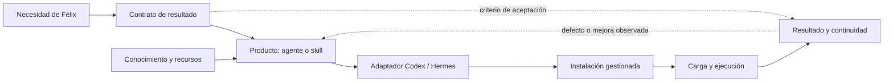

# Productos KORA: estado y dirección

Fecha de corte: 2026-09-14. Fuente gobernante: encargo de Félix de fijar y
publicar una línea de estado, repensar la reconstrucción y proponer su ejecución
con `steipete` y `cat-thinking`, para un usuario y desarrollador en un host.
La [especificación confirmada](kora-version-oro.md) conserva los requisitos;
la [guía](operacion.md), la operación; este documento reúne el corte y el plan
de productos. La [propuesta anterior](propuesta-refactorizacion-productos.md)
conserva diagnóstico y evidencias por lote, sin gobernar el siguiente paso.

## Línea de estado publicada

**Contratos reconstruidos y admitidos, maquinaria comprobada, conducta sintética
acotada; integración personal incompleta y mejora de utilidad parcialmente
demostrada.** No corresponde declarar terminada la misión de reconstruir
mejorando los productos, ni volver a empezar su autoría.

El corte de fuentes es `a494e9c` en pneuma/master y `9af3696` en
knowledge/main. Los commits `f827636` y `03d4a5f` añaden a Git la historia ya
existente de seis productos; no cambian las fuentes activas del corte.

| Parte | Hecho comprobado o antecedente identificado | Límite / pendiente |
|---|---|---|
| Colección | 61 fuentes activas: 16 agentes y 45 skills. 58 declaran ambos destinos; 3 sólo Codex. | Cantidad descriptiva, sin cuota de reducción. `codex-route` se conserva; los otros 60 están integrados en lotes de reconstrucción. |
| Lotes | KORA operativo, ingeniería, salud, GTD general, compatibilidad, organización, especialidades de proyecto, modelado y Diseño están admitidos y confirmados en Git. Diseño cerró en `a494e9c`. | Admisión y documentación de ensayos no equivalen a utilidad personal demostrada. |
| Maquinaria | `check`: 523 activos, 18 archivados, 0 incidencias. Suite ejecutada en este corte: 251 pruebas, OK. | No acredita fidelidad de toda la biblioteca, carga de todos los cuerpos o utilidad. |
| Codex personal | 61 instancias gestionadas en alcance: fuente y dependencias `current`. | Estado material; no es observación de sesiones personales. |
| Hermes personal | 62 instancias en alcance: 58 productos y 4 instancias adicionales de skills en perfiles. 29 `current`; 33 con fuente cambiada, de las cuales 14 también tienen dependencias cambiadas. | Falta reconciliar. No hay cambios nativos detectados ni recuperación pendiente. La cifra anterior de 40 ha quedado superada. |
| Conservación | Se incorporan candidatas admitidas y 12 versiones de los seis productos GTD/compatibilidad. Candidata, fuente activa y revisión registrada coinciden en los seis. | Se verificaron estas versiones con el verificador nativo; no se auditó toda la historia ni se atribuye aprobación nueva. |
| Biblioteca | Sigue en `9af3696`; incluye cuatro referencias Jobs publicadas y revisiones anteriores conservadas. | El corpus general heredado conserva su estatus. No se declara reconstruido, íntegramente revisado ni optimizado en tokens. |
| Git | El corte de fuentes estaba publicado y en paridad 0/0 tras fetch. La línea de estado y conservación se publica con este incremento. | Los cambios locales archivados OpenClaw y material privado en knowledge quedan fuera; `.hermes/` local se conserva. Paridad Git no implica igualdad del workspace completo con el remoto. |

Las seis historias son `fxsl/{david-allen,gtd-flow,memorizacion-espaciada}`,
`dev/agent-architect` y `kora/{autoria-de-persona,auditoria-exposicion-kora}`.
Se conservaron `product`, `state.yaml` y las versiones publicables. Los
directorios `displaced-*` permanecen locales e ignorados según la política
existente; no son una fuente operativa nueva.

### Qué evidencia tiene cada afirmación

| Dimensión | Estado defendible |
|---|---|
| Integridad mecánica | PASS en el catálogo actual y 251 pruebas de maquinaria; verificación focal de las 12 versiones preservadas. |
| Fidelidad semántica | Revisiones y correcciones documentadas por lote. Hay tensiones focales aún examinables; no se releyeron todos los cuerpos para este corte. |
| Carga nativa | Evidencia histórica de sesiones nuevas sobre casos y configuraciones concretas. KORA mediante skill directa Codex y SOUL Hermes; rol personalizado KORA no acreditado en su campaña. Dori Codex sólo lectura parcial observada; Hermes con margen estrecho bajo Sol/272K. |
| Conducta | Casos sintéticos de los lotes documentados. Diseño registra 16/16, pero `SPEC_ONLY` y errores fundados ante contexto insuficiente no acreditan todo el recorrido positivo de diseño y materialización. No se repitió inferencia en este corte. |
| Utilidad | Correcciones concretas y capacidades conservadas. Comparación de esfuerzo, errores, resultado y costo frente a alternativas simples mayormente pendiente; no equivale a inutilidad demostrada. |
| Efectos | Fuentes admitidas y publicadas; instalaciones focales previas. El estado actual identifica 33 realizaciones Hermes pendientes. No se realizaron actos clínicos, institucionales ni envíos. |

La cobertura se apoya en los dictámenes por lote de la propuesta anterior y en
la ejecución mecánica de este corte. Los recibos temporales son evidencia
auxiliar: antes de reutilizar una afirmación decisiva se comprueba que existan y
correspondan al caso, revisiones y entorno. Si faltan, se declara la limitación;
no se reconstruyen logs ni se repiten campañas enteras para llenar un archivo.

### Reproducir y mantener el corte

Usar `python3 kora_cli.py check`, `python3 -m unittest discover -s tests -v`
y `git diff --check`. Derivar productos desde `products/*/*/object.yaml`,
seleccionar sus identidades con `status --compare-source --id URN` repetible,
excluyendo `gtd-felix` y `gtd-operations`, y resumir `source_comparison` por
destino, perfil y estado. Las instancias adicionales son `ship-discipline` y
`hermes-agent-specialist` en los perfiles `hospitalista` y `urgencia`.
No publicar recibos completos del home, credenciales o respaldos privados.

Esta tabla es un **corte fechado**, no un inventario manual que deba acompañar
cada instalación. El estado vivo se deriva por CLI. Sólo se actualiza el
dictamen cuando cambie una conclusión material; Git conserva el corte anterior.

## Decisiones del corte

1. Conservar la colección admitida y su historia como punto de partida.
2. Corregir la declaración prematura de cierre. Instalación actualizada,
   conducta acotada y utilidad comparada son afirmaciones diferentes.
3. Mantener el núcleo, la biblioteca separada, las fuentes agnósticas y los dos
   adaptadores. No hay evidencia que justifique una nueva plataforma.
4. La reconciliación personal es el primer incremento del plan posterior;
   este corte no cambia instalaciones para hacer que la fotografía salga verde.
5. `gtd-felix`/`gtd-operations`, sus dependencias protegidas, los espacios
   institucionales y los datos privados conservan las exclusiones del encargo.
   Un solo usuario no elimina errores, interrupciones o procesos concurrentes;
   sí elimina la necesidad de diseñar tenants, roles empresariales o servicios
   de coordinación sin consumidor.

## Estado al que queremos llegar

Félix puede entregar una fuente, un problema o un compromiso a KORA, escoger una
ruta comprensible y obtener un resultado utilizable con menos corrección y
coordinación manual, manteniendo profundidad, autoridad y continuidad. Puede
mejorar un producto y usar la nueva revisión en Codex o Hermes sin perseguir
copias, perder recursos ni reconstruir la conversación anterior.

El resultado incluye tres promesas diferentes:

- **Conocimiento:** transformación íntegra del contenido definido por KOR-01,
  con procedencia y mínima expresión practicable medida junto con los recursos
  necesarios. No basta resumir ni medir sólo el cuerpo corto.
- **Agentes y skills:** responsabilidad o tarea reconocible, conocimiento
  oportuno y conducta que complete trabajo autorizado. El agente debe justificar
  su aporte frente al método directo o una instrucción breve; una especialidad
  puede conservarse sin necesidad de convertirla en un agente.
- **Realización:** lo necesario llega y se usa en la superficie prometida;
  actualizar y recuperar sigue siendo una operación local comprensible.

Se conserva el alcance de productos y conocimientos necesarios para sus
recorridos. Renovar toda la biblioteca heredada sería otro encargo. El límite se
explicita por capacidad: conservar un conocimiento `legacy` no lo hace inválido,
pero tampoco acredita una revisión editorial nueva o economía óptima de tokens.

## Descomposición estructural con cat-thinking

La pregunta reformulada es: **¿qué debe conservar cada transformación y qué
conexiones necesitan evidencia para que una intención llegue a un resultado?**
La lectura suficiente es un modelo de relaciones tipadas (`M`) y criterios de
ingeniería (`H`), contrastados con observaciones (`E`). No se construye aquí una
categoría formal, ni se afirma functorialidad, bisimulación o equivalencia entre
LLM. El vocabulario no reemplaza pruebas de uso.

Cada flecha del dibujo identifica una dependencia o transformación que hay que
examinar; no representa automáticamente un morfismo demostrado. La ruta inferior
de comparación entre contrato y resultado es la que falta cerrar en varias
familias. Fuente correcta y archivos actuales sólo cubren tramos intermedios.

| Relación y clase | Qué tenemos | Qué falta / decisión |
|---|---|---|
| Necesidad → responsabilidad → producto (`M/H`) | 16 agentes y 45 métodos/accesos con contratos explícitos. | Contrastar si la separación ayuda a Félix. No decidir por nombre, prestigio, tamaño o cuota. |
| Fuente → versión revisada (`E/H`) | Candidatas, revisión concreta, procedencia, admisión y versiones; correcciones semánticas documentadas. | En cada cambio nuevo, cotejar también recursos y referencias que puedan reintroducir el defecto. Preservar contenido no exige conservar cada duplicación prescriptiva. |
| Producto + dependencias → realización (`E/M`) | Cierre de `requires`, recursos seleccionados y adaptadores. | Una condición escrita no es un dispatcher; `relations` no ejecuta llamadas. Probar la conexión realmente usada y su autoridad. |
| Realización → instalación (`E`) | Propiedad, planes, recuperación y comparación de fuentes funcionan en la suite; 33 instancias Hermes cambiadas. | Reconciliar el conjunto afectado sin tocar consumidores protegidos. |
| Instalación → conducta (`E/H`) | Sesiones sintéticas por lotes; límites de rol y contexto identificados. | No transferir evidencia de skill directa a rol delegado ni de lectura parcial a especialidad completa. Probar el tramo positivo ausente. |
| Conducta → utilidad y continuidad (`M/H`) | Criterios EVA existentes y casos parciales. | Comparar resultado, retrabajo, errores y costo; retomar asuntos desde su dueño en sesiones nuevas. |

Trazabilidad de las conclusiones estructurales:

- Identidad, dependencia y realización: `urn:kora:kb:cat-kora-kernel`,
  secciones «Actividad e identidad» y «Dependencias y realización».
- Preservación y pérdidas al traducir (`H`): `urn:fxsl:kb:icas-preservacion`,
  «El patrón que aparece en todas partes». No se traslada su definición formal
  de funtor a estos adaptadores sin construir las estructuras y probar leyes.
- Instalación, efecto y recuperación (`E/H`):
  `urn:kora:kb:cat-kora-semantica-operacional`, «Fuente, realización e instalación»
  y «Transacción y recuperación»; la evidencia de este corte está arriba.
- Separación Spec/Model/Runtime (`M/H`):
  `urn:kora:kb:cat-programacion-agentica-autonoma`, §4.4–4.5. La comparación
  conducta/contrato exige un testigo propio, no paridad de archivos.
- Agente, método y evidencia proporcional (`H`):
  `urn:kora:kb:cat-contrato-ingenieria-agentica`, «Elegir y expresar el producto»
  y «Evidencia según la afirmación».

Coherencia de esta aplicación: distingue identidades de sus versiones, consulta
de ejecución, aprobación editorial de autoridad institucional y publicación de
instalación. No postula leyes formales ni promueve la delegación dinámica
retirada de la monografía. Las observaciones pertenecen a su runtime y revisión;
las decisiones de arquitectura son hipótesis contrastables, no teoremas.

### Alternativas y decisión

| Alternativa | Beneficio | Costo o pérdida | Decisión |
|---|---|---|---|
| Reescribir todo con una arquitectura nueva | Uniformidad aparente. | Descarta aprendizaje, mueve demasiadas variables y posterga el uso sin evidencia de necesidad. | Descartada para este encargo. |
| Declarar terminado tras instalación y tests | Cierre rápido de la maquinaria. | Omite el aporte del producto y confunde artefactos con resultados. | Insuficiente. |
| Reducir de inmediato a una colección mínima por número | Menos entradas. | Puede destruir profundidad, disparadores y acceso directo aún no comparados. | Descartada como criterio. |
| Conservar la base y mejorar por recorridos completos | Reutiliza evidencia y hace observable el valor de cada cambio. | Requiere escoger casos y aceptar resultados inconclusos sin inventar éxito. | Elegida. |

## Plan de implementación

La unidad de trabajo es un resultado completo con sus dependencias. Los
incrementos siguientes conservan una sola dirección e integración; escrituras
compartidas se serializan. No se abren agentes, ramas, tableros o documentos por
fase automáticamente. El plan es propuesto para ejecución posterior a este
corte; su publicación no significa que se hayan realizado estas mejoras.

### 1. Dejar consistente el uso personal

**Cambio:** derivar nuevamente las instancias gestionadas cambiadas, preparar
planes por destino y consumidor, inspeccionar efectos y actualizar las
seleccionadas. Incluir las instancias de skills en perfiles existentes; no sólo
las instalaciones raíz. Preservar ediciones locales, versiones y recuperación.

**Propiedad:** operación del instalador existente; `kora/install.py` y sus tests
sólo si un defecto reproducido impide la operación. No cambiar configuración
global ni actualizar Hermes/Codex por rutina. Las 33 diferencias del corte son
un punto de partida, no una lista fija que prevalezca sobre el estado real.

**Aceptación:** todas las instancias en alcance seleccionadas y sus consumidores
materiales quedan `current`, sin recuperación pendiente, o con conflicto
protegido concreto aislado. Contrastar el ensamblaje afectado; el tamaño de
Dori se evalúa respecto del contexto efectivo, sin recortar contenido para
obtener verde. Reutilizar evidencia nativa compatible y repetir sólo el tramo
que cambió materialmente. No confundir este resultado con utilidad.

### 2. Cerrar un ciclo útil de KORA sobre sus propios productos

**Cambio:** usar KORA para llevar una reparación real y acotada del incremento
3 desde el problema hasta candidata, revisión, admisión, instalación y uso en
una sesión nueva. Añadir un caso de transformación de una fuente pública o
sintética con negación, condición, excepción y contenido estructurado: conservar
el original, producir conocimiento consultable y comprobar comprensión y costo
completo. Un caso sintético no se publica en la biblioteca personal por rutina.

**Propiedad:** `products/kora/{kora,autoria-kora,koraficacion,
koraficacion-integral,auditoria-artefactos-kora,instalacion-kora}` y sólo los
recursos/referencias necesarios para un defecto observado. Cambios desde sus
candidatas; el conocimiento publicado usa su ciclo editorial, nunca edición
directa de versiones. El objetivo no es reescribir los seis.

**Aceptación:** el cambio llega al consumidor con su semántica conservada y una
retoma que reconoce la revisión nueva. El conocimiento mantiene la información
y el resultado de consultas discriminantes; tokens totales medidos cuando
exista contador compatible, o `NOT_MEASURED` con la afirmación de economía aún
pendiente. Contrastar la ruta KORA con el método directo donde decida su aporte.
Se reutiliza la prueba de recuperación de maquinaria salvo que el cambio la
afecte. Este incremento y el siguiente pueden compartir el mismo caso y recibo.

### 3. Conseguir una entrega positiva de Diseño sin trámites superfluos

**Cambio:** encargo pequeño y completo con contexto suficiente, por ejemplo
mejorar una página local de ayuda de KORA en un fixture temporal. Debe producir
un artefacto funcional inspeccionable y una comprobación real. Comparar la ruta
director + método con método directo; usar asistencia sin producto cuando sea
necesaria para decidir el aporte. Misma tarea, materiales y herramientas, en
sesiones nuevas y sin revelar criterios esperados como respuestas.

**Propiedad:** las siete fuentes de Diseño y sus dependencias afectadas.
Inspección focal inicial: `diseno-producto-integrado` combina ledger opcional
con exigencia universal de `[E#]` y paquete de ocho secciones;
`director-diseno-producto` admite pruebas sobre artefactos propios y exige luego
una fuente independiente de su propia salida. Son tensiones textuales, todavía
no fallos runtime observados. Resolver la ambigüedad distinguiendo el artefacto
generado de la prueba ejecutada sobre él y haciendo proporcional la entrega.

**Aceptación:** produce una mejora utilizable y comprueba lo que afirma, conserva
recuperación y accesibilidad necesarias, no inventa investigación y no exige
documentos sin función. Se observa tanto el recorrido positivo como la excepción
afectada. `SPEC_ONLY` sigue siendo válido cuando ése sea el encargo; no sustituye
este caso materializado. Conservar, simplificar o combinar entradas según
resultado y carga real, preservando acceso a investigación y crítica.

### 4. Comprobar continuidad y profundidad donde cambian el resultado

Los frentes siguientes se realizan según dependencia y utilidad, aprovechando
el trabajo de los incrementos anteriores. No son campañas por archivo.

| Frente y fuentes principales | Caso que falta discriminar | Criterio de salida |
|---|---|---|
| DT HODOM y Telemedicina, con sus métodos propietarios | Asunto sintético con decisión autorizada, compromiso con dueño, cambio posterior y retoma en otra sesión desde el mismo cuaderno. | Conserva el cargo y la decisión vigente, realiza la contribución autorizada y mantiene continuidad sin libreta paralela. Probar la diferencia de responsabilidad del segundo gemelo; sin actos institucionales reales. |
| Medicina hospitalaria, urgencia y salud pública | Mismo problema sintético visto desde las responsabilidades respectivas, con fuentes públicas suficientes. | Cada producto conserva el nivel micro/meso/macro y entrega el resultado propio sin invadir autoridad; reutiliza los casos sanitarios previos y añade sólo la diferencia faltante. No acredita eficacia clínica. |
| Dori y OPM, con métodos y recursos expertos | Consulta técnica que necesite contenido sustantivo o tardío y un recurso especializado, más el caso vecino que no necesita OPM. | Acceso efectivo al conocimiento decisivo, resultado técnico contrastable y proporcionalidad. Separar corrección formal, premisa de dominio y ejecución de herramienta; no prometer roundtrip no ejecutado. |
| Steipete, Fugaz y acceso agent-architect | Reparación y comprobación real del propio ciclo KORA; autoría por acceso especializado frente al método directo. | Trabajo integrado, conservación de autoridad y cierre sobre candidato correcto. No duplicar los ensayos de los incrementos 2–3. |
| David Allen, Allan Kelly y métodos de claridad/organización | Compromiso personal o célula sintética con responsabilidades cruzadas y una decisión pendiente concreta. | Claridad y siguiente acción útiles, sin apropiarse del trabajo ajeno ni imponer registros. Comparar acceso agente con método suficiente; GTD protegido excluido. |

**Cobertura:** los frentes, junto con KORA y Diseño, incluyen las 16 identidades
de agente activas. No exigen 16 campañas aisladas: se reutiliza evidencia sólo
cuando la responsabilidad, el caso y la configuración la hagan aplicable.
Cada promesa distinta de una skill debe estar cubierta por un recorrido propio
o evidencia previa pertinente. Si permanece sin evaluar, conserva ese estatus;
no puede sumarse a una afirmación de mejora completa.

### 5. Decidir la forma final y comprobar ambos destinos

**Cambio:** con los resultados anteriores, resolver cada duplicación o
especialización que cambie una ruta de uso. Agente para responsabilidad y juicio
persistentes; skill para procedimiento reutilizable; conocimiento para contenido
consultable con valor propio. Una relación documental no crea orquestación.
Evitar prólogos y reglas generales duplicadas cuando no aporten conducta.

**Propiedad:** sólo productos, recursos, referencias y consumidores afectados
por la decisión. Una fusión o retiro exige mapa concreto de capacidad conservada,
acceso alternativo comprobado, versiones disponibles y reconciliación de
consumidores. Un alias en el catálogo no prueba invocación nativa equivalente.

**Aceptación:** cada agente del alcance tiene una razón de conservación,
recomposición o retiro sustentada en evidencia proporcional. Si una comparación
es inconclusa, se conserva provisionalmente sin afirmar ventaja; se limita
explícitamente la promesa y queda pendiente la decisión necesaria. Las rutas
prometidas funcionan en ambos runtimes declarados, con superficie efectiva
identificada (skill directa, rol invocado o perfil). No hay matriz universal de
todos los modelos: se usan configuraciones reales contrastadas y se declaran
sus límites. No se elimina un destino prometido para evitar una prueba fallida.

### 6. Cerrar una colección útil y mantenible

**Cambio:** integrar y publicar cada resultado por intención, revisar la
documentación vigente y conservar el mínimo recibo no sensible de los nuevos
casos en recursos/tests/docs existentes según quién lo use. Caso, revisión,
runtime/configuración pertinente, resultado y límite bastan; no duplicar logs,
fichas y matrices. Los temporales no deben ser la única prueba de una afirmación
decisiva que deba sobrevivir al host. El commit conserva decisión y aprendizaje;
la guía expresa la operación vigente.

**Aceptación final:** fuentes y recursos preservados; revisiones admitidas
coherentes; casos positivos y límites materiales cubiertos; decisiones de
arquitectura pendientes resueltas o alcance de conformidad explícitamente parcial;
instalaciones autorizadas coherentes; cambios propios publicables en Git y
paridad verificada. El dictamen separa las seis dimensiones del corte y explica
lo reconstruido, conservado, retirado y aún no evaluado. La aceptación personal
de Félix se distingue del juicio técnico del ejecutor.

No se declara «misión completa» mientras falte una promesa necesaria para el
alcance acordado. Sí se puede cerrar un incremento o informar conformidad parcial
sin mantener activo todo el corpus. Tras cierre material, la documentación
canónica conserva lo necesario y este plan pasa a antecedente fechado; si hay
interrupción, sólo `HANDOFF.md` temporal conserva el siguiente paso.

## Cómo controlar el esfuerzo sin perder la complejidad

- El ejecutor decide el menor caso que pueda refutar la afirmación importante.
  No repite una prueba por cambiar de fase o recibir otro nombre de lote.
- Compara el resultado entregado, errores materiales, correcciones e
  intervenciones humanas, tiempo y tokens/costo si el runtime los expone.
  Mide la ruta completa, incluidos auxiliares y repetición de intentos. No usa
  longitud, retórica, test verde o un puntaje compuesto como sustitutos de valor.
- Usa igual contexto, configuración y herramientas al comparar rutas. El
  criterio se fija antes de mirar la respuesta; un juicio propio no se llama
  aceptación de Félix. Una diferencia pequeña o variable queda inconclusa;
  repite sólo si la incertidumbre impide decidir una arquitectura relevante.
- La evidencia de una negativa correcta no sustituye el resultado positivo
  prometido. La evidencia de un método no acredita automáticamente el agente
  que lo envuelve. La composición se prueba donde puede perder información,
  responsabilidad o continuidad.
- Un fallo de proveedor se separa de un defecto de producto. No se cambia un
  prompt para facilitarle la respuesta ni se amplía infraestructura por una
  incidencia aislada. Un límite de herramienta se declara o resuelve dentro de
  autoridad; no se simula el efecto ausente.
- No se estiman semanas o presupuestos de inferencia sin datos. El primer caso
  comparable informa el costo de los restantes; se ajusta orden y profundidad
  con esa evidencia. Un gasto o efecto fuera de la autoridad se plantea con
  alcance concreto, continuando lo independiente.
- No se implementan multi-tenancy, RBAC empresarial, scheduler, dashboard de
  evals, base de estado paralela o catálogo duplicado. Se conservan locks,
  propiedad, revisión y recuperación porque incluso un usuario puede tener dos
  procesos y ediciones que no deben perderse.

**Siguiente movimiento de implementación:** ejecutar el incremento 1 con planes
actuales y exclusiones comprobadas. Preparar después el caso compartido 2–3;
su resultado decide las primeras correcciones de producto. No hace falta otra
auditoría general ni una especificación nueva para comenzar.
