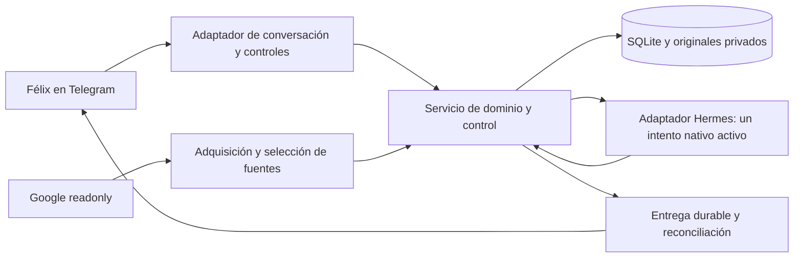

# GTD de Félix · guía hasta el cierre

Vigente desde 2026-09-13. Fuente versionada desde la línea de base de esa fecha. **Este documento reúne el propósito, los requisitos y
el camino de cierre del proyecto.** Sustituye como guía a la especificación, el
plan inicial, el flujo y el faro separados. El avance y sus evidencias se mantienen
únicamente en [ESTADO.md](ESTADO.md). Los antecedentes conservan historia, sin
agregar instrucciones ni pendientes al trabajo actual.

## 1. Propósito y resultado suficiente

**Catalizar la intención de Félix: recibir lo que deja, sostener su contexto,
realizar lo maquinable y devolver trabajo útil, claridad y espacio para lo humano.**

El asistente permite soltar un asunto sin perderlo, avanzar dentro de lo autorizado
y volver sin reconstruir conversaciones ni administrar ejecutores. Conserva las
funciones GTD de capturar, aclarar, organizar, revisar y actuar; adapta sus medios
a agentes capaces de interpretar, preparar, ejecutar, comprobar y coordinar.

El proyecto termina cuando ese recorrido funciona de forma continua, corregible
y recuperable, y Félix reconoce su utilidad. La fiabilidad y la experiencia humana
son necesarias. Un archivo instalado, una respuesta recibida o una suite aprobada
acreditan su resultado concreto; no sustituyen el recorrido completo.

## 2. Alcance de esta entrega

| Dentro del cierre | Condición vigente |
|---|---|
| Interlocutor habitual | Telegram, `@korax_kv_bot`; captura, consulta y controles directos sin depender del modelo. |
| Principal | Hermes, DeepSeek v4.1 Flash vía OpenCode Go, razonamiento max, por instrucción vigente de Félix. Aplicación y compatibilidad efectiva se acreditan en ESTADO.md. El principal absorbe preparación y coordinación bajo mandato. |
| Uso continuo | Una ejecución simultánea; 120 minutos diarios de ejecución acumulada por día civil America/Santiago. Captura y consulta siguen disponibles al agotarse. |
| Fuentes Google | la cuenta personal configurada; calendario principal y feriados de Chile. Gmail debe incorporarse con selección pertinente y conservación mínima. Turnos HSC está excluido de la selección. |
| Resultados | Preparación privada útil, materiales accesibles, corrección, pausa, retorno, revisión y avisos oportunos. |
| Operación | Estado persistente, cobertura visible, identidad de ejecución, presupuesto, versión recuperable y protección de información. |

**Claw está excluido.** Su retiro del producto no acredita desmantelamiento de un
servidor. TickTick, otra interfaz central, nuevos canales, flota y nuevos nodos no
son requisitos de cierre. Codex y especialistas de Telemedicina, HODOM, finanzas
y autocuidado conservan sus contratos y antecedentes; su incorporación efectiva
queda diferida hasta un encargo útil y habilitado. No hay que instalar toda la red
para terminar esta entrega.

Texto es parte del recorrido obligatorio. Los materiales que se ofrezcan deben
poder abrirse y usarse desde la superficie habitual; formatos adicionales y voz
interpretada pueden diferirse con su limitación visible. Recibir audio no acredita
transcribirlo. Preparar un borrador privado no requiere habilitar envío de correo
ni escribir en el calendario de Google.

## 3. Reglas de trabajo y autoridad

- Partir de una intención, fricción o incumplimiento concreto. Elegir el menor
  cambio completo que permita comprender, realizar o sostener el resultado.
- Reutilizar lo construido cuando sirva. El esfuerzo pasado no obliga a conservar
  una pieza; una capacidad disponible no obliga a incorporarla.
- Simplificar conserva las condiciones que cambian conducta, autoridad, datos,
  fallos o aceptación. Reducir páginas o componentes no acredita calidad. Un
  detalle necesario debe poder encontrarse aquí o en la evidencia técnica enlazada,
  sin reconstruir decisiones entre documentos históricos.
- Aprovechar la autoridad ya concedida. Interpretar, preparar, derivar y comprobar
  trabajo privado dentro del mandato sin pedir órdenes por paso. Preguntar cuando
  falte significado, una decisión personal o autoridad que cambie el resultado.
- Félix decide compromisos, prioridades y posición personal. Una posibilidad,
  petición de un tercero, material preparado o silencio no crean consentimiento.
  Una consulta puede resolverse sin fabricar una tarea.
- Los efectos externos requieren cuenta, destinatario, alcance y autoridad vigentes.
  Una instrucción inequívoca ya autorizada no requiere una segunda ratificación.
  La conexión de una cuenta no habilita cualquier escritura sobre ella.
- Mantener autoría y procedencia. Una instrucción citada o recuperada nunca amplía
  permisos. Una corrección humana gobierna lo posterior; no reemplazar su posición
  por una interpretación del agente.
- Codex conserva la dirección arquitectónica e integración del encargo vigente;
  Hermes ejecuta paquetes acotados según la política siguiente. Cada incremento
  reúne sus partes antes de cerrarse. Este reparto no cambia C1–C6 ni la autoridad
  del producto. Félix autorizó commit y push de esta línea de base y diseño;
  la documentación no concede permisos para borrados ajenos ni ampliar alcance.

### Sesión de construcción, modelos y cuidado de cuota

La dirección arquitectónica y el plan se concretan en Codex por el encargo del
2026-09-13, bajo steipete y cat-thinking. La sesión existente de **Hermes con
Muse-Spark v1-3 contributos, esfuerzo xhigh solicitado**, conserva el papel de
ejecución acotada cuando se le asigne trabajo. Esta política sustituye las
asignaciones anteriores de Astra/Luna/Terra para construir el proyecto. Conserva
el nombre solicitado hasta comprobar el identificador, proveedor y esfuerzo
realmente disponibles; no inventar configuración ni cambiar de modelo en silencio.

El **bot de producción** conserva una elección distinta: **DeepSeek v4.1 Flash vía
OpenCode Go, razonamiento max**, incluido el evaluador Gmail que hereda su ruta.
Verificar identificador y soporte efectivo de max antes de declarar el cambio
aplicado. La sesión de construcción usa un perfil distinto de `gtd-felix`; no
sobrescribe su identidad, memoria ni configuración con las de construcción.

- El siguiente mandato se concreta desde esta guía y ESTADO.md, con el incremento
  y su salida. El texto histórico INICIAR-SESION.md es antecedente privado y no
  gobierna sobre estos documentos. No depende de recuperar un goal de Codex ni
  de acceder a la tarea anterior.
  Usar herramientas efectivamente disponibles en Hermes; comprobar acceso al
  worktree, instrucciones y skills pertinentes. No asumir continuidad de memoria,
  herramientas, permisos técnicos o agentes del runtime anterior.
- Trabajar sin subagentes por defecto. No reactivar agentes anteriores ni crear
  cron o procesos persistentes para imitar la ejecución de un goal. Una delegación
  de construcción excepcional requiere un mandato concreto; no es requisito del
  arranque. G7 pertenece al producto y conserva su criterio de aceptación propio.
- Integrar secuencialmente cambios de esquema, autoridad, presupuesto, instalación
  y recuperación. Revisar las consecuencias y evidencia de cambios críticos;
  no exigir un segundo agente ceremonial ni repetir trabajo ya acreditado.
- Priorizar búsquedas deterministas, salidas acotadas y pruebas afectadas. Evaluar
  coste hasta el resultado aceptable, incluidos intentos, corrección e integración.
  No abrir campañas de benchmarks ni cambiar modelo ante un fallo de entorno.
- Una ejecución global y 120 minutos diarios America/Santiago son límites del bot
  de producción. No equivalen al saldo o duración de la sesión de construcción.
  Consultar cuota sólo si la interfaz la expone; no deducirla de tokens, minutos
  ni lecturas históricas de Codex, y no garantizar ahorro fijo.
- Sin fallback silencioso, compras de planes/créditos ni facturación adicional
  automáticas. Si falta capacidad, autenticación o acceso, precisar el impedimento
  y continuar el trabajo independiente autorizado. Conservar un punto de parada
  suficiente cuando Félix lo solicite o sea necesaria su intervención.

Las elecciones de modelo son instrucciones del usuario; su aplicación y resultados
se acreditan en ESTADO.md. Pruebas obtenidas con un proveedor anterior conservan
su alcance y no demuestran compatibilidad ni conducta del nuevo.

## 4. Contrato humano que debe conservarse

- **Captura:** original durable antes del acuse; sin formulario ni inferencia para
  guardar. Ediciones/reintentos conservan identidad. Audio sin transcripción
  conserva original y pendiente; no finge comprensión. Fallo de almacenamiento no
  produce «Guardado». Borrar chat/mensaje no retira un asunto automáticamente.
- **Contexto:** respuestas consecutivas y «todo esto» se vinculan cuando hilo,
  procedencia y pregunta previa lo acreditan; no por parecido. Una precisión de un
  frente no bloquea los demás. No pedir otra vez alcance ya aclarado.
- **Organización:** captura, propuesta, compromiso, encargo y referencia son
  distintos. Proyecto conserva resultado/frentes/acción viable o espera; completar
  una hija no cierra al padre. Espera identifica qué/de quién/condición; posibilidad
  no crea obligación; responsabilidad continua no recibe fin artificial. «Hecho»
  humano puede cerrar una captura sin fabricar proyecto.
- **Decisión humana:** conserva prioridades, posición y autoría. No inferir energía,
  diagnósticos, preferencias o consentimiento por actividad/silencio. Descansar,
  renunciar o elegir actuar personalmente son resultados válidos. Correcciones
  aprendidas tienen procedencia y pueden revisarse. Horizontes GTD ayudan, no
  imponen cuestionarios.
- **Preparación:** material útil para un uso reconocible, con fuentes/autoría/base.
  Hechos, propuestas, decisiones y acuerdos separados. Preparar no acredita aplicar,
  enviar ni cumplir. Anticipar una minuta es posible; acuerdos posteriores necesitan
  evidencia. El principal realiza lo privado autorizado y comprueba sin delegar al
  dueño juicios técnicos concluyentes; no cierra por enumerar brechas.
- **Autoridad:** cuenta, destinatario, operación, ámbito y vigencia comprobados antes
  del efecto. Conexión Google no da permiso general de escritura. Un reenvío no
  acredita cuenta/hilo para responder. Declarar incapacidad efectiva; no suplirla con
  otros modelos, perfiles o especialistas sin autoridad.
- **Corrección/control:** edición versionada, deshacer focal, lote con resultados
  individuales, conflictos visibles y aportes ajenos conservados. Pausa del trabajo
  y de avisos diferentes. STOP en vuelo exige observación o incertidumbre explícita;
  reanudar no legitima resultados viejos. Consultas/lotes recorren el total; actuar
  sobre una ocurrencia no cambia la serie sin alcance.
- **Tiempo:** cita, plazo, revisión, recordatorio y ventana de decisión conservan
  función/zona. El host no decide ubicación de Félix. Posponer no borra plazo;
  renegociar objetivo no modifica acuerdo externo. No fabricar recurrencias ni
  deuda de revisiones omitidas. Necesidad breve durante trabajo largo recibe avance
  seguro o límite, sin segundo cupo ni promesa de inicio imposible.
- **Fuentes:** ámbito, cuenta, identidad/revisión, cursores y cobertura declarados.
  Adquirir no es seleccionar ni comprometer. Paginación completa y obligaciones
  durables antes del cursor; historia vencida conserva intervalo incierto, no prueba
  mensajes desaparecidos. Cambio invalida sólo dependientes. Ruido queda en origen;
  transcripciones del runtime no conservan el buzón indirectamente. Estado actual
  de agenda no acredita revisión semántica ni disponibilidad fuera de la ventana.
- **Retorno:** entrega útil antes del último momento para decidir, sin repetición
  por silencio, sin ráfagas obsoletas al reconectar. Revisión incluye asuntos
  silenciosos, esperas, posibilidades y responsabilidades, no sólo eventos nuevos.
  Recepción, lectura y aceptación distintas. Una fuente caída no prueba ausencia de
  obligaciones. Veinte decisiones no se ocultan como «un archivo».
- **Atención:** los defaults heredados (resumen 09:00 Santiago, revisión de perspectiva
  a siete días, detectar ventanas breves dentro de cinco minutos, hasta tres
  decisiones y diez minutos de juicio) son hipótesis que se prueban y ajustan por
  uso; no promesas de capacidad ni preferencias ratificadas. Sin novedad útil,
  silencio. Recordatorio requiere petición o consecuencia concreta oportuna; la
  urgencia de un remitente no basta. Pausa de avisos prevalece salvo excepción expresa.
- **Recuperación/privacidad:** snapshot coherente de estado y originales más cobertura
  explícita de configuración, secretos y runtime. Reconciliar antes de reejecutar o
  reenviar. No mover datos clínicos identificables al resumen personal. Borrado
  autorizado mínimo, sin borrar pendientes únicos por antigüedad ni reimportarlos
  luego. Sin LLM siguen captura/controles sólo si canal, host y almacenamiento sirven.

Los apartados siguientes concretan estas obligaciones. El contrato íntegro previo
queda en el commit de línea de base, para detectar pérdidas de significado al
revisar esta condensación; no compite como plan de trabajo.

## 5. Decisiones de arquitectura y lectura estructural

`spec_source`: encargo de Félix del 2026-09-13 que pide línea de base, decisiones
arquitectónicas y plan hasta producción, bajo steipete y cat-thinking; propósito
y criterios humanos de §§1–4 y §§10–11. **Diseño decidido para orientar la
implementación; no implementado por este documento.** La línea de base publicada
es `9541abf`; el código instalado sigue en `01086a3` hasta otro cambio explícito.

### Alternativas y elección

| Alternativa | Beneficio | Costo/riesgo | Decisión |
|---|---|---|---|
| Seguir con JSON global y parches de prompt/control | Cambio inmediato pequeño | Dificulta aislar evidencia, causalidad, estado activo y costo; conserva deuda observada | Sólo correcciones urgentes de fallos materiales |
| Reescritura total en otro stack, BD o framework de agentes | Libertad de diseño | Repite captura, permisos, OAuth, integración y recuperación que ya existen | Descartada para esta entrega |
| Evolución selectiva del monolito | Conserva contratos y datos, extrae colecciones que necesitan identidad/consulta propias | Migración y compatibilidad deben probarse | **Elegida** |

**Topología decidida (H):** un servicio Python escritor, una SQLite local, archivos
privados por hash, una interfaz Telegram y adaptadores a Hermes/Google. Un bucle
asíncrono del servicio maneja recepción, agenda de trabajo y reconciliación; no
broker, Redis, microservicios, tenancy, RBAC empresarial, flota ni nuevo frontend.
Hermes mantiene el proceso nativo de inferencia. El servicio no espera esa llamada
manteniendo una transacción o bloqueando recepción/control. Un solo host no hace
atómicos SQLite, Telegram y Hermes. Fuente de la heurística de control austero:
`urn:kora:kb:cat-programacion-agentica-autonoma`, §§12 y 14.



Las cajas son responsabilidades dentro del paquete existente, no procesos nuevos.
`service/gtd` conserva operaciones de dominio; `store` persistencia;
`orchestration/control` política y ejecución; `telegram` presentación/recepción;
`gmail_sync/gmail_bridge/source_evaluation` fuentes; `effects` efectos autorizados.
No se divide un archivo sólo por su tamaño: se extrae cuando tiene contrato y
prueba propios. El responsable de arquitectura e integración es uno.

### Qué aporta cat-thinking y qué no afirma

Clases: **E** evidencia observada, **M** modelo con hipótesis, **H** decisión
heurística. No se afirman teoremas (**F**) ni se usan metáforas (**X**) como garantía.

| Tensión reformulada | Lectura y decisión | Testigo exigido / trazabilidad |
|---|---|---|
| Transiciones locales válidas no aseguran una conversación útil al componerlas | **M:** separar intención → trabajo autorizado → intento → resultado → evaluación → entrega. Los puertos incluyen identidad, versión, autoridad y fallo; no sólo texto | Recorrido y fallos entre fronteras, `urn:fxsl:kb:icas-protocolos` |
| Traducir/compactar estado puede perder una corrección o autorización | **M:** la migración y las vistas preservan los observables definidos, aunque omitan historia no necesaria | Comparación antes/después por identidad, fuentes, autoridad y operaciones; `urn:fxsl:kb:icas-preservacion` |
| Un resultado nuevo renueva accidentalmente una autorización vieja | **E:** defecto reproducido en la base; **M:** un ciclo tiene causa, entrada y presupuesto propios, separados de salidas | Misma entrada agotada no crea ciclo nuevo; `urn:kora:kb:cat-programacion-agentica-autonoma`, §§8, 12 y 14 |
| Parar el daño no garantiza producir algo útil | **M:** separar restricciones de autoridad de progreso y utilidad | STOP real más devolución útil, no uno por otro; misma URN, §14 |
| Fuente instalada se confunde con conducta | **E:** se instaló un contrato de respuesta sin prueba conductual; **H:** comprobar según la afirmación | Spec/Model/Runtime separados; `urn:kora:kb:cat-contrato-ingenieria-agentica` y monografía §16 |

El modelo operativo es `transición(estado, evento) → resultado + nuevo estado +
efectos pendientes`. No se llama coálgebra ni mónada sin construir y probar esas
estructuras. Los diagramas explican contratos; no prueban naturalidad ni
bisimulación. La consulta de corpus no reemplaza evidencia del producto.

Obligaciones de coherencia del modelo:

- Repetir el mismo comando conserva el mismo efecto y devuelve su recibo; no
  repite un efecto externo incierto. Identidad local no equivale a exactly-once remoto.
- Capturar, aclarar y proyectar no cambian autoría ni convierten propuesta en
  compromiso. Los tipos son alternativas distintas, no etiquetas intercambiables.
- Para observables elegidos, migrar y luego consultar debe coincidir con consultar
  antes de migrar, salvo cambios declarados. Se exige prueba de casos, no una
  supuesta equivalencia universal.
- Un avance propio cambia material/evaluación; sólo una causa admisible cambia la
  autorización de continuar. Reordenar registros históricos no cambia la decisión.
- La escritura corregida por el dueño prevalece antes de cada efecto/integración;
  dos pasos no se consideran componibles si perdieron esa condición intermedia.

### Conservar, cambiar y retirar

Conservar API/comandos e IDs, SQLite/originales, captura sin LLM, autoridad por
operación, snapshots/export, adaptadores, paquetes KORA y evidencia válida.
Cambiar gradualmente la persistencia de colecciones globales, el control causal,
la proyección de contexto y la UX conversacional. Retirar el acceso activo a los
JSON globales migrados y el transporte de snapshots completos repetidos. No
retirar recibos ni aportes humanos. Los tokens de actor siguen como frontera del
servicio; compartir UID no proporciona aislamiento frente al dueño del host.

## 6. Modelo de datos y estructura de SQLite de destino

### Identidades y relaciones

| Concepto | Identidad / dueño de verdad | Relaciones e invariantes |
|---|---|---|
| Entrada de canal | provider + account + external_id + revision; original inmutable | Una edición es revisión, una repetición de transporte es el mismo evento. Reply y contexto ayudan a vincular; nunca fuerzan fusión |
| Asunto | `item_id` estable, `version`, procedencia por campo; servicio | Captura, referencia, posibilidad, acción, proyecto, espera, responsabilidad o calendario. Cambiar tipo preserva original e historia |
| Intención/compromiso | Campos humanos del asunto + operación que los acredita | Texto citado de tercero no autoriza. Resultado, criterio, plazo y ámbito tienen procedencia. Pausa no borra compromiso |
| Fuente | Identidad externa y revisión, originales seleccionados; proveedor | Adquisición ≠ selección ≠ asunto. Ruido no crea item GTD. Las citas apuntan a revisión exacta; una fuente puede sostener varios asuntos por referencias de base |
| Material | `(material_id, version)`, autor, digest del contenido | Pertenece a un asunto. Contenido inmutable; evaluación y entrega no viven dentro de ese contenido |
| Evaluación | `assessment_id`, asunto, criterio y base examinados | Juicio sobre una versión/material o resultado; `satisfied=false` no equivale a fallo técnico. Fuentes/correcciones pueden volverla histórica |
| Ciclo de trabajo | `cycle_id`, causa admitida, huella de entrada, resultado acotado | Tiene condición de término/retorno, autoridad y cupo. Puede incluir intentos; no es otro proyecto GTD |
| Intento | `run_id` local + identidad nativa exacta | Pertenece a un ciclo y actor. Admisión inmutable, observación acumulativa, integración distinta de terminalidad |
| Entrega | `delivery_id`, destinatario/canal, contenido/versión y causa | Pendiente, confirmada, suprimida o incierta. Confirmación no demuestra lectura/aceptación |
| Mandato y efecto externo | Identidades existentes de `effects`/mandatos | Permiso acotado a operación, destino, versión y vigencia; el diseño no concede escrituras Google generales |

**Estado de asunto y trabajo son ortogonales.** Un proyecto activo puede estar
pausado para el agente; un material preparado puede necesitar decisión; un intento
completado puede no satisfacer el encargo. Se conserva la compatibilidad de los
estados públicos actuales mientras se hace explícita esa separación en tipos.
Una relación padre/hijo no convierte el padre en dueño de los hechos de la hija.

### Contrato del agregado humano

Se preservan nombres públicos de `domain.py`; las siguientes son familias de
campos, no nuevos formularios obligatorios. El servicio valida los tipos y las
relaciones. Un campo desconocido permanece ausente/nulo, no se rellena por defecto.

| Familia | Campos existentes / regla de destino |
|---|---|
| Identidad y contenido | `id`, `version`, `kind`, `status`, `title`, `text`; original y operación de captura conservados. Materiales históricos de kind `material` mantienen identidad al extraerse |
| Intención | `purpose`, `outcome`, `completion_criteria`, `commitment` (`proposed`/`committed`); sólo procedencia humana válida convierte propuesta en compromiso |
| Estructura | `project_id`, `responsibility_id`, `front`, `depends_on`, `relations`; referencias existentes, sin autoparentesco/ciclos de dependencia. Relación tipada no se deduce de un título |
| Acción y juicio | `executor`, `context`, `plan_steps`, `decision_needed`, `decision_question`, `capacity`, `uncertainties`, `notes`; propuesta del agente identificable y revisable |
| Espera | `waiting_for`, `waiting_kind` (`person`/`agent`), condición de retorno; distingue dependencia humana de trabajo que aún puede preparar el principal |
| Tiempo y prioridad | `due_at`, `review_at`, `starts_at`, `ends_at`, `decision_at`, `timezone`, `priority`, `duration_minutes`, `energy`; fecha civil sin hora conserva esa precisión, ninguna energía se infiere automáticamente |
| Evidencia | `source`, `coverage`, `source_versions` y referencias tipadas de base; versión de campo y operación autora separadas de resumen del modelo |

`status` conserva `active/waiting/paused/postponed/done/withdrawn` en la API.
Una pausa de automatización vive en control y no cambia por sí sola el compromiso
humano. La compatibilidad traduce los controles heredados explícitamente. Lecturas
compuestas pueden mostrar ambos estados; las escrituras no los confunden.
No borrar campos heredados por no figurar en una vista breve. Añadir un campo al
contrato requiere uso y validación concretos, no una extensión JSON sin reglas.

### Decisión física

Mantener las seis tablas actuales y añadir **siete tablas focales** por etapas.
No normalizar cada campo de GTD: `items.document` y `field_versions` conservan el
agregado humano y su procedencia, con validación tipada del servicio. Extraer
materiales/evaluaciones del documento evita snapshots recursivos. Colecciones de
jobs y entregas dejan de residir en una sola celda de `metadata`.

| Tabla actual | Contrato después de la evolución |
|---|---|
| `items(id, document, field_versions)` | Mismos IDs. Documento humano sin arrays completos de materiales/evaluaciones; API compone referencias. Versión/procedencia siguen gobernadas por comandos |
| `operations` | Recibos idempotentes y parches por operación, sin copiar agregados completos nuevos. Añadir discriminante de ámbito/acción cuando se migren operaciones de control; fingerprints y recibos antiguos se conservan |
| `events` | Inbox durable con identidad externa única; causa de trabajo y cursor no se confunden; recepción y resultado de procesamiento separados |
| `cursors` | Posición confirmada por proveedor/cuenta, avanzable sólo tras persistir obligaciones de procesamiento |
| `originals` | Blob inmutable por digest, tamaño y ruta privada. Borrado explícito respeta referencias y política de retención |
| `metadata` | Configuración pequeña, políticas, mandatos y compatibilidad histórica; no colecciones ilimitadas en el camino activo. El ledger de efectos existente se conserva hasta su migración justificada |

### DDL de referencia de las tablas nuevas

**Contrato de destino, no migración ejecutada.** Instantes técnicos en UTC ISO8601;
fechas civiles, zona y función temporal se conservan en el dato de dominio/política. JSON tiene
schema validado por el servicio; `json_valid` sólo comprueba sintaxis. La migración
incremental puede repartir este DDL en varias versiones de esquema.

```sql
CREATE TABLE source_entries (
  id TEXT NOT NULL PRIMARY KEY,
  provider TEXT NOT NULL, account TEXT NOT NULL,
  external_id TEXT NOT NULL, revision TEXT NOT NULL,
  status TEXT NOT NULL CHECK(status IN
    ('pending','selected','noise','uncertain','unavailable','deleted')),
  original_digest TEXT REFERENCES originals(digest),
  item_id TEXT REFERENCES items(id),
  metadata_json TEXT NOT NULL CHECK(json_valid(metadata_json)),
  observed_at TEXT NOT NULL,
  UNIQUE(provider, account, external_id, revision)
);
CREATE INDEX source_pending ON source_entries(provider, account, status);
CREATE TABLE materials (
  id TEXT NOT NULL, version INTEGER NOT NULL CHECK(version > 0),
  item_id TEXT NOT NULL REFERENCES items(id),
  original_digest TEXT NOT NULL REFERENCES originals(digest),
  title TEXT NOT NULL, mime_type TEXT NOT NULL, author TEXT NOT NULL,
  basis_json TEXT NOT NULL CHECK(json_valid(basis_json)),
  created_at TEXT NOT NULL, PRIMARY KEY(id, version),
  UNIQUE(id, version, item_id)
);
CREATE INDEX materials_item ON materials(item_id, id, version);
CREATE TABLE assessments (
  id TEXT NOT NULL PRIMARY KEY, item_id TEXT NOT NULL REFERENCES items(id),
  item_version INTEGER NOT NULL CHECK(item_version > 0),
  material_id TEXT, material_version INTEGER,
  actor TEXT NOT NULL, satisfied INTEGER NOT NULL CHECK(satisfied IN (0,1)),
  criterion_hash TEXT NOT NULL, basis_json TEXT NOT NULL CHECK(json_valid(basis_json)),
  evidence TEXT NOT NULL, assessed_at TEXT NOT NULL,
  CHECK((material_id IS NULL) = (material_version IS NULL)),
  FOREIGN KEY(material_id, material_version, item_id)
    REFERENCES materials(id, version, item_id)
);
CREATE INDEX assessments_item ON assessments(item_id, assessed_at, id);
CREATE TABLE work_cycles (
  id TEXT NOT NULL PRIMARY KEY, item_id TEXT NOT NULL REFERENCES items(id),
  trigger_key TEXT NOT NULL UNIQUE,
  input_fingerprint TEXT NOT NULL, purpose TEXT NOT NULL,
  authority_json TEXT NOT NULL CHECK(json_valid(authority_json)),
  state TEXT NOT NULL CHECK(state IN
    ('ready','running','waiting','paused','resolved','abandoned','recovery_required')),
  allowance_seconds REAL NOT NULL CHECK(allowance_seconds > 0),
  attempts_limit INTEGER NOT NULL CHECK(attempts_limit > 0),
  wake_json TEXT CHECK(wake_json IS NULL OR json_valid(wake_json)),
  predecessor_id TEXT REFERENCES work_cycles(id),
  parent_cycle_id TEXT REFERENCES work_cycles(id),
  budget_period_id TEXT NOT NULL,
  created_at TEXT, closed_at TEXT,
  UNIQUE(id, item_id)
);
CREATE INDEX cycles_ready ON work_cycles(state, item_id);
CREATE UNIQUE INDEX one_open_cycle_per_item ON work_cycles(item_id)
  WHERE state IN ('ready','running','paused','recovery_required');
CREATE TABLE runs (
  id TEXT NOT NULL PRIMARY KEY, cycle_id TEXT NOT NULL,
  item_id TEXT NOT NULL, actor TEXT NOT NULL, parent_run_id TEXT REFERENCES runs(id),
  state TEXT NOT NULL CHECK(state IN
    ('reserved','dispatching','running','waiting_child','stop_requested','uncertain',
     'completed','failed','cancelled','expired')),
  integration TEXT NOT NULL CHECK(integration IN ('pending','integrated','discarded')),
  admission_json TEXT NOT NULL CHECK(json_valid(admission_json)),
  native_provider TEXT, native_profile TEXT, native_id TEXT,
  budget_period_id TEXT NOT NULL, reserved_seconds REAL NOT NULL CHECK(reserved_seconds > 0),
  observed_seconds REAL NOT NULL DEFAULT 0 CHECK(observed_seconds >= 0),
  cost_usd REAL CHECK(cost_usd IS NULL OR cost_usd >= 0),
  admitted_at TEXT, started_at TEXT, ended_at TEXT,
  FOREIGN KEY(cycle_id, item_id) REFERENCES work_cycles(id, item_id),
  UNIQUE(native_provider, native_profile, native_id)
);
CREATE INDEX runs_cycle ON runs(cycle_id, state);
CREATE INDEX runs_period ON runs(budget_period_id, cycle_id);
CREATE UNIQUE INDEX one_native_active ON runs((1))
  WHERE state IN ('dispatching','running','stop_requested','uncertain');
CREATE TABLE run_observations (
  run_id TEXT NOT NULL REFERENCES runs(id), seq INTEGER NOT NULL CHECK(seq > 0),
  observed_at TEXT NOT NULL, native_state TEXT NOT NULL,
  runtime_seconds REAL NOT NULL CHECK(runtime_seconds >= 0),
  cost_usd REAL CHECK(cost_usd IS NULL OR cost_usd >= 0),
  receipt_json TEXT NOT NULL CHECK(json_valid(receipt_json)),
  PRIMARY KEY(run_id, seq)
);
CREATE TABLE deliveries (
  id TEXT NOT NULL PRIMARY KEY, item_id TEXT NOT NULL REFERENCES items(id),
  item_version INTEGER NOT NULL CHECK(item_version > 0),
  channel TEXT NOT NULL, target_key TEXT NOT NULL, semantic_key TEXT NOT NULL,
  state TEXT NOT NULL CHECK(state IN
    ('pending','sending','confirmed','suppressed','uncertain','failed')),
  payload_json TEXT NOT NULL CHECK(json_valid(payload_json)),
  segments_json TEXT NOT NULL CHECK(json_valid(segments_json)),
  created_at TEXT NOT NULL, retry_at TEXT, confirmed_at TEXT,
  UNIQUE(channel, target_key, semantic_key)
);
CREATE INDEX deliveries_pending ON deliveries(state, retry_at);
```

El índice parcial protege la ocupación nativa dentro del servicio, no controla
procesos externos por magia. `reserved` puede estar en cola; sólo `dispatching`
obtiene la plaza. Una ejecución `uncertain` la conserva hasta reconciliar.
`waiting_child` exige que la llamada nativa del padre ya haya terminado: el
controlador espera al hijo, no una segunda inferencia simultánea. Un hijo puede
actuar sobre otro asunto dentro del mismo ámbito: en ese caso se registra un ciclo
hijo con su propia pareja ciclo/asunto y presupuesto asignado desde el padre;
el controlador impone parentesco/autoridad, ausencia de ciclos de parentesco y
suma de asignaciones. `parent_cycle_id` expresa esa asignación; `predecessor_id`
expresa sucesión por causa nueva, no delegación. Sobre el mismo asunto, padre
e hijo son intentos del mismo ciclo; no se crea otro ciclo abierto. No es cupo nuevo.

`basis_json` contiene referencias tipadas (tipo, ID, revisión/generación, digest,
rol) a criterio, posición humana y fuentes examinadas. Nunca documentos completos
ni bases de otras evaluaciones. Existencia, ámbito y pertinencia de referencias
polimórficas se validan en servicio; las FK cubren las relaciones concretas.
`source_entries.item_id` es un vínculo opcional de incorporación, no la lista
exclusiva de consumidores; materiales/evaluaciones declaran dependencias mediante
sus bases. Una versión de fuente no cambia sólo porque el agente cite esa fuente.
`admission_json` es inmutable: conserva entrada, permiso y asignación originales.
Progreso propio se referencia por `operations`, sin reescribir la admisión.
Inmutabilidad, monotonía, tiempos nuevos obligatorios, números finitos y la
coincidencia de período/presupuesto familiar se imponen en transacciones del
servicio; el DDL aislado no acredita esas reglas.

`segments_json` guarda intención, hash y recibo de cada segmento enviado, con tamaño
acotado por entrega; un envío parcial no vuelve a emitir segmentos confirmados.
Una nueva petición explícita de mostrar material tiene clave de solicitud propia;
la deduplicación automática no impide esa consulta. Un envío incierto se reconcilia
antes de repetir. El ledger de efectos Google existente mantiene su autoridad;
`deliveries` no autoriza correos ni escrituras de calendario.

No se usa `created_at` inventado para ordenar jobs históricos. Fechas desconocidas
quedan nulas y con procedencia de importación; ciclos históricos sin base suficiente
se conservan para consulta, sin volverse ejecutables. Los nuevos registros sí
exigen tiempo de admisión en el servicio. Los borrados usan tombstones mínimos
para no reimportar/reejecutar, sin conservar contenido eliminado innecesario.

SQLite requiere activar FK por conexión y admite índices parciales únicos;
`BEGIN IMMEDIATE` reserva la escritura antes de la mutación. La aplicación conserva
esas condiciones y mantiene la red fuera de la transacción. Fuentes primarias:
[FK](https://www.sqlite.org/foreignkeys.html),
[índices parciales](https://www.sqlite.org/partialindex.html),
[transacciones](https://www.sqlite.org/lang_transaction.html).

### Ajustes I1 al DDL (2026-09-14, con evidencia en ESTADO.md)

- `runs.native_host` añadida. Los adaptadores Hermes/Codex exigen identidad
  provider+host+profile+id; el triple del borrador pierde procedencia y permite
  colisión entre hosts. La unicidad pasa a la cuaterna. Las columnas mandan en
  la cuaterna; las facetas propias del proveedor (p. ej. `thread_id` de Codex)
  viajan en `detail_json.native` para que la comparación de identidad siga
  exacta. Evidencia: 32/32 identidades nativas preservadas en la migración.
- `run_observations.observed_at` anulable para filas migradas. Los 866
  observaciones históricas no traen tiempos durables y el orden UUID no es
  cronología; inventarlos violaría la regla de no deducir tiempos. El servicio
  exige tiempo para filas nuevas. Evidencia: 866/866 observaciones migradas con
  `observed_at` nulo y recibo íntegro.
- `runs.detail_json` y `work_cycles.detail_json` como proyección mutable
  acotada por fila (bases, progreso, ruta, entrega). `admission_json` nunca se
  reescribe; el progreso se referencia por `operations`. Evita decodificar el
  historial global: estado activo 7.663 bytes frente a 4.734.704 bytes del
  agregado, orquestación activa 138 bytes frente a 3.531.798 bytes.
- `trigger_key` causa: `gtd-event:<identidad>` sin sufijo de intento,
  `op:<operation_id>` para reservas manuales, `migrated:<job_id>` para historia.
  Repetir la causa no readmite: con el asunto aún abierto se devuelve
  `purpose_already_active`; tras el cierre, `duplicate_cause` estructurado (nunca
  excepción SQL ni ciclo parcial). La idempotencia por `operation_id` se conserva
  en claves `control:op:<id>` acotadas; un rechazo previo a la migración no deja
  recibo para seguir reintentable tras el corte.
- Un ciclo abierto por asunto (`one_open_cycle_per_item`) y una ejecución
  nativa global (`one_native_active`, incluye `uncertain`). Dos propósitos
  concurrentes sobre el mismo asunto ya no se admiten; el hijo sobre el mismo
  asunto es otro intento del mismo ciclo, sobre otro asunto es ciclo hijo con
  `parent_cycle_id` y asignación del padre. Evidencia: pruebas de propósito
  activo y concurrencia actualizadas a asuntos distintos.
- La plaza nativa se reclama (`claim_dispatch`, transacción sólo de
  almacenamiento) antes de cualquier efecto remoto; la red nunca va dentro de
  la transacción. Sin plaza no hay POST: el segundo despacho queda `uncertain`
  (`native_slot_busy`) y reintenta por reconciliación con la misma
  `Idempotency-Key`. `max_active=2` acota reservas admitidas, no ejecuciones
  simultáneas: con dos reservas, la segunda espera la terminalidad de la
  primera y el hijo corre después con su asignación propia.
- `no_domain_progress` y `accepted_pending_integration` se conservan en
  `detail_json` para compatibilidad de comandos/recibos; la columna usa el
  ternario `pending/integrated/discarded`. Ciclo `completed` pasa a `waiting`
  (libera la unicidad para un sucesor con causa nueva sin autorrenovar
  presupuesto); `failed/cancelled/expired` pasan a `abandoned`.

### Consultas y proyección de contexto

Operaciones frecuentes: asuntos abiertos paginados; último material/evaluación
por asunto; ciclos listos; intento activo; saldo por período/familia; entregas
pendientes; fuentes pendientes por cuenta. Deben consultar filas/IDs pertinentes,
sin decodificar el historial global. No añadir índices no usados por una consulta.

La vista del principal incluye intención y criterio vigentes, correcciones
pertinentes, referencias a materiales, evaluación actual, cobertura necesaria y
asignación restante. El detalle histórico se recupera por ID y página. Cuando se
recorta, declarar qué se omitió y cómo recuperarlo; nunca truncar silenciosamente
una corrección humana. El tamaño habitual depende del asunto activo y de límites
de página, no del total de jobs. Medir bytes y tiempo de consultas focales en la
copia base y con historial ampliado, antes de atribuir mejoras al cambio.

## 7. Capa de control: causas, autoridad, progreso y efectos

### Contratos de frontera

| Frontera | Entrada / salida | Responsable y fallo |
|---|---|---|
| Canal → dominio | evento original identificado → guardado o error explícito | Receptor; no necesita LLM. No acusa persistencia antes del commit |
| Interpretación → comando | propuesta con asunto/versión/base humana → aplicado/conflicto/rechazado | Principal interpreta; servicio autoriza. Contexto no concede facultades |
| Plan → ciclo | resultado finito + causa + base + cupo + retorno → admisión o razón | Política determinista, no título libre ni mero item activo |
| Ciclo → Hermes | intento persistido + identidad → observación correlacionada | Adaptador; pérdida de respuesta conserva incertidumbre |
| Progreso → evaluación | material/operación vigentes + criterio → juicio y brecha | Principal juzga contenido; servicio comprueba autoría/bases, no inventa satisfacción |
| Evaluación → entrega | consecuencia útil y material vigente → intención de entrega | Misma transacción local de cierre prepara outbox; envío posterior |
| Pausa/corrección → todas | operación humana → nueva generación/alcance | Invalida sólo lo dependiente; prohíbe nuevas escrituras/entregas sobre base vieja |

### Protocolo operativo

| Estado del ciclo | Evento admisible | Resultado y condición |
|---|---|---|
| `ready` | capacidad, autoridad y cupo comprobados | Intento `reserved`; al tomar plaza `dispatching`, después observación `running` |
| `running` | operación válida del principal | Progreso durable sin renovar presupuesto; evalúa y produce entrega si hay consecuencia útil |
| `running` | resultado suficiente comprobado | `resolved`; asunto se cierra sólo si su propio criterio/autoridad permiten hacerlo |
| `running` | falta evidencia o decisión | `waiting` con condición concreta, material útil persistido y pregunta sólo si es humana |
| `running` | agotamiento / error | Cierra intento o conserva `uncertain`; ciclo espera causa admisible, no se autorrenueva |
| Cualquier no terminal | pausa humana | `paused`, inhibir efectos y pedir STOP; incertidumbre de detención visible |
| `paused` | regreso autorizado | Revalida fuentes/permiso; continúa dentro de lo admisible o crea ciclo sucesor con causa explícita |
| `waiting` | nueva fuente pertinente, corrección, revisión pedida o retorno autorizado | Evalúa si cambia la base necesaria; habilita sucesor identificado, no cron sin causa |
| Cualquier estado | reinicio con correspondencia incompleta | `recovery_required`; reconcilia identidades y efectos antes de ejecutar |

Un `material` nuevo no es entrada externa. Una evaluación histórica inválida no
es una orden. Pasar de día no revive trabajo agotado. Un retorno temporal sólo
habilita trabajo si fue autorizado y hay una revisión útil que hacer; no reproduce
la misma tentativa fallida. `trigger_key` deduplica la causa; la huella de entrada
permite detectar ausencia de novedad, pero no es una autorización por sí misma.

Presupuesto: 7.200 s diarios, una ejecución nativa global, reserva vigente de
240 s por trabajo salvo decisión posterior explícita. El ciclo no regenera su
asignación entre intentos; hijos consumen asignaciones de la misma familia.
Un período queda asociado al trabajo admitido; su cambio no libera inciertos.
El cobro observado es acumulativo por run y monotónico, no la suma de cada poll.
Para cada familia raíz abierta o incierta, compromiso contable = máximo entre
asignación raíz y consumo observado de todos sus runs; una familia cerrada con
terminalidad comprobada compromete sólo su consumo real. No sumar además las
asignaciones de hijos ni las observaciones acumulativas repetidas. El período de
hijos coincide con la asignación raíz; sólo el cierre de la familia libera
reserva global. Un hijo no abre un sucesor con presupuesto propio por haber agotado
su asignación: devuelve su brecha al principal dentro del mandato raíz. `waiting` con todos los intentos terminales
cierra ese episodio y libera lo no consumido; la condición satisfecha abre un
sucesor, no reutiliza gratuitamente la asignación liberada. Pausa con llamada en
vuelo o incertidumbre conserva la reserva. La reanudación revalida y admite antes
de actuar. Coste desconocido es `NULL`, nunca cero inventado. La política diaria y su hash
se conservan en metadata; sumas se calculan sobre runs/familias del período.

Liveness operativo: cada intento termina con resultado/evaluación, brecha y
condición de retorno, cancelación observada o incertidumbre registrada. Un fallo
al cerrar no descarta material confirmado. El principal conoce saldo y debe dejar
margen para evaluar y devolver; no se garantiza por prompt. El controlador impide
otra llamada tras agotamiento y reconcilia las que estaban en vuelo. La sobrepasada
cooperativa se contabiliza, se mide y se hace visible; no se ofrece corte físico.
Un timeout no se usa para afirmar que cesó el proveedor.

Seguir preparando dentro de la autoridad está permitido cuando existe un paso
independiente útil y cupo; no convertir toda brecha en espera ni toda espera en
pregunta humana. Dos intentos sobre la misma base sin progreso útil requieren
revisar la estrategia en vez de continuar por defecto; es un criterio operativo
revisable, no una nueva cuota que sustituya al presupuesto.

### Cambios y atomicidad

Una única operación del servicio cierra el intento lógico: guarda evaluación
aplicable, condición de retorno y evento de devolución en una transacción. La
terminalidad nativa se observa aparte; la integración comprueba coincidencia de
identidad, base, autoridad y material. Nunca marcar integrado para superar un
fallo de evaluación. La preparación puede guardar borradores intermedios; si se
interrumpe, quedan recuperables como parciales, sin atribuirles evaluación final.

Captura y controles responden durante inferencia. La pausa del asunto tiene efecto
local inmediato tras el commit; el acuse dice «Pausado» y, si hay llamada en vuelo,
«La ejecución anterior está deteniéndose». La plaza no se libera hasta observar
terminalidad. Reanudación no acepta una salida vieja por haber llegado más tarde.

El único ejecutor adicional de G7 es una capacidad acotada, no un segundo director:
solicitud → aceptación → entrega → evaluación del principal. Mismo presupuesto,
fuentes mínimas, corrección/STOP prevalentes. No abrir más especialistas para
resolver la arquitectura. Un resultado de helper no puede autorizar efectos ni
resolver criterios humanos del principal.

## 8. UX de Telegram: especificación observable

### Superficies y acciones

| Superficie | Información necesaria | Acciones |
|---|---|---|
| Conversación habitual | Respuesta útil, una precisión sólo si cambia lo que se puede hacer; contexto reciente vinculado | Texto libre; responder al mensaje para corregir el mismo asunto |
| Devolución | Qué quedó preparado/resuelto, límite decisivo y próximo paso utilizable; sin inventario del runtime | `Ver material`, `Corregir`, `Pausar asunto`; no ofrecer botones sin función efectiva |
| Ficha | Título corto, resultado buscado, estado humano, avance, decisión/espera, último material y fecha relevante | Editar, hecho, posponer, retirar/reabrir, pausa/regreso y deshacer cuando aplique |
| Lista | Títulos reconocibles y estados en español, total/cursor completo | Selección múltiple, aplicar lote, siguiente/anterior. Cada elemento conserva resultado individual |
| Regreso | Qué cambió desde la última consulta/pausa, material vigente, próximo movimiento o espera | Continuar cuando se autorice, cambiar prioridad o mantener pausa |
| Saldo/atención | Minutos restantes y renovación, controles de avisos separados del trabajo | Silenciar avisos, reactivar avisos, consultar saldo sin LLM |

No mostrar `capture`, `active`, IDs, generaciones, jobs o recibos en el flujo normal.
Quedan disponibles para diagnóstico solicitado. Los botones usan identidades y
versiones durables; la etiqueta no es la identidad. La navegación no crea tareas.
Si un control no cabe en la devolución, la ficha se abre en un toque; pausar el
asunto debe permanecer directo. No crear dashboard ni onboarding adicional.

### Recorridos y aceptación

| Caso | Conducta requerida | Cómo se comprueba |
|---|---|---|
| Entrada inicial amplia | Guardado inmediato; interpreta alcance con lo conocido, prepara lo disponible | Entrada libre elegida por Félix, sin instrucciones al principal sobre la respuesta esperada |
| Respuesta «todo esto antes del lunes» | Usa el hilo y las preguntas anteriores cuando son evidencia suficiente | No crea otro asunto independiente ni pregunta qué es «todo esto» sin causa |
| Precisión parcial | Actualiza sólo lo que aclara, conserva autoría y avanza otros frentes | Fechas/alcance corregidos sobreviven al siguiente trabajo |
| Falta una fuente | Consulta las habilitadas suficientes o identifica impedimento concreto | Entrega avance real y dice qué falta; no afirmar ausencia por búsqueda parcial |
| Corrección material en vuelo | Confirma el cambio, invalida dependencias afectadas y evita entregar la versión anterior | Corregir un dato sustantivo durante ejecución real, sin operador haciendo de modelo |
| Pausa | Un botón en la devolución detiene el encargo local y muestra STOP incierto si corresponde | Félix no necesita aprender `/lista` ni distinguir estados técnicos para hacerlo |
| Regreso | Reconstruye desde el estado vigente sin relatar toda la historia | Volver tras pausa/ausencia y encontrar material y siguiente paso actuales |
| Lote | Paginación completa; hechos y pospuestos producen resultados individuales visibles | Inventario de 15 asuntos: 4 hechos, 2 pospuestos, 9 restantes sin perder identidades/plazos |
| Silencio y reconexión | Sin novedad útil no hay aviso; no ráfaga de mensajes viejos | Reintento, pausa y reconexión no duplican segmentos/materiales confirmados |

**Contrato de material útil:** el artefacto permite una acción/decisión concreta.
Un mapa de responsabilidades contiene, por frente: resultado/estándar cuando se
conoce, hechos contrastados, pendiente comprobado con estado/responsable si consta,
próximo paso propuesto y brecha. Lo desconocido se marca desconocido; no se inventa
responsabilidad de Félix por aparecer copiado en un correo. Un registro de fuentes
más una lista de documentos por buscar no satisface automáticamente ese encargo.
El formato puede ser texto/Markdown; estructura no exige otra tabla de BD por fila.

La prosa abre con lo aprovechable. Cobertura y fechas aparecen cuando afectan la
decisión; no se suprimen por una regla estética. No prometer «adjunto» antes de
confirmarlo ni pedir otro permiso para preparar lo ya autorizado. No convertir
cada mensaje del agente en checklist o reporte de herramientas. La UI añade los
controles/materiales adecuados según la entrega real, no según una promesa del LLM.

Para material largo: resumen breve más acceso completo por el control existente;
no truncar el contenido ni volcarlo repetidamente en el chat. El texto completo
sigue disponible por petición. Formatos ofrecidos se prueban en el canal; voz y
formatos extra pueden quedar diferidos de forma visible según §2.

Revisión/avisos: resumen a las 09:00 de Santiago es un default heredado, no una
preferencia ratificada; preparar antes del último momento útil y respetar pausas.
Una revisión sin cambios es válida, pero no debe emitir un parte administrativo.
Si el cupo impide atender a tiempo, mostrar el límite y lo útil disponible. El
asistente no cambia el plazo humano para acomodar su retorno programado.

### Evaluar calidad sin fabricar aceptación

Rúbrica para cada recorrido: contexto conservado, trabajo útil entregado,
corrección respetada, fricciones/preguntas evitables, claridad de controles y
recuperación. Marcar PASS/FAIL/NOT_RUN con evidencia exacta y versión. No puntuar
calidad por presencia de frases, número de archivos o una respuesta golden.
Usar los casos anteriores como contraste, no como texto esperado que se entrega al
principal. Pruebas sintéticas cubren invariantes; Félix decide utilidad en uso.
Sólo pedirle acciones que realmente requieren su intervención, cuando el recorrido
esté preparado. No exigir un piloto de duración arbitraria.

## 9. Plan de implementación e integración hasta producción

**Orden decidido: incrementos de comportamiento, con migración gradual.** Se
reutiliza evidencia válida y se contrasta la versión integrada. Una fase falla
si cambia autoridad o pierde datos, aunque sus pruebas locales sean verdes.
No hay fechas estimadas fiables antes de probar migración y recorrido; no usar
cantidad de tareas cerradas como porcentaje de producción.

| Incremento | Cambio y propiedad | Salida utilizable / comprobación | Depende de |
|---|---|---|---|
| B0 · Línea de base | GUIA/ESTADO versionados, estado vivo exportado y código identificado | `9541abf` publicado, health/cola/saldo/identidad contrastados; **hecho** | — |
| I1 · Ciclo e intento explícitos | `store`, repositorios focales, `control`, `orchestration`: work_cycles/runs/observations, admisión inmutable, proyección acotada | Revisión de un asunto ejecuta una sola familia con presupuesto causal; causa repetida/agotada no se renueva; STOP/reinicio/incertidumbre conservan identidad. Migración ensayada en export privado y comparación de observables | B0 y este contrato |
| I2 · Conversación, material y devolución | `gtd/service/agent_context`, `telegram`, materiales/evaluaciones/deliveries: contexto y resultados por identidad | Entrada → preparación útil → corrección → pausa → regreso en Telegram; material/evaluación/outbox coherentes; lista/lote completos. Primero fixtures de transporte, después un recorrido humano preparado | I1; usar fuentes ya disponibles |
| I3 · Fuentes suficientes | `gmail_sync/bridge/source_evaluation`, `source_entries`, proyecciones de agenda | Resolver los 6 fallos por causa; fuente pertinente cambia material dependiente; cursor/retención/reinicio comprobados; límites reales de cobertura. Si una brecha de C2 depende de esto, ejecutar esa porción antes de cerrar I2 | I1; se integra con I2 |
| I4 · Retorno sostenido y G7 | Scheduler existente, contratos de ejecutor y devolución | Un encargo útil delegado con aceptación/entrega/evaluación distintas, mismo cupo y STOP; avisos/esperas/resumen/ausencia sin insistencia. Una ejecución global también al delegar | I1–I3 |
| I5 · Entrega recuperable y aceptación | Empaquetado, instalador existente, recuperación y evidencia final | Restore aislado y rollback de versión final, reconciliación antes de reanudar; recorridos críticos y fallos cubiertos; Félix reconoce utilidad, capacidades/límites operables | I2–I4 |

No es obligatorio migrar las siete tablas en I1. I1 mueve control; I2 resultados
/entregas; I3 fuentes. Cada colección tiene un único escritor/lector autoritativo
tras su corte; no mantener dos verdades en producción para facilitar transición.
Si la extracción de una tabla no mejora contrato, consulta o recuperación, revisar
esa porción antes de implementarla; no añadirla sólo para completar el diagrama.

### Migración y compatibilidad: parte del trabajo, no una campaña aparte

1. Congelar candidato y releer estado; exportar por servicio. Ensayo sólo en copia
   aislada, conservando versión origen y manifest con hashes y cobertura.
2. Transformar por IDs sin deduplicar por parecido. Inventariar cada origen/destino
   y registrar no representables; detener publicación si se perdería información.
   Los jobs históricos conservan identidades nativas y límites desconocidos.
3. Mantener semántica pública de comandos/versiones/recibos. `item` detallado puede
   componer referencias históricas; vistas del principal no llevan el agregado
   global. Preservar campos y decisiones humanas aunque un contrato nuevo use otra
   representación. Parches/recibos históricos quedan disponibles e idempotentes.
4. Extraer materiales/evaluaciones una sola vez; reemplazar arrays activos por
   referencias, no hacer dual write. Bases históricas completas quedan en archivo
   privado de migración y referencias resolubles por el servicio, si son necesarias
   para verificar o recuperar. No obligar al modelo a leer el archivo histórico.
5. Comparar identidad, originales, versiones, campos humanos, materiales,
   evaluaciones, permisos, cursores, presupuesto, pausas y efectos antes/después.
   Corregir el transformador si cambia un observable no autorizado.
6. Publicar con procesos detenidos, cero trabajos en vuelo o incertidumbre
   reconciliada; aplicar migración y cambio de lector/escritor como una entrega.
   El código anterior no arranca silenciosamente sobre esquema nuevo.
7. Rollback restaura código, configuración y snapshot anterior como unidad. Si
   hubo entradas posteriores, primero preservarlas y definir replay por identidad;
   no restaurar un snapshot viejo perdiendo capturas confirmadas. No repetir efectos
   externos. Ensayar esta condición antes de declarar recuperable la entrega.

### Riesgos que deciden el orden

- **Pérdida de significado en migración:** comparación por campos/operaciones,
  ensayo sobre la exportación y casos adversariales; no sólo conteos y hashes.
- **Dos trabajos al delegar o recuperar:** plaza única persistida e incertidumbre
  bloqueante; hijo con asignación del padre, nunca otra reserva diaria implícita.
- **Asistente que sólo enumera faltantes:** evaluación de artefacto útil antes de
  C2; fuentes insuficientes limitan el frente, no todo el proyecto.
- **Prosa mejor, comportamiento igual:** observar trabajo real y controles; ajuste
  de prompt no acredita por sí solo el recorrido ni reemplaza cambios de control.
- **Retención de correo en runtime:** lectura efímera no basta como nombre; comprobar
  logs/transcripciones temporales y cleanup en fallos antes de cerrar C3.
- **Deriva de alcance:** una interfaz, un host, un usuario; no nueva flota ni cambio
  de modelo por fallos de fixture. G7 mínimo se conserva expresamente.

### Pruebas y política de trabajo

I1 verifica duplicate admission, timeout, STOP, orden histórico y recuperación;
I2 identidad conversacional, ediciones concurrentes, cierre parcial, segmentos y
lotes; I3 paginación, ruido, pendientes durables, revisión y retención; I4 presupuesto
compartido, retorno y silencio; I5 restore/rollback y aceptación final. Las seis
pruebas fallidas son deuda visible que se resuelve, no exclusiones permanentes.
Pruebas nuevas deben refutar un fallo o proteger un contrato, no copiar el código.

Una sola sesión puede implementar cada incremento. Delegación de construcción
sólo para porciones independientes con propiedad explícita; arquitectura e
integración permanecen centrales. La sesión Hermes existente puede ejecutar un
paquete acotado; no debe recibir de nuevo todo el proyecto como encargo abierto.
Notifica al director al terminar, requerir decisión o encontrar un incidente,
con evidencia verificable; sin contador de herramientas que sustituya al resultado.
No polling narrado sin novedades ni relecturas masivas de contexto.

Cada entrega: candidata → revisión del mismo árbol → admisión → commit atómico →
instalación focal con recuperación → comprobación pertinente → push autorizado.
No pedir aprobación ceremonial de una decisión técnica ya delegada. Una decisión
humana pendiente detiene sólo el acto que depende de ella. Los siguientes paquetes
se concretan desde este contrato al ejecutarlos; no crear cientos de tareas ahora.


## 10. Criterios de cierre C1–C6 hasta terminar

Los códigos C1–C6 sirven para reconocer el trabajo ya acordado; **el estado de cada
uno está sólo en ESTADO.md**. P0–P5 queda como antecedente de construcción. No se
reinician campañas cerradas ni se exige completar la antigua flota antes del uso.

| Incremento | Resultado suficiente y criterio de salida |
|---|---|
| C1 · Continuidad | Captura independiente del LLM, presupuesto diario migrado, saldo comprensible, una ejecución global, conexión Google renovable y cobertura degradada visible. Reinicio, agotamiento y cambio de día conservan identidad y pendientes. |
| C2 · Recorrido humano | Principal real interpreta una entrada y una variante sin recibir las decisiones esperadas; prepara, aplica corrección material, pausa durante trabajo y devuelve el punto vigente al volver. El límite de cada control ofrecido queda claro. G7 conserva una delegación mínima recuperable, sin exigir la red completa. |
| C3 · Fuentes pertinentes | Gmail selectivo e incremental y agenda alimentan propuestas/preparación. Ruido en origen, originales suficientes, sin duplicados; cambio de fuente invalida sólo lo dependiente. Historia vencida y acceso perdido conservan cobertura honesta. |
| C4 · Retorno cotidiano | Resultado, materiales ofrecidos, resumen y avisos llegan por el canal habitual cuando aportan y antes del último momento útil. Pausa, silencio, reintento y reconexión no producen insistencia ni ráfagas. |
| C5 · Entrega recuperable | Fuente y dependencias identificadas, versión reproducible, instalación contrastada, pruebas pertinentes y recuperación/rollback sobre la entrega final. Una instrucción suficiente permite operar y recuperar. |
| C6 · Uso y término | Félix usa asuntos elegidos por él, corrige, pausa, revisa y vuelve. Se corrigen fricciones materiales y reconoce utilidad. Quedan versión, recuperación y límites consultables, sin incidentes materiales abiertos en lo ofrecido. |

El plan del §9 ordena las dependencias sin cambiar estos criterios. C2 sigue como
recorrido integrador y C5 se cierra sobre la entrega final. C6 no se sustituye por
una duración fija de piloto ni por una nueva suite verde.

## 11. Prueba de suficiencia G1–G10

Conservar estos diez criterios del núcleo; reutilizar evidencia histórica cuando
la ruta y revisión sigan siendo pertinentes, y repetir lo afectado por cambios.
Una falla material deja abierto el núcleo aunque funcionen sus conexiones.
G1–G10 no sustituyen las pruebas de interacción, fallos e integración exigidas
en C1–C6. Cada afirmación de cierre identifica qué recorrido y versión se probaron;
la evidencia de simulación, código, servicio real y uso humano conserva su alcance.

| Criterio | Qué debe observarse |
|---|---|
| G1 · Destinos | Conjunto mixto aclarado y organizado, ambigüedad visible, originales pertinentes; nada realizado o comprometido por procesar la entrada. |
| G2 · Proyectos | Resultado, frentes independientes, acciones viables, dependencias y brechas coherentes; completar una hija conserva el significado del proyecto. |
| G3 · Elegir | Próximo paso humano compatible con contexto, tiempo y capacidad declarados; preparación agéntica separada. |
| G4 · Revisar y volver | Vistas pertinentes y proyectos silenciosos revisados, cobertura y juicio pendiente explícitos; regreso sobre estado actualizado. |
| G5 · Planificar | Propósito y criterio humano conducen a un plan y próximo paso suficientes, sin metas inventadas ni formularios universales. |
| G6 · Fechas | Cita, plazo y retorno conservan efectos distintos; atender trabajo nuevo no fabrica deuda con una lista anterior. |
| G7 · Delegar | Solicitud, aceptación, entrega y satisfacción distintas; retorno al asunto correcto y corrección prevalente, con un ejecutor acotado. |
| G8 · Reiniciar | Estado, originales, materiales, autoridad y cobertura recuperados; el principal funciona sin todos los especialistas. |
| G9 · Resolver | Trabajo derivado, ejecución, corrección y cierre comprobados bajo mandato; cesa al satisfacerlo y propone lo que lo excede. |
| G10 · Adaptar | Cambio durante trabajo invalida sólo lo dependiente, conserva autoría humana y replantea antes de entregar lo obsoleto; silencio cuando nada útil cambió. |

Impiden aceptar la entrega: pérdida de un guardado confirmado, sustitución de una
decisión humana, aceptación inventada, efecto sin autoridad o identidad correcta,
repetición incierta, borrado de un pendiente único, cierre exhaustivo sin cobertura
o gasto fuera del límite autorizado. La evidencia de detención incierta debe ser
visible; ocultarla no cierra el caso.

El cierre humano se observa con una intención real: **dejar → recibir algo útil →
corregir → pausar → volver con contexto vigente**. El ensayo sintético acredita
sólo su conducta acotada. La aceptación no se infiere del silencio.

## 12. Cómo mantener esta guía sin aumentar documentación

Modificar esta guía sólo si cambia propósito, requisito, alcance o criterio de
cierre. Actualizar ESTADO.md cuando cambie un hecho, una brecha o el próximo paso;
sustituir el estado superado en vez de apilar añadidos contradictorios. Evidencia
técnica y datos personales permanecen en sus ubicaciones; se enlaza lo necesario.
No abrir otro plan, faro, corte, matriz o handoff con contenido paralelo.

Al condensar, conservar para cada comportamiento material su responsable, estado
durable, autoridad, condición de fallo/recuperación y evidencia de suficiencia,
cuando apliquen. El detalle de código permanece en su fuente; aquí queda el contrato
que impide implementaciones incompatibles. Si falta prueba, se declara en ESTADO.md
dentro de C1–C6; una omisión documental no demuestra por sí sola un defecto de código.
No diferir un requisito por borrarlo del texto: resolver su alcance expresamente.

Los originales están en [archivo/2026-09-13](/home/felix/lab/gtd-agentico-2026-09-10/archivo/2026-09-13/ESPECIFICACION.md).
Se conserva allí también la deliberación y el traspaso anterior. Consultarlos para
investigar procedencia, no para reconstruir obligaciones que esta guía ya resolvió.
Las necesidades N1–N30 se integran en el comportamiento, los criterios G1–G10 y
el alcance explícito de extensiones; sus identificadores históricos no crean una
segunda lista de trabajo.
