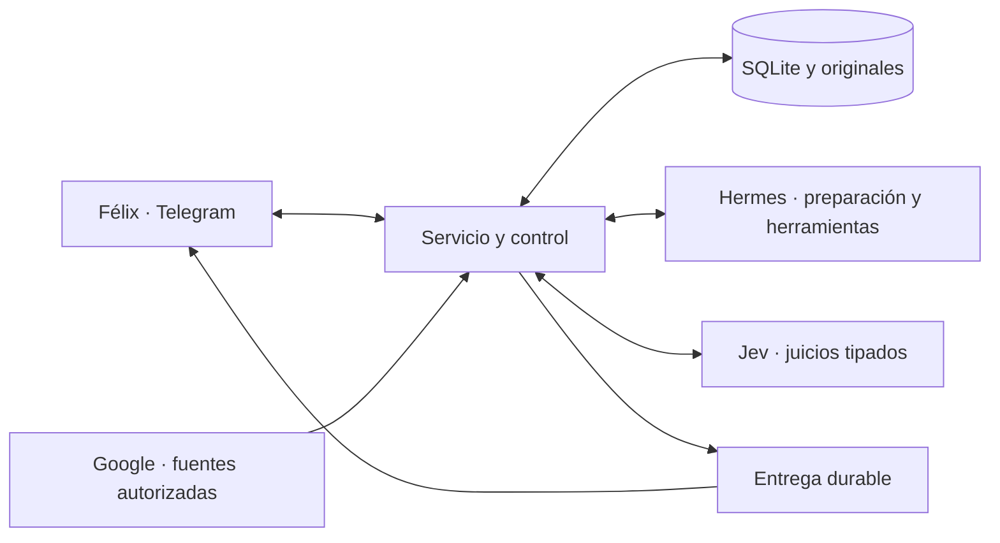

# GTD-Félix · guía de desarrollo desde el corte 2026-09-22

**Esta es la dirección vigente.** Sustituye la secuencia de encargos E1–E69 y el
plan de construcción I1–I5. La base de código conservada es `af0a023`; el corte
se identifica por la etiqueta Git `gtd-felix/corte-2026-09-22`. Es una línea de
desarrollo, no una versión aceptada en producción. No se reinician datos ni historia.

[ESTADO.md](ESTADO.md) contiene hechos, brechas y siguiente acción. Los contratos
exactos de herramientas están en
[operations.md](../../products/fxsl/gtd-operations/references/operations.md);
el esquema ejecutable está en
[store.py](../../products/fxsl/gtd-operations/runtime/gtd_felix/store.py).
La guía anterior se recupera con `git show af0a023:docs/gtd-felix/GUIA.md` cuando
una decisión necesite procedencia; no es una segunda cola de trabajo.

## 1. Producto y término

Un asistente personal para que Félix pueda **dejar una intención, recibir trabajo
útil, corregir, pausar y volver con contexto vigente**, principalmente por Telegram.
Capturar, aclarar, organizar, revisar y actuar sirven a ese propósito; no imponen
administrar una metodología, una flota o los componentes internos.

Un usuario, un host, un desarrollador. El resultado suficiente es ayuda cotidiana
útil y recuperable, reconocida por Félix. No exige terminar todas sus obligaciones
personales ni esperar un número arbitrario de días. Producción significa que el
conjunto ofrecido funciona, se puede controlar y se puede recuperar.

## 2. Alcance decidido

| Responsabilidad | Elección vigente |
|---|---|
| Interlocución | Telegram `@korax_kv_bot`; texto, lista, ficha, materiales y controles |
| Preparación y ejecución | Hermes principal; DeepSeek v4.1 Flash / OpenCode Go / max. Muse autorizado como alternativa, no sustitución automática |
| Juicios semánticos | Jev / TypeSafe / `jev-1.13.0`: sí/no, clasificación y puntuación por defecto |
| Estado y reglas | Servicio Python existente, SQLite, originales privados, un escritor |
| Fuentes | Gmail de la cuenta autorizada desde agosto de 2026; calendario principal y feriados de Chile. Turnos HSC excluido |
| Consumo | Una ejecución nativa global; 7.200 s diarios, día civil America/Santiago; reservas y descendientes de una misma familia |
| Delegación | Un ejecutor privado acotado para un encargo útil (G7), cuando corresponda; sin otra dirección ni flota |

Jev está elegido. No se abre otra campaña de modelos, benchmarks, corpus o canarios
para decidir su adopción. La orden de no hacer más tests ni experimentos se conserva;
no autoriza afirmar comprobaciones omitidas. Usar el producto y observar su salida
legítima no se reemplaza por generar solicitudes sintéticas.

Quedan fuera del cierre: multitenencia, otro host, microservicios, otro gestor de
tareas, panel web, nuevos canales, la antigua flota y expansión de formatos o voz.
Los formatos ya ofrecidos deben funcionar o declarar su límite. Claw sigue excluido.
Envíos y escrituras Google son efectos distintos de preparar material privado;
conservar sus controles sin exigir habilitarlos para cerrar este producto.

## 3. Desarrollo y autoridad

- Un responsable de integrar, un incremento activo y una salida utilizable.
  La sesión de construcción puede ejecutar directamente; delegar sólo una parte
  independiente y con dueño explícito cuando ahorre trabajo, no por ceremonia.
- Reutilizar autoridad ya concedida de desarrollo, instalación y publicación.
  No pedir aprobación técnica por cada paso. Eso no concede decisiones personales,
  mensajes a terceros, efectos institucionales ni aceptación del producto.
- Cada cambio resuelve una brecha del recorrido vigente o una condición real de
  operación/recuperación. Un incidente sólo entra si lo impide; mejoras ajenas se
  difieren sin crear otra lista exhaustiva.
- Ante repetición del mismo bloqueo sin nueva evidencia, reducir el alcance o
  revisar la causa; no producir otra sonda, reporte o capa por defecto. Un límite
  agotado no justifica elevarlo ni cambiar modelo silenciosamente.
- Fuente y configuración se instalan como conjunto identificable. Publicar código
  no equivale a instalarlo; instalarlo no equivale a que haya funcionado.
- No usar `gtd-flow` para construir. No abrir SQLite viva desde herramientas
  auxiliares. API propietaria y exportación consistente; secretos y datos privados
  fuera de Git. Preservar cambios ajenos y archivos no seguidos.

## 4. Contrato humano

- Original guardado antes del acuse, con identidad durable; la captura no espera
  al modelo. Una edición es revisión; un reintento no es otro asunto. Borrar un
  mensaje del chat no retira por sí solo un compromiso.
- Hilo, procedencia y pregunta previa conservan contexto: «todo esto» no vuelve a
  empezar. Una precisión parcial afecta su frente y permite avanzar los demás.
- Captura, propuesta, compromiso, referencia, acción, proyecto, espera y
  responsabilidad continua son distintos. Terminar una hija no cierra el padre;
  esperar identifica qué, de quién y bajo qué condición volver.
- La posición humana prevalece. No inferir consentimiento, energía, prioridades
  o diagnósticos del silencio. Descansar, renunciar y actuar personalmente son
  opciones válidas. Aprender una preferencia exige procedencia y revisión posible.
- Preparar produce material útil con hechos, propuestas y límites distinguibles.
  No se declara cumplimiento por enumerar brechas, redactar un plan o guardar un
  archivo. Consultas sin compromiso no fabrican tareas.
- Corrección versionada, deshacer focal y lotes conservan aportes y conflictos.
  Pausa del asunto y silencio de avisos son controles diferentes. Reanudar no
  legitima una respuesta antigua. Actuar en una ocurrencia no modifica una serie.
- Cita, plazo, revisión, recordatorio y ventana conservan su significado y zona.
  La zona del host no determina la ubicación de Félix. Posponer no borra un plazo;
  una revisión omitida no fabrica deuda ni una recurrencia inexistente.
- Acceso a fuentes no acredita cobertura completa. Cursor sólo avanza tras
  conservar obligaciones; cambio de fuente invalida sólo lo dependiente. Ruido
  queda en origen; no conservar el buzón indirectamente en transcripciones.
- Devolución antes del último momento útil, accesible y sin duplicados. Sin
  novedad útil, silencio; sin ráfagas obsoletas al reconectar. Revisar también
  proyectos silenciosos, esperas, posibilidades y responsabilidades.
- Toda escritura externa exige cuenta, destino, operación, ámbito y autoridad
  vigentes. Un reenvío o una fuente no dan permisos. Preparado, enviado, entregado,
  leído y aceptado son estados diferentes.
- Recuperación conserva capturas confirmadas, originales, permisos y efectos.
  No borrar pendientes únicos por antigüedad, importar datos clínicos identificables
  a resúmenes personales ni presentar coste desconocido como cero.
- Defaults históricos de horario, revisión o atención son hipótesis revisables,
  no preferencias ratificadas. No convierten al usuario en operador del sistema.

## 5. Arquitectura suficiente

Conservar el monolito modular y los adaptadores existentes. Un único servicio
posee el estado; Hermes, Jev, Telegram y Google son fronteras con contratos
concretos. No se reescribe el motor para incorporar un proveedor de juicio.

La cadena lógica es entrada → asunto con intención vigente → trabajo autorizado
→ preparación y juicio → material/evaluación → devolución. Una respuesta tipada
no ejecuta un efecto; cada paso posterior revalida su base y autoridad.

| Frontera | Entrada → salida | Pérdida o fallo que debe quedar visible |
|---|---|---|
| Canal → registro | Original identificado → captura durable | Fallo de guardado, repetición o edición |
| Estado → juicio | Evidencia actual + pregunta/opciones/rúbrica → juicio Jev | Insuficiencia semántica, error técnico y estado obsoleto distintos |
| Juicio → comando | Propuesta + versión + permiso → aplicado/conflicto/rechazado | El juicio no concede permiso ni acepta por Félix |
| Trabajo → material | Asignación y fuentes → aporte identificado | Parcial, ausente, agotado o cancelado conservan su sentido |
| Material → devolución | Resultado vigente → entrega identificada | Confirmación de transporte no prueba utilidad ni lectura |

**Jev:** un cliente HTTP directo compartido por Gmail y `gtd_decide`, sin SDK
adicional ni proceso propio. El principal selecciona evidencia y formula criterios;
Jev decide lo tipable; Hermes redacta, planifica y ejecuta lo autorizado.
No se requiere una consulta por cada pensamiento ni para releer una orden explícita.

Noul conserva probabilidad y una política inicial ≤0,2 no / ≥0,8 sí / intermedio
incierto; no se afirma calibración. Choice conserva catálogo y distribución,
con alternativa de insuficiencia cuando aplique; Score conserva rúbrica y valor,
sin fingir cantidad física. Fallo técnico no se convierte en «no» ni «ruido».
Sin fallback silencioso ni reintentos automáticos. Credencial privada sólo en el
servicio. Cálculos, permisos, presupuesto y fechas siguen en código.

## 6. Modelo de datos y base existente

**Se conserva el esquema v4 de 13 tablas de `store.py`.** No hay una migración
nueva justificada por este corte. El DDL ejecutable es la única especificación
física; se retira de esta guía la copia de un DDL de destino ya implementado.

| Concepto / almacenamiento | Identidad y relación que se preserva |
|---|---|
| Asunto · `items` | `id`, documento, versión y procedencia por campo; intención y compromiso humanos |
| Operación · `operations` | `operation_id`, huella, autor, recibo y parche; repetición idempotente |
| Entrada · `events` | Proveedor/cuenta/ID externo/revisión; original, procesamiento y causa distintos |
| Adquisición · `cursors`, `originals` | Cursor confirmado y bytes inmutables por digest; retención respeta dependencias |
| Fuente · `source_entries` | Proveedor/cuenta/colección/ID/revisión; adquisición, decisión, disponibilidad y vínculo al asunto |
| Trabajo · `work_cycles` | Causa única, asunto, propósito, autoridad, presupuesto y retorno |
| Intento · `runs` | Identidad local y nativa exacta, padre, admisión, estado e integración separados |
| Observación · `run_observations` | Run/secuencia; consumo acumulativo sin doble cargo |
| Resultado · `materials`, `assessments` | Material/versiones y juicio sobre base exacta; satisfacer no es aceptar humanamente |
| Devolución · `deliveries` | Identidad, canal, versión, estado y confirmación; no repetir lo confirmado |
| Control auxiliar · `metadata` | Políticas, mandatos y recibos existentes; Jev agrega recibos por identidad, no otra base |

`items.document` conserva campos humanos (`purpose`, `outcome`,
`completion_criteria`, `commitment`), estructura (`project_id`, `responsibility_id`,
`front`, `depends_on`, `relations`), plan/espera/decisión y tiempos separados.
`field_versions` conserva autoría; nulo/ausente no se rellena por conveniencia.
El dominio valida relaciones, ciclos y tipos; una relación no se deduce del título.
Los estados públicos `active/waiting/paused/postponed/done/withdrawn` conservan
compatibilidad; estado humano y estado del trabajo siguen siendo ortogonales.

Lecturas frecuentes por ID y página, sin deserializar el historial global.
Materiales/evaluaciones/fuentes tienen sus tablas autoritativas; stubs no son una
segunda verdad. No retirar compatibilidad o datos históricos por no aparecer en
una vista abreviada. La política de retención no borra evidencia única pendiente.

Una nueva tabla o migración sólo se justifica por una consulta, relación, volumen
o recuperación concretos; no por uniformidad estética. Las consultas de contexto
conservan correcciones y bases necesarias, declarando omisiones y acceso al detalle.

## 7. Control y continuidad de ejecución

- El servicio admite una causa identificada con propósito finito, versiones,
  autoridad, presupuesto y condición de retorno. Ni estar activo ni cambiar de
  día autorizan repetir una tentativa agotada. `trigger_key` deduplica la causa.
- Separar ciclo, intento nativo, observación e integración. Terminalidad nativa
  no demuestra resultado útil; material persistido no demuestra cierre del asunto.
- Plaza antes del efecto remoto. Incertidumbre conserva plaza y reserva hasta
  reconciliar; STOP solicitado no acredita detención. No abrir otro intento para
  esconder uno incierto ni duplicar el trabajo al reiniciar.
- Base de presupuesto: 7.200 s/día America/Santiago y reserva vigente de 240 s por
  trabajo salvo decisión posterior explícita. Hijos comparten período y asignación
  familiar; ni reservas ni observaciones acumulativas se cobran dos veces.
  Mientras la familia siga abierta/incierta se conserva el máximo entre reserva
  raíz y consumo; cerrada con terminalidad, queda el consumo observado.
- Jev consume tiempo dentro del trabajo padre, con uso separado en recibos. Una
  llamada no crea otro job ni renueva su presupuesto. Coste observado desconocido
  es NULL; imputación conservadora y factura son conceptos distintos.
- Avance propio no crea autoridad nueva. Agotamiento devuelve material parcial o
  una brecha concreta con retorno admisible. Continuar otro paso útil bajo la
  autoridad existente es válido; no convertir cada brecha en pregunta humana.
- Corrección/pausa invalida sólo lo dependiente. Acuse local tras commit y estado
  de detención visible; reanudar revalida. Captura/consulta/controles siguen
  disponibles durante inferencia si canal, host y almacenamiento funcionan.
- Cierre local integra evidencia y devolución de forma coherente; envío ocurre
  después. Preservar el material confirmado aunque falle otra parte del cierre.
- Recuperación compara código/configuración/datos, reconcilia antes de reanudar y
  conserva capturas posteriores por identidad; rollback no desenvía efectos.
- El ejecutor G7 recibe mandato acotado, fuentes mínimas y presupuesto familiar;
  entrega contribución, no acepta por Félix ni sustituye la dirección.

## 8. UX de Telegram

| Superficie | Qué debe permitir |
|---|---|
| Conversación | Una respuesta útil; contexto conservado; preguntar sólo lo que cambie la acción |
| Devolución | Resultado y límite relevante, `Ver material`, `Corregir`, `Pausar asunto` |
| Ficha | Resultado buscado, avance, decisión/espera, material vigente; editar, hecho, posponer, retirar/reabrir |
| Lista | Títulos reconocibles y estados en español, paginación completa, lote con resultado por elemento |
| Regreso | Qué cambió, material y siguiente paso vigentes; continuar, cambiar prioridad o mantener pausa |
| Saldo y avisos | Minutos y renovación comprensibles; pausa de avisos separada de pausa del trabajo |

Nada de IDs, `capture`, `active`, jobs o contabilidad interna en la conversación
normal. Diagnóstico disponible cuando se pida. Navegar no crea tareas. No exigir
aprender `/lista` para pausar: control directo desde devolución/ficha.
`Retomar` reabre el asunto; `/reanudar` sólo avisos. No botones sin función efectiva.

Material largo: encabezado breve y acceso al completo; entrega corta por segmentos
sin repetir confirmados. Material útil permite actuar o decidir y conserva fuentes,
fecha, autoría, brechas y alcance. Una minuta anticipada no inventa acuerdos.
La plantilla, nombre de archivo o número de palabras no acredita utilidad.

## 9. Trabajo desde este corte

**Orden por resultados integrados, con un solo incremento activo.** No se empieza
por reescribir el motor ni por recrear las fases I1–I5. Se conserva lo que ya sirve.

| Incremento | Trabajo mínimo completo | Salida que permite continuar |
|---|---|---|
| Instalación coherente | Diagnosticar y recuperar el gateway principal; integrar el candidato Jev con API/MCP/guard/instrucciones/configuración y recuperación existentes | Bot accesible, composición identificada, captura y controles disponibles; ruta de juicio preparada sin admisiones sintéticas |
| Un asunto útil completo | Usar una intención real vigente y sus fuentes; preparar material, juicio, integración y devolución; resolver las fricciones de corrección, pausa y regreso en ese mismo recorrido | Félix recibe algo utilizable y puede conducirlo sin administrar el sistema; cobertura parcial honesta cuando corresponda |
| Uso sostenido y cierre | Completar retorno/avisos, un encargo delegado útil G7 y recuperación de la entrega final, usando mecanismos existentes | C1–C6 y G1–G10 satisfechos en su alcance; límites operables y aceptación explícita |

Cada incremento termina en el conjunto integrado o en un impedimento concreto,
no en una sucesión de candidatos locales que nadie instala. El estado lleva sólo
brecha, acción y salida; evidencia privada necesaria se enlaza, no se transcribe.
No arreglar todos los asuntos de Félix para demostrar que el producto funciona.

**Primer encargo:** concretado en ESTADO; propiedad de la misma sesión que integra.
La autorización de desarrollo continúa. Este corte no reabre asuntos pausados,
no resucita plazos antiguos ni dispara una ejecución de dominio.

## 10. Aceptación C1–C6

Los identificadores se conservan para no perder obligaciones. Su estado se mantiene
sólo en ESTADO. Comprobación omitida se declara; no se inventa ni se sustituye
aceptación por autorización de diseño. Sin nuevos tests/experimentos en este corte.

| Criterio | Resultado suficiente |
|---|---|
| C1 · Continuidad | Captura sin LLM, saldo y plaza únicos, conexión renovable, degradación visible; reinicio/agotar/cambiar de día conservan identidad y pendientes |
| C2 · Recorrido humano | Entrada real y variante → preparación útil → corrección → pausa durante trabajo → regreso; controles claros y G7 mínimo recuperable |
| C3 · Fuentes pertinentes | Gmail selectivo incremental y agenda aportan; ruido en origen, originales suficientes, sin duplicados; cambios invalidan sólo dependientes; cobertura honesta |
| C4 · Retorno cotidiano | Resultados/materiales/resumen/avisos por el canal habitual antes del último momento útil, sin insistencia ni duplicados por pausa o reconexión |
| C5 · Entrega recuperable | Código, dependencias, configuración y datos identificados; recuperación/rollback de la entrega final y guía operable; comprobaciones pertinentes con alcance explícito |
| C6 · Uso y término | Félix usa, corrige, pausa, revisa y vuelve; reconoce utilidad; límites consultables y sin incidentes materiales abiertos en lo ofrecido |

Se reutiliza evidencia aplicable a la misma ruta y versión; no se reabre una
campaña histórica ni se transfiere un resultado de copia al vivo sin fundamento.
La observación de uso legítimo puede resolver varias condiciones a la vez.

## 11. Suficiencia G1–G10 conservada

| Criterio | Qué debe observarse |
|---|---|
| G1 · Destinos | Aclarar y organizar sin inventar compromiso; ambigüedad y originales conservados |
| G2 · Proyectos | Resultado, frentes, acciones, dependencias y brechas coherentes; una hija no cierra todo |
| G3 · Elegir | Próximo paso compatible con contexto, tiempo y capacidad declarados; no inferir preferencias |
| G4 · Revisar y volver | Vistas y proyectos silenciosos considerados; cobertura y juicio pendientes explícitos |
| G5 · Planificar | Propósito humano → plan y siguiente paso suficientes, sin metas o cuestionarios inventados |
| G6 · Fechas | Cita, plazo y retorno distintos; trabajo nuevo no fabrica deuda de otra lista |
| G7 · Delegar | Un ejecutor acotado útil; solicitud, aceptación, entrega y satisfacción separadas; corrección prevalente |
| G8 · Reiniciar | Estado, originales, materiales, autoridad y cobertura recuperados; principal independiente de la flota |
| G9 · Resolver | Trabajo y cierre bajo mandato; cesa al satisfacerlo y propone lo que lo excede |
| G10 · Adaptar | Cambios invalidan sólo dependientes; autoría conservada; silencio si no hay novedad útil |

Impiden aceptación: pérdida de un guardado, sustitución de decisión humana,
efecto sin autoridad/identidad, repetición incierta, borrado de pendiente único,
falsa exhaustividad, gasto fuera del límite u ocultar detención incierta.

## 12. Disciplina y fundamento del corte

**Antiburocracia:** GUIA decide; ESTADO informa hechos y siguiente paso; HANDOFF
sólo orienta el arranque. Contratos de herramientas junto al producto; DDL en
código; evidencias privadas fuera de Git. No nuevos reportes seriados ni inventarios
paralelos. Un commit por intención, no por cada archivo o comprobación.

**Anti sobreingeniería:** reutilizar servicio, tablas, adaptadores y recuperación.
Añadir una pieza sólo cuando una necesidad concreta no cabe razonablemente ahí.

**Anti deriva:** terminar el recorrido activo; incidentes ajenos y perfeccionamientos
no lo sustituyen. La elección de Jev está cerrada. La evidencia histórica es
consultable, no una lista de trabajos obligatorios.

**Anti sobresimplificación:** conservar identidad, procedencia, autoridad, versiones,
dependencias, presupuesto, fallos y recuperación. Reducir documentación o código no
permite borrar esas distinciones ni afirmar capacidades todavía no realizadas.

Aplicación de cat-thinking: **M** = modelo de interfaces y efectos bajo hipótesis;
**H** = criterio de ingeniería; **E** = observación situada con evidencia en ESTADO.
No se afirma un teorema, equivalencia conductual ni garantía formal (F).

- **M/H · composición:** cada tramo necesita entrada/salida, protocolo, error y
  autoridad compatibles. Candidato, instalado y observado son planos distintos.
  Trazas: `urn:kora:kb:cat-programacion-agentica-autonoma` §§2.5, 4.4–4.5;
  `urn:fxsl:kb:icas-protocolos` §Errores en protocolos distribuidos.
- **H · preservación:** el corte retira el plan histórico, conserva datos y
  obligaciones; comparar lo observable antes de atribuir equivalencia.
  Traza: `urn:fxsl:kb:icas-preservacion` §Candidatos en la ingeniería cotidiana.
- **H · progreso:** componentes correctos no aseguran ayuda útil; cada incremento
  cierra una brecha del recorrido y tiene término. Un timeout no prueba detención.
  Traza: `urn:kora:kb:cat-programacion-agentica-autonoma` §§14.1–14.4.
- **H · evolución:** mantener una base identificada y avanzar por comportamiento
  integrado. Reescritura total pierde activos sin necesidad demostrada; prolongar
  los encargos numerados conserva la deriva. Se elige evolución focal.
  Traza: `urn:fxsl:kb:icas-lifecycle` §§Evolución y drift, Todo tiene un ciclo de vida.
