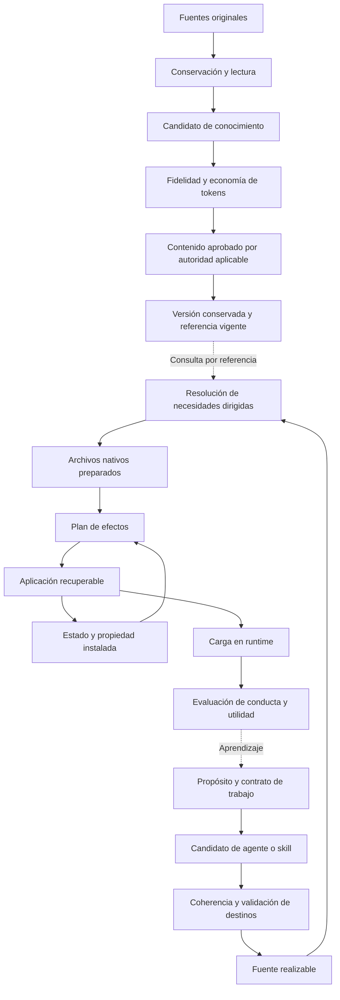

# KORA: especificación de la versión de oro

Fecha: 2026-09-10. Estado: **contrato de destino confirmado por Félix**.

Este documento especifica qué debe ser KORA y cómo reconocer que lo cumple. Se
elabora desde su propósito, incorporando la evaluación de la maquinaria y la
revisión completa de ALM, KHM, ADP, SFD y STS. La implementación existente aporta
evidencia y restricciones de transición; no determina la forma de la solución.

La especificación no declara que estas capacidades estén implementadas ni convierte
los antecedentes históricos en instrucciones vigentes. Tampoco modifica por sí
sola la autoridad para publicar conocimiento, operar un runtime o actuar en una
institución. La operación actual sigue descrita en [operacion.md](operacion.md).

El destinatario es Félix como dueño, desarrollador y operador de KORA, con sus
agentes de trabajo. El resultado esperado es una base única para decidir su
diseño y aceptar sus realizaciones.

**Contexto de diseño fijado por Félix:** red segura, un desarrollador y un usuario
(mono-dev y mono-user). Los agentes y procesos actúan para ese mismo operador.
El consumidor principal del conocimiento koraficado es el **LLM**: se busca la
menor cantidad de tokens practicable **sin perder información del contenido del
original**. Burocracia, sobreingeniería y deriva circunstancial son defectos de
diseño que deben corregirse, no costos inevitables del rigor.

## 0. Cómo leer y utilizar esta especificación

Los requisitos identificados expresan decisiones **confirmadas**. «Debe» indica
una condición necesaria para declarar conformidad con este diseño; «puede» deja
una opción. Los antecedentes distinguen hechos observados, inferencias y
decisiones. Un ejemplo ilustra el contrato y no impone una sintaxis de manifiesto,
un nombre de comando ni una estructura de módulos.

Los requisitos definen el comportamiento esperado; los escenarios del capítulo
22 reúnen su aceptación. Se seleccionan las comprobaciones que acrediten el
resultado o cubran un riesgo concreto del cambio. Una misma evidencia puede
cubrir varios requisitos. La conducta se observa en el runtime y las propiedades
deterministas pueden comprobarse sin un modelo. Los anexos conservan antecedentes
y procedencia para consulta puntual; no agregan requisitos de operación.

Este documento orienta el diseño; no es una lista de trámites, un esquema de
metadatos ni un prompt para cargar completo en cada agente o conocimiento. Sus
distinciones no exigen roles humanos separados, servicios, registros ni etapas
separadas. La profundidad documental responde al encargo de especificación; la
operación cotidiana debe conservar el menor recorrido completo.

La conformidad se declara para un alcance explícito: versión de maquinaria,
productos y revisiones, bibliotecas, destinos, sistema operativo y capacidades
efectivamente examinadas. Un componente conforme no vuelve conforme al conjunto.

### Recorrido del documento

| Capítulos | Pregunta que resuelven |
|---|---|
| 1–3 | Para qué existe KORA, qué objetos administra y quién puede decidir. |
| 4–8 | Cómo conserva fuentes, transforma conocimiento y permite utilizarlo. |
| 9–12 | Qué hace valioso a un agente o skill y cómo se compone y autora. |
| 13–16 | Cómo se realiza, actualiza, instala y recupera. |
| 17–21 | Cómo se comprueba, opera, protege y mantiene. |
| 22–23 | Qué recorridos deben funcionar y qué arquitectura lógica los sostiene. |
| 24 | Cuándo puede llamarse versión de oro y qué decisiones quedan para la implementación. |
| Anexos A–B | Procedencia histórica y fundamento de decisiones; consulta opcional. |

## 1. Propósito, resultados y límites

**PUR-01 — Propósito central.** KORA debe transformar fuentes heterogéneas en
conocimiento denso en información para consumo por LLM, minimizando tokens sin
pérdida informativa; convertir propósitos de trabajo en agentes y skills útiles;
y realizarlos en Codex y Hermes. Las tres funciones deben componer un recorrido
completo y simple para Félix, conservando sus diferencias de significado.

**PUR-02 — Beneficio para el operador.** Debe disminuir trabajo repetido de
reconstrucción, selección de fuentes, preparación de instrucciones, instalación
y diagnóstico. La evaluación debe considerar el trabajo total que Félix necesita
para obtener y sostener resultados, incluido el esfuerzo de corregir al sistema.

**PUR-03 — Resultado suficiente.** Una capacidad debe tener destinatario,
problema concreto, resultado verificable y condición de término o continuidad.
La existencia de un archivo, una identidad, una personalidad convincente o una
instalación exitosa no constituye por sí sola valor entregado.

**PUR-04 — Independencia útil.** La maquinaria debe poder operar desde una copia
de sus fuentes y dependencias declaradas. La biblioteca debe poder consultarse
sin instalar agentes. Las operaciones deterministas de conservación, consulta,
validación y realización deben poder ejecutarse sin proveedor de modelos.

**PUR-05 — Entorno y alcance.** KORA opera en una red segura, para un desarrollador
y un usuario: Félix. Puede haber varias sesiones, agentes y procesos suyos. Los
destinos son Codex y Hermes. No se diseñarán multiusuario, multitenencia, gestión
de identidades, segregación de cargos, alta disponibilidad ni coordinación
distribuida sin un cambio explícito de necesidad y alcance.

**PUR-06 — Economía de diseño.** Debe preferirse la menor solución completa que
satisfaga el propósito. Toda nueva abstracción, dependencia, verificación, registro
o paso debe atender una necesidad presente o un riesgo concreto y aportar más
valor que costo total. Se deben retirar pasos redundantes, derivar lo derivable
y evitar convertir un incidente, una preferencia de un dominio o una posibilidad
futura en una obligación general. Esta evaluación no requiere otro formulario.

## 2. Modelo conceptual, identidad y procedencia

**OBJ-01 — Distinciones básicas.** El modelo debe distinguir, al menos, fuente
original, extracción, conocimiento en preparación, revisión publicada, agente,
skill, recurso técnico, realización nativa e instalación. No exige una clase o
archivo por concepto; exige no confundir sus significados ni ciclos de vida.

**OBJ-02 — Identidad estable.** Cada producto o referencia reutilizable debe
tener una identidad independiente de su ubicación, nombre visible y destino.
Renombrar o trasladar un archivo no debe crear silenciosamente otra identidad.
Las colisiones deben diagnosticarse antes de resolver de forma ambigua.

**OBJ-03 — Identidad y revisión.** Una identidad designa el objeto a lo largo del
tiempo; una revisión designa un contenido exacto. Debe ser posible solicitar la
revisión vigente o una revisión determinada y reconocer cuál se obtuvo. Una
revisión observada no debe reconstruirse a partir de «lo último».

**OBJ-04 — Procedencia suficiente.** Debe poder reconstruirse de qué originales,
revisiones, recursos y transformaciones proviene un artefacto. La procedencia
debe conservar identificadores y localizadores útiles, huellas de contenido
cuando corresponda, fecha de obtención y límites de acceso o extracción.
La procedencia documental y los recibos se conservan en el soporte del artefacto,
separados del cuerpo de conocimiento, sin duplicarlos como texto koraficado.
Los datos necesarios para identificar, resolver o citar se consultan desde ese
soporte; no requieren otra ficha ni un nuevo registro paralelo.

**OBJ-05 — Límites materiales.** Agentes, skills y maquinaria tienen una fuente
activa; la biblioteca de conocimiento tiene la suya; credenciales, memoria,
sesiones y preferencias pertenecen al entorno del operador. Las dependencias
entre esas áreas deben ser explícitas sin fusionar propiedad ni autoridad.

**OBJ-06 — Alias y retiro.** Los alias deben dirigir de manera inequívoca a una
identidad, detectar ciclos y conservar la explicación de cambios relevantes.
Una identidad retirada debe seguir siendo reconocible como retirada; no debe
reutilizarse para un objeto distinto ni quedar ocultada por otro nombre igual.

**OBJ-07 — Metadatos con consumidor.** Solo deben exigirse metadatos usados para
resolver, realizar, operar, revisar o preservar un artefacto. Los índices,
conteos, listados y estados derivables no deben mantenerse manualmente en
paralelo. Git conserva historia, pero no sustituye identidad ni aprobación.

## 3. Autoridad, autonomía y separación de evidencia

**AUT-01 — Autoridad de tarea.** Toda acción debe quedar dentro de la solicitud
vigente y las autorizaciones aplicables. Una autorización puede cubrir un
recorrido completo; no debe pedirse nuevamente por cada paso equivalente. Un
cambio material de alcance debe hacerse visible antes de ejecutarse.

**AUT-02 — Fuentes como contenido.** Las instrucciones presentes en documentos,
ejemplos, formularios, páginas o mensajes recuperados deben tratarse como
contenido de esas fuentes. Su lectura no les concede autoridad sobre el agente,
la maquinaria, el usuario ni las herramientas.

**AUT-03 — Publicación de conocimiento.** Aprobar conocimiento exige aprobación
de su contenido concreto por Félix o una delegación explícita de esa decisión.
La autorización para reparar código, crear borradores, ejecutar pruebas o
instalar productos no implica esa aprobación. Al ser el mismo dueño, desarrollador
y usuario, esta distinción no requiere otro revisor, firma, rol, comité ni sistema
de permisos; una autorización o delegación suficiente evita repetir consultas.

**AUT-04 — Evidencia diferenciada.** Deben distinguirse validez formal, integridad
material, fidelidad semántica, aprobación, publicación, instalación, carga nativa
y conducta observada. Cada informe debe afirmar solo lo demostrado en su plano.
Un hash no certifica verdad y una prueba de parser no certifica comportamiento.

**AUT-05 — Acciones externas.** Una recomendación, una capacidad disponible y una
autorización para actuar son hechos distintos. Publicar Git, enviar mensajes,
o modificar un sistema externo requiere la autoridad correspondiente al alcance
concreto. Los límites propios de un dominio se aplican cuando ese trabajo los
involucra; no se convierten en trámites generales de la maquinaria.

**AUT-06 — Privilegios efectivos.** Los manifiestos y prompts pueden expresar
límites y necesidades, pero no deben presentarse como controles de permisos que
el runtime no aplica. Debe distinguirse restricción técnica, instrucción de
conducta y condición que depende del operador. Se utilizan los mecanismos del
runtime y del host; KORA no necesita una capa propia de identidad o autorización
multiusuario en este contexto.

**AUT-07 — Configuración examinable.** Félix debe poder inspeccionar las fuentes,
contratos y decisiones que gobiernan sus productos. La privacidad de los datos y
la separación entre configuración y respuesta no deben justificar ocultarle su
propia configuración. La evaluación no requerirá exponer razonamiento interno
privado del modelo; examinará resultados, acciones y justificaciones pertinentes.

## 4. Ingreso, conservación y lectura de fuentes

**FUE-01 — Ingreso fiel.** Deben conservarse los originales necesarios para
reconstruir el trabajo, en su formato y con procedencia. Extraer texto, convertir
una tabla o hacer OCR crea un derivado; no reemplaza silenciosamente el original.

**FUE-02 — Estado de acceso.** Deben distinguirse recurso encontrado, bytes
obtenidos, contenido extraído, contenido leído y contenido revisado. Un enlace
válido, una respuesta HTTP exitosa o una extracción vacía no acreditan lectura.
Las restricciones de acceso deben acompañar el resultado que limitan.

**FUE-03 — Cobertura heterogénea.** La lectura debe contemplar texto, tablas,
imágenes, diagramas, notas, anexos, formularios y recursos enlazados cuando
contengan significado necesario. La técnica de extracción se elige según el
recurso. Se extrae el contenido informativo de una figura o tabla; describir
que ocupaba un lugar en la página no lo sustituye. Los elementos decorativos
no requieren transcripción. La ilegibilidad que limite la cobertura se registra
como incidencia de extracción, fuera del cuerpo de conocimiento.

**FUE-04 — Versiones y contexto.** Deben conservarse autoría atribuida, fecha,
versión, jurisdicción o ámbito, vigencia declarada y localizadores internos
cuando sean relevantes. Los atributos documentales pertenecen a la procedencia;
las condiciones que determinan el significado, alcance o aplicación de una
afirmación forman parte de su contenido y se conservan con ella. En fuentes
vivas se identifica qué recurso o vista se obtuvo efectivamente. No se imponen
campos vacíos ni se convierten los datos de conservación en conocimiento.

**FUE-05 — Duplicados y divergencias.** El sistema puede reutilizar originales
idénticos verificados. Debe mantener diferenciados documentos parecidos con
contenido, período o autoridad distintos y conservar contradicciones materiales
sin resolverlas por orden de llegada o semejanza de nombres.

**FUE-06 — Reanudación.** Una ingestión o revisión interrumpida debe conservar el
avance útil y distinguir lo completado de lo pendiente. Reanudar no debe requerir
releer por defecto todo el corpus ni atribuir lectura a unidades no examinadas.

## 5. Koraficación para LLM: mínimos tokens sin pérdida informativa

**KOR-01 — Destinatario y objetivo.** Koraficar debe producir conocimiento para
consumo por LLM con la menor cantidad practicable de tokens, conservando toda la
información del contenido del original. La reducción se obtiene transformando
la expresión y la organización, no seleccionando solo lo considerado importante.
Un resumen selectivo requiere otro encargo y no satisface este contrato integral.

El objeto de la koraficación es el **contenido de conocimiento de la fuente**.
Quedan fuera de ese cuerpo los metadatos documentales, la descripción de su
presentación y los comentarios de extracción: logos decorativos, paginación,
encabezados editoriales repetidos o frases como «aquí iba un logo del SSÑ».
Se omiten sin dejar marcadores de su ausencia. Esta delimitación rige las
afirmaciones de integridad de la especificación: preservar todo el contenido
no significa reproducir la envoltura documental.

**KOR-02 — Cobertura informativa.** Debe reconocerse qué información aportan las
afirmaciones, relaciones, procedimientos, tablas, ejemplos, restricciones y
anexos. Cada aporte informativo debe conservarse. Una repetición puede factorizarse
si no añade énfasis significativo, alcance, evidencia o contexto distintos.
El control de cobertura puede ser una comparación directa; no exige un inventario
separado por oración ni copiar el original en un registro de revisión.

**KOR-03 — Equivalencia semántica.** Deben preservarse hechos, cifras, unidades,
nombres, condiciones, excepciones, negaciones, secuencias, causalidad, modalidad,
grado de certeza, contexto y detalles de ejemplos que aporten información. Se
conservan también contradicciones y errores presentes en la fuente como tales.
El formato o la redacción literal se preservan cuando portan significado o cuando
el contenido depende de su exactitud. Las relaciones expresadas visualmente se
conservan como conocimiento; las descripciones de maquetación y presencia de
elementos decorativos quedan fuera conforme a KOR-01.

**KOR-04 — Economía medida en tokens.** Deben compararse tokens, no palabras,
caracteres ni bytes, con el mismo tokenizer identificado y sobre entradas
comparables. Se mide la representación completa necesaria para su consumo,
incluidos encabezados, etiquetas, glosarios, instrucciones de lectura y referencias
auxiliares que el LLM deba cargar. Se reduce ese total sin sacrificar fidelidad.
Si no puede medirse el tokenizer del destino, una medición alternativa debe
declararse como aproximación y no como ahorro exacto en ese destino.

**KOR-05 — Fidelidad sin aportes encubiertos.** El conocimiento koraficado debe
conservar lo que dice la fuente. Inferencias, correcciones, explicaciones o
ejemplos nuevos pueden acompañarlo cuando sean útiles y estén autorizados, con
su carácter añadido visible. No deben reemplazar contenido original ni contaminar
su significado. Aclarar una contradicción no permite suprimirla del registro de
lo que la fuente afirma.

**KOR-06 — Representación eficiente para el modelo.** Se elige prosa densa,
estructura telegráfica, listas, tablas, esquemas u otra representación que el
LLM pueda interpretar de forma fiable con menos tokens. Se favorecen eliminación
de relleno, factorización de información repetida y relaciones explícitas. Las
abreviaturas y claves solo sirven si el ahorro neto incluye su interpretación.
Una notación críptica, un glosario costoso o un formato obligatorio para toda
fuente no se justifican por parecer compactos.

**KOR-07 — Composición sin pérdida desplazada.** Puede distribuirse el contenido
en unidades consultables y evitar repeticiones mediante referencias resolubles.
El conjunto koraficado debe conservar toda la información; una remisión al
original no sustituye información omitida. Cada unidad cargada debe incluir o
recuperar el contexto necesario para interpretar sus reglas y excepciones.
La selección de unidades para una consulta reduce contexto de esa consulta, pero
no demuestra por sí sola compresión del original completo.

**KOR-08 — Revisión de fidelidad y consumo.** La comparación con el original debe
buscar omisiones, alteraciones y ambigüedades introducidas por la compresión.
Debe detectar también metainformación documental o comentarios de extracción
incorporados indebidamente al cuerpo de conocimiento.
Las representaciones nuevas o dudosas deben probarse con consultas que permitan
al LLM recuperar las distinciones que podrían haberse perdido. Se reutiliza un
formato ya contrastado cuando corresponda; no se exige un benchmark completo
por cada documento. La revisión cubre todo el contenido para afirmar integridad;
los casos conductuales focales complementan esa comparación, no la reemplazan.

**KOR-09 — Resultado y límite de la optimización.** Debe quedar disponible la
medición de tokens y la condición real de fidelidad y cobertura, sin imponer
que ese recibo se cargue con el conocimiento. La minimización es práctica:
se adopta la representación más económica entre las alternativas pertinentes
que conserven información e interpretación fiable. No se promete un mínimo
matemático global, un porcentaje universal ni una búsqueda indefinida de mejoras
marginales. Si la fuente ya es compacta o falta lectura, se informa el límite.

**Criterio de optimización.** Para una misma fuente y un tokenizer identificado,
minimizar tokens de la representación consumible completa, sujeto a preservar
toda la información de su contenido de conocimiento y hacerla accesible al LLM.
La base de comparación es una representación fiel de ese contenido, delimitado
según KOR-01. El tamaño binario de un PDF, una extracción incompleta o los
comentarios sobre logos no sirven para inflar el denominador. Eliminar envoltura
documental no demuestra por sí solo compresión del contenido.

La comparación registra el costo del conjunto completo y, cuando haya carga
selectiva, el de las unidades necesarias para una consulta representativa.
Mover texto a un glosario obligatorio o a varios archivos no lo elimina del costo.
Los originales conservados para procedencia y los recibos de operación no cuentan
como contexto si el LLM no necesita cargarlos para comprender el conocimiento.

## 6. Formularios, esquemas y recursos técnicos

**FOR-01 — Definición y respuesta.** Debe distinguirse el esquema de un formulario
de cada instancia completada. Una plantilla vacía no es un registro clínico,
administrativo o personal y no debe adquirir valores inferidos al transformarse.

**FOR-02 — Equivalencia funcional.** Deben conservarse campos, tipos, etiquetas
necesarias, obligatoriedad, opciones, valores predeterminados, unidades, rangos,
restricciones, dependencias, lógica condicional y grupos repetibles. El orden se
preserva cuando afecta interpretación o ejecución.

**FOR-03 — Semántica de valores.** Ausente, vacío, cero, falso, desconocido y no
aplica deben permanecer diferenciados cuando lo estén en el original. El sistema
no debe convertir una respuesta omitida en negativa ni una fecha incompleta en
una fecha supuesta.

**FOR-04 — Ambigüedades de origen.** Condiciones incompatibles o restricciones
contradictorias deben señalarse para resolución. Una versión funcional propuesta
puede aclararlas, pero debe distinguir qué corrigió, con qué fundamento y quién
puede adoptar esa corrección.

**FOR-05 — Reutilización nativa.** Código, esquemas, hojas, consultas y plantillas
ejecutables deben conservar el formato necesario para su uso y su licencia o
restricción aplicable. Una explicación en Markdown puede acompañarlos; no debe
declararse equivalente al recurso operativo sin comprobar esa equivalencia.

**FOR-06 — Comprobación de comportamiento.** La aceptación debe incluir entradas
válidas, inválidas, condicionales y de borde del recurso. Un parser comprueba
sintaxis; la equivalencia funcional exige examinar qué admite, rechaza, calcula
o solicita la representación resultante.

## 7. Ciclo de vida y publicación del conocimiento

**PUB-01 — Estados con significado.** Deben distinguirse ingreso, preparación,
revisión, aprobación, publicación, sustitución y retiro. Esos estados expresan
hechos del ciclo de vida; no requieren una burocracia ni un archivo por etapa.

**PUB-02 — Revisión identificada.** Una revisión debe fijar el contenido concreto,
los recursos que lo integran y su revisión base. Cambiar cualquiera de esos
elementos relevantes después de revisarlo invalida la autorización ligada a
aquella revisión y requiere examinar el cambio.

**PUB-03 — Publicación protegida.** Solo puede hacerse vigente el contenido
concreto aprobado. La operación debe detectar cambios concurrentes de la base,
conservar la nueva versión completa y cambiar la referencia de manera que no
exponga una versión parcial.

**PUB-04 — Continuidad durante revisión.** Preparar o revisar una versión nueva
debe mantener disponible la publicada. Un borrador no debe aparecer como vigente
en consultas ordinarias, ni retirar el conocimiento válido durante el trabajo.

**PUB-05 — Versiones conservadas.** Las revisiones publicadas deben ser inmutables
y verificables. Una corrección se expresa mediante otra revisión o mediante un
retiro explícito. No se reescribe una versión publicada ni se altera su aprobación
para acomodar el estado posterior.

**PUB-06 — Herencia honesta.** El material heredado puede permanecer utilizable
con una condición de procedencia como `legacy`. Migrarlo, calcularle una huella
o instalar consumidores no debe atribuirle una aprobación retrospectiva.

**PUB-07 — Dependencias de versiones.** La publicación debe verificar que sus
dependencias obligatorias resuelven según la política declarada. Un consumidor
que siga la referencia vigente podrá ver nuevas revisiones; uno que necesite
reproducibilidad debe fijar revisiones. Ambas políticas deben ser visibles.

**PUB-08 — Retiro e impacto.** Retirar conocimiento debe identificar consumidores
afectados, motivo y posibilidad de sustitución. La historia debe conservarse en
la medida permitida por sus condiciones de privacidad y conservación. Un retiro
no debe fingirse como simple ausencia ni propagar borrados de productos.

## 8. Catálogo, descubrimiento y resolución

**CAT-01 — Catálogo derivado.** El catálogo debe obtenerse de las fuentes activas
y sus referencias. Una caché puede acelerar operaciones, pero debe ser
reconstruible, detectar su desactualización y no convertirse en otra fuente
manual de identidad, aprobación o estado instalado.

**CAT-02 — Descubrimiento por necesidad.** Debe poder encontrarse un artefacto por
identidad, nombre, tipo, propósito, ámbito y relación pertinente. Los resultados
deben ayudar a elegir, mostrando diferencias útiles y disponibilidad. Una
búsqueda semántica puede sugerir candidatos; no debe inventar identidades.

**CAT-03 — Resolución exacta.** Una vez elegida la identidad, la resolución debe
ser inequívoca y devolver tipo, revisión resuelta, ubicación y estado relevante.
La interfaz ofrecida a un consumidor debe poder resolver tanto productos de la
maquinaria como referencias de la biblioteca, usando las raíces seleccionadas.

**CAT-04 — Disponibilidad honesta.** Ausente, inaccesible, mal formado, retirado,
ambiguo y disponible sin aprobación acreditada son condiciones distintas. La
resolución no debe convertirlas en «no encontrado» ni elegir una alternativa
parecida sin informar el cambio.

**CAT-05 — Consulta sin efectos.** Listar, buscar, resolver y analizar impacto no
deben instalar, publicar, ejecutar código de los recursos ni cambiar contenido.
Los borradores solo deben aparecer cuando se solicite explícitamente ese ámbito.

**CAT-06 — Fallas contenidas.** Una operación focal debe continuar si puede
demostrar que un defecto ajeno no afecta su identidad, dependencias ni destinos.
Si el defecto impide descartar una colisión o evaluar el alcance de forma segura,
debe detenerse explicando esa incertidumbre. La comprobación global debe
reportar todos los defectos independientes que pueda examinar.

**CAT-07 — Selección trazable.** El consumidor debe poder justificar por qué usa
una fuente y qué alcance le atribuye. La selección debe considerar pertinencia,
procedencia, versión y autoridad; la familiaridad con un nombre o un mapa temático
no sustituye la lectura del contenido necesario.

## 9. Contrato de agentes y autoría de personalidad

**AGE-01 — Razón de existir.** Un agente debe tener propósito persistente,
destinatario, ámbito de responsabilidad y ventaja esperada frente a una
instrucción breve o una skill. Si solo empaqueta un procedimiento ocasional,
debe evaluarse si corresponde una skill antes de crear otra identidad de agente.

**AGE-02 — Contrato observable.** Su definición debe precisar entradas relevantes,
resultados utilizables, acciones posibles, condiciones de suficiencia,
incertidumbres y límites. Puede expresar flujos o estados cuando ayuden, pero
no debe imponer una máquina de estados artificial a toda conversación.

**AGE-03 — Juicio y personalidad.** La personalidad debe traducirse en prioridades,
criterios de decisión, atención, desacuerdo, estilo y adaptación observables.
Un nombre prestigioso, una biografía o terminología especializada no acreditan
competencia. Las personas inspiradas en figuras deben conservar su carácter
sintético sin atribuirse identidad ni autoridad de la persona real.

**AGE-04 — Conducta con información insuficiente.** El agente debe reconocer qué
sabe, qué infiere y qué falta. Debe resolver vacíos menores mediante supuestos
revisables y pedir aclaración cuando pueda cambiar una decisión material,
continuando el trabajo independiente que siga siendo útil.

**AGE-05 — Herramientas efectivas.** Debe declarar las capacidades necesarias para
sus acciones y comprobar su disponibilidad cuando sean pertinentes. Mencionar una
herramienta no la habilita. Si falta una capacidad, debe explicar el límite,
usar una alternativa autorizada o precisar qué permite continuar.

**AGE-06 — Activación y continuidad.** La activación en la conversación actual
debe distinguirse de la ejecución como agente delegado. El producto debe indicar
qué contexto necesita recuperar, qué puede asumir y qué conserva al cambiar de
tarea o reanudar una interrupción. No debe reiniciar por rutina un trabajo activo.

**AGE-07 — Autonomía proporcionada.** Debe llevar el trabajo autorizado hasta un
resultado suficiente y comprobado, evitando tanto la pasividad como la ampliación
de alcance. Debe informar avances materiales y detenerse cuando se cumpla el
propósito o falte una condición real para continuar.

**AGE-08 — Composición sin contradicciones.** El agente debe conservar coherencia
entre su cuerpo, métodos exigidos, referencias, herramientas y límites. Una skill
puede aportar un procedimiento; no puede ampliar por sí sola la autoridad de la
tarea ni introducir obligaciones incompatibles sin que el conflicto se resuelva.

**AGE-09 — Contexto con propósito.** La definición debe cargar de forma fiable
identidad y límites esenciales y recuperar métodos, conocimiento y ejemplos
según el trabajo. Debe evitar prólogos, doctrina repetida y metadatos operativos
en el contexto del modelo. La carga gradual debe preservar instrucciones y
relaciones necesarias; se mide su costo total antes de considerar que ahorra
tokens. La extensión de un cuerpo no acredita por sí sola calidad ni defecto.

## 10. Contrato de skills

**SKL-01 — Unidad de reutilización.** Una skill debe resolver una clase reconocible
de tareas mediante un procedimiento reutilizable. Su alcance debe ser lo bastante
coherente para explicar cuándo aporta valor, qué necesita y qué entrega.

**SKL-02 — Activación pertinente.** Debe describir condiciones de uso y límites
suficientes para seleccionarla. La coincidencia de una palabra no debe obligar a
cargarla si no aporta al trabajo. La invocación explícita del usuario debe
atenderse conforme a su intención y a la disponibilidad real.

**SKL-03 — Procedimiento completo.** Debe incluir la secuencia o criterios
necesarios para producir el resultado, reconocer fallas y cerrar. No debe
reemplazar instrucciones útiles por enlaces que el consumidor no puede abrir,
ni exigir rituales cuyo cumplimiento no cambia el resultado.

**SKL-04 — Recursos accesibles.** Los scripts, ejemplos, plantillas y referencias
necesarios deben estar disponibles en la realización o ser resolubles mediante
un mecanismo declarado. Sus rutas deben funcionar desde el contexto efectivo
de ejecución, incluido un directorio de trabajo distinto al del producto.

**SKL-05 — Efectos de helpers.** Todo helper ejecutable debe tener entradas,
salidas, dependencias y efectos comprensibles. Debe distinguir consulta de
mutación, conservar datos relevantes y devolver errores utilizables. Leer una
skill o preparar su instalación no debe ejecutar sus helpers.

**SKL-06 — Autonomía de uso.** Una skill compartida debe poder utilizarse fuera
del agente que la originó, salvo que declare una dependencia de contexto
indispensable. No debe duplicar una personalidad completa ni depender de
instrucciones tácitas conocidas solo por su autor.

**SKL-07 — Contrato de cierre.** Debe explicar cómo reconocer el resultado
suficiente, qué comprobar según sus consecuencias y qué informar si falta una
condición. La exigencia de planificación, aprobación o documentación debe
responder al trabajo, sin agregarse a toda invocación por defecto.

## 11. Dependencias y composición

La distinción siguiente es semántica; puede implementarse con un esquema pequeño.
No exige crear siete clases de relaciones si los datos existentes permiten
expresar inequívocamente los efectos.

| Relación semántica | Obligación que introduce | Efecto que no se presume |
|---|---|---|
| Necesita producto realizable | Hacer disponible el agente o skill requerido, compatible con el destino. | Ejecutarlo automáticamente. |
| Necesita conocimiento | Resolver una referencia o revisión consultable. | Copiarla a cada instalación o reinstalar a todos sus lectores. |
| Necesita capacidad | Verificar una herramienta o posibilidad del runtime para la acción pertinente. | Otorgar credenciales o permisos. |
| Necesidad condicional | Satisfacer la necesidad al entrar en el caso declarado, o detener ese recorrido. | Disponibilidad accidental por una instalación global. |
| Relación opcional | Ayudar a descubrir o componer si el caso lo justifica. | Instalar o imponer su uso. |
| Cita o procedencia | Conservar un vínculo explicativo o documental. | Convertir el destino en dependencia operativa. |
| Delegación prevista | Definir un posible reparto de trabajo y su integración. | Crear un agente hijo por el hecho de estar mencionado. |

**DEP-01 — Dirección y tipo.** Cada necesidad debe indicar qué consumidor depende
de qué objeto o capacidad y para qué. El cálculo de realización debe seguir
dependencias dirigidas; una conexión temática o un consumidor inverso no crea
por sí sola una obligación de instalar.

**DEP-02 — Coherencia con el cuerpo.** Si el contrato obliga a usar una skill,
consultar una referencia o ejecutar una capacidad, la dependencia debe estar
declarada y ser satisfacible. La detección textual puede ayudar a revisar; una
heurística no prueba exhaustivamente la semántica del cuerpo.

**DEP-03 — Cierre suficiente.** La realización individual debe incluir o volver
resoluble todo lo necesario para los recorridos que declara disponibles. La
presencia previa del catálogo completo no puede ser una precondición tácita.

**DEP-04 — Condiciones explícitas.** Una dependencia condicional debe indicar el
caso que la requiere y cómo se satisface. Puede instalarse anticipadamente o
obtenerse mediante un mecanismo efectivo al necesitarla. Si ese mecanismo no
existe, el recorrido no debe ofrecerse como disponible.

**DEP-05 — Compatibilidad y conflictos.** Deben detectarse ciclos que impiden la
realización, identidades ausentes, revisiones incompatibles y colisiones de
archivos. Un ciclo meramente documental puede ser válido. Ningún conflicto debe
resolverse eligiendo silenciosamente la última entrada encontrada.

**DEP-06 — Archivo compartido.** Cuando varios productos necesitan un mismo archivo
nativo, el sistema debe conocer sus consumidores y el contenido compatible
esperado. Compartir una dependencia de consulta no equivale a compartir un
archivo. El retiro de un consumidor no debe borrar recursos aún necesarios.

**DEP-07 — Delegación con integración.** Cuando se use delegación, deben quedar
claros objetivo, entradas, alcance, autoridad, salida y responsabilidad de
integración. El resultado de un hijo debe examinarse e incorporarse a la tarea;
la mera creación o finalización del hijo no acredita la entrega del conjunto.

**DEP-08 — Explicación del cierre.** Debe poder explicarse por qué cada componente
forma parte de una realización o actualización, incluyendo la cadena relevante
de necesidad. La explicación debe generarse del mismo cálculo que gobierna los
efectos, sin un inventario manual paralelo.

## 12. Autoría y admisión de productos

**CRE-01 — Diseño antes de sintaxis.** La autoría debe comenzar por propósito,
destinatario, contrato y capacidades efectivas. La selección de YAML, Markdown,
plantillas o módulos debe servir a ese diseño. Completar un esquema extenso no
debe sustituir decidir qué trabajo hará el producto.

**CRE-02 — Candidato preservado.** Crear o revisar un producto debe permitir
trabajar sobre un candidato sin destruir la versión activa. Debe conservarse el
material útil cuando una validación falle, indicando qué falta para admitirlo.

**CRE-03 — Validación determinista previa.** Antes de admitir una versión como
realizable, deben comprobarse identidad, manifiesto, referencias, recursos,
dependencias y contratos formales de todos los destinos que declara. Una
realización fallida no debe incorporarse como producto activo listo para instalar.

**CRE-04 — Revisión semántica.** La autoría debe contrastar cuerpo y manifiesto:
promesas, dependencias obligatorias, recursos enlazados, límites y ejemplos.
Debe identificar contradicciones y requisitos no materializados sin afirmar
que un linter puede garantizar coherencia conductual.

**CRE-05 — Calidad declarada.** «Autorado», «realizable» y «evaluado en un runtime»
deben tener significados distintos. Se permite conservar candidatos experimentales
con un estado visible; no se les atribuye validación por compartir carpeta con
productos aceptados.

**CRE-06 — Actualización desde fuente.** Las correcciones durables de un producto
deben realizarse en su fuente y volver a realizarse. Una edición nativa puede
servir como experimento; debe reconocerse como tal y no convertirse silenciosamente
en otra fuente canónica.

**CRE-07 — Cambios de identidad o contrato.** Renombrar, dividir, fusionar o
retirar un producto debe considerar consumidores, alias, recursos y evidencia
existente. Debe explicarse si el cambio conserva compatibilidad o requiere una
migración; copiar archivos no basta para decidirlo.

## 13. Realización y empaquetado

**REA-01 — Realización pura.** La realización debe producir archivos nativos y un
inventario examinable a partir de un conjunto identificado de entradas. No debe
modificar el home, publicar conocimiento, cambiar fuentes ni ejecutar recursos
del producto.

**REA-02 — Reproducibilidad acotada.** Con las mismas revisiones, recursos,
configuración explícita y versión de adaptador, la realización debe producir
el mismo contenido y modos portables. Las rutas específicas del destino que
formen parte de la salida deben declararse como entradas, no como azar ambiental.

**REA-03 — Recursos distribuibles.** El producto debe tener una política explícita
de inclusión de recursos autorados. Puede expresarse por archivos o directorios
delimitados, con diagnóstico de incorporaciones impropias. Un recorrido recursivo
indiscriminado de toda su carpeta no satisface el contrato.

**REA-04 — Exclusión de estado impropio.** Cachés, bytecode, temporales,
credenciales, archivos de entorno y estado personal no deben entrar al bundle
por proximidad. Una plantilla de configuración vacía puede distribuirse cuando
se declare como recurso legítimo y no contenga secretos reales.

**REA-05 — Huella del producto.** La selección usada para calcular la revisión
distribuible debe coincidir con la usada para empaquetar. Nombres, contenido y
ejecutabilidad de los recursos relevantes deben afectar esa huella; residuos no
distribuibles no deben alterar accidentalmente el producto.

**REA-06 — Referencias funcionales.** Toda ruta o instrucción de resolución
generada debe funcionar desde la superficie nativa donde se utiliza. Las rutas
relativas deben conservar su base correcta o convertirse de forma explícita.
Una ruta existente en el host del autor no prueba portabilidad.

**REA-07 — Sin pérdidas silenciosas.** El adaptador debe declarar cualquier
omisión, traducción o limitación que afecte el contrato del producto. Si una
capacidad indispensable no puede realizarse, el resultado debe ser incompatible,
no una versión aparentemente completa con el contenido truncado.

**REA-08 — Separación de distribución y consulta.** El conocimiento debe
consultarse por referencia de manera predeterminada. Una copia empaquetada solo
se justifica por una necesidad concreta, con revisión fijada, procedencia y
política de actualización explícitas; no se introduce por conveniencia del
recorrido de dependencias.

## 14. Contratos de Codex y Hermes

**ADA-01 — Núcleo agnóstico.** El propósito, contrato y conocimiento de un
producto deben mantenerse independientes del destino cuando su significado lo
permita. Las particularidades nativas deben concentrarse en adaptadores y
configuración específica, evitando dos copias manuales del mismo cuerpo.

**ADA-02 — Capacidades contrastadas.** Cada adaptador debe documentar las
superficies que realiza, sus límites y las versiones examinadas, apoyado en
fuentes oficiales y probes pertinentes. Un cambio de runtime debe activar una
revisión de las capacidades afectadas; no invalida automáticamente todo el corpus.

**ADA-03 — Activación en Codex.** La realización debe diferenciar una skill que
activa la perspectiva en la conversación de un rol nativo para delegación.
Debe comprobar descubrimiento, carga y acceso a recursos de cada superficie
ofrecida. Una activación no debe afirmarse como creación de un agente hijo.

**ADA-04 — Perfil y skills en Hermes.** La realización debe comprobar cómo el
perfil carga su identidad, skills y recursos en el runtime examinado. Las
preferencias de proveedor, modelo, autenticación, memoria y sesiones del operador
deben conservar su propiedad y no sobrescribirse como parte del cuerpo del agente.

**ADA-05 — Equivalencia por resultado.** Dos destinos pueden usar archivos y
mecanismos diferentes. Su equivalencia se juzga por los contratos compartidos y
los casos de aceptación pertinentes, no por tener los mismos bytes ni nombres.
Las diferencias que cambien la experiencia deben estar documentadas.

**ADA-06 — Carga efectiva.** Si se usa un cargador indirecto, debe comprobarse que
el runtime encuentra y lee la definición requerida. Si se usa contenido directo,
deben comprobarse sus límites. Un prompt que dice «asimila este archivo» no
demuestra que el archivo se haya cargado.

**ADA-07 — Diagnóstico por capas.** Debe distinguirse fallo de realización,
descubrimiento, carga, herramienta, proveedor, conectividad y conducta. La falta
de credenciales para inferencia debe reportarse como falta de esa comprobación,
sin presentarla como error del parser ni como validación del agente.

## 15. Operaciones y cálculo de efectos

**OPE-01 — Efectos desde una intención.** Toda mutación debe derivar sus efectos
de la solicitud: producto o conjunto, destino, revisión deseada y entorno. El
cálculo usa fuentes y estado instalado coherentes. Puede ser una estructura
transitoria de la propia operación; no requiere un documento de plan, otro
servicio, una fase manual ni aprobación adicional para cambios ya autorizados.

**OPE-02 — Vista previa suficiente.** Debe poder examinarse qué se creará,
cambiará, retirará o conservará, qué productos intervienen y por qué. Debe mostrar
conflictos y condiciones pendientes. La vista previa no exige una confirmación
adicional cuando el alcance ya está autorizado.

**OPE-03 — Alcance mínimo correcto.** Una actualización debe abarcar los efectos
materiales necesarios del cambio solicitado, considerando dependencias
realizables, archivos compartidos y propiedad previa. Compartir conocimiento de
consulta o una relación documental no debe ampliar por sí solo la operación.

**OPE-04 — Consumidores realmente afectados.** Un archivo compartido que cambie
puede exigir incluir consumidores adicionales para mantener consistencia. Debe
explicarse ese efecto, comprobar compatibilidad y distinguirlo de incorporar
cambios pendientes ajenos. Si no puede mantenerse el alcance autorizado, el plan
debe identificar la decisión concreta que falta.

**OPE-05 — Plan verificable al aplicar.** Entre preparación y ejecución deben
comprobarse cambios de fuentes, propiedad y destinos relevantes. Si el plan ya
no describe los efectos reales, debe recalcularse o detenerse con un diagnóstico.
No puede aplicarse a ciegas una vista previa obsoleta.

**OPE-06 — Operación sin cambios.** Aplicar otra vez el mismo contenido sobre un
estado conforme debe ser una operación sin cambios materiales. Debe informarse
como tal, sin reescrituras innecesarias ni una falsa actualización de contenido.
El registro puede conservar que la comprobación ocurrió.

**OPE-07 — Retiro delimitado.** Retirar debe eliminar solo los archivos
administrados que ya no tengan consumidores. Debe preservar datos personales,
archivos ajenos y evidencia necesaria para recuperación. Retirar en Codex no
autoriza cambios en Hermes, ni a la inversa.

## 16. Instalación, propiedad, recuperación y estado

**INS-01 — Propiedad exacta.** El instalador debe conocer qué archivos y fragmentos
de configuración administra y para qué consumidores. Nunca debe asumir propiedad
de todo un directorio por haber instalado un archivo dentro de él.

**INS-02 — Protección de trabajo local.** Antes de reemplazar o retirar contenido
debe detectar ediciones relevantes respecto de la instalación registrada y
preservarlas. Debe tratar como distintos un archivo ajeno, un archivo administrado
modificado y una fuente nueva todavía no instalada.

**INS-03 — Transacción recuperable.** Una mutación de varios archivos debe
registrar intención y progreso suficientes para reconocer el estado después de
una interrupción. Debe conservar originales y reemplazos necesarios para
recuperar, sin depender de que el último paso haya logrado escribir su recibo.

**INS-04 — Concurrencia local y filesystem.** Debe preservar el trabajo de Félix
ante operaciones superpuestas de sus editores, agentes y procesos, detectar
cambios relevantes de rutas y evitar escrituras fuera del destino. Se prefieren
serialización local y comprobaciones antes de aplicar. Las garantías especiales
sobre enlaces, archivos abiertos o primitivas del filesystem se implementan y
prueban cuando resuelven un riesgo concreto; no se diseña resistencia a un
adversario con control del host ni un sistema de bloqueo distribuido.

**INS-05 — Activación coherente.** El recorrido normal puede actualizar entre
usos y cargar los cambios en una nueva sesión del runtime. Si un lector pudiera
consumir archivos a medio actualizar, se coordina la operación o se pausa ese
uso de forma explícita. No se exige actualización en caliente, disponibilidad
ininterrumpida ni generaciones completas como arquitectura obligatoria. Un
renombre atómico por archivo no se presenta como atomicidad del conjunto.

**INS-06 — Recuperación repetible.** Recuperar debe reconocer operaciones
completas, pendientes y conflictivas, y poder repetirse sin duplicar efectos.
Revertir debe restaurar solo lo que puede restituirse sin destruir trabajo
posterior. Si hay conflicto, conserva la evidencia y precisa la intervención
necesaria; no fuerza una restauración engañosa.

**INS-07 — Estado multidimensional.** El estado debe distinguir presencia,
integridad respecto del recibo, correspondencia con la fuente seleccionada,
situación de la fuente, disponibilidad de dependencias y evidencia de carga.
Estas dimensiones pueden coexistir; no deben reducirse a un único «limpio».
La comparación con fuente puede ser una operación explícita si requiere más costo.

**INS-08 — Límite de la recuperación.** Recuperar una instalación no debe revertir
publicaciones de conocimiento, mensajes enviados ni efectos externos del agente.
El informe debe precisar qué quedó recuperado y qué pertenece a otro ciclo de vida.

## 17. Integridad, rendimiento y manejo de fallas

**CAL-01 — Una vista coherente por operación.** La preparación debe construir una
representación consistente del catálogo, dependencias y contenido relevante,
reutilizable durante esa operación. Los cambios concurrentes deben detectarse en
las fronteras de publicación o aplicación, no ocultarse detrás de una caché.

**CAL-02 — Verificación sin repetición desproporcionada.** La verificación de una
misma referencia inmutable debe reutilizarse dentro de cada fase coherente.
Varias rutas del grafo hacia el mismo objeto no deben provocar cientos de
lecturas o hashes redundantes. Una nueva verificación por cambio de fase o riesgo
concreto debe tener una razón identificable.

**CAL-03 — Escalamiento explicable.** Una medición de rendimiento debe poder
relacionar tamaño de entrada, objetos únicos, recorridos, bytes procesados,
archivos afectados y tiempos de las fases pertinentes. La instrumentación
puede ser focal y temporal; no requiere telemetría continua, paneles ni un
subsistema de observabilidad. Debe evitarse trabajo repetido ajeno al efecto
solicitado y medir tokens cuando el costo sea contexto del modelo.

**CAL-04 — Suficiencia basada en uso.** Latencia, memoria, tokens y costo deben
ser adecuados para las tareas habituales de Félix. Se definen umbrales cuando
una necesidad o regresión concreta los haga útiles, sin fabricar SLA ni
presupuestos para cada operación. Se compara antes y después bajo condiciones
equivalentes; no se prolonga la optimización por ganancias marginales sin efecto
práctico ni se sacrifica información para alcanzar una cifra.

**CAL-05 — Error accionable.** El diagnóstico debe identificar fase, objeto o
path, condición observada, efecto sobre la operación y forma concreta de
continuar. Debe evitar tanto un traceback como única respuesta como un mensaje
genérico que oculte la causa.

**CAL-06 — Contención comprobada.** Una falla no debe corromper fuentes válidas,
ampliar el alcance de escritura ni hacer pasar resultados parciales por completos.
Los errores independientes pueden acumularse en una revisión global; una mutación
debe detenerse donde ya no puede garantizar sus invariantes.

**CAL-07 — Optimización con garantías preservadas.** Una mejora de rendimiento
debe volver a comprobar los riesgos que podía detectar el trabajo eliminado:
mutación concurrente, referencia alterada, caché vencida y plan obsoleto. El
tiempo ahorrado no justifica perder integridad sin declarar un nuevo contrato.

## 18. Evaluación de calidad y utilidad real

**EVA-01 — Evidencia por promesa.** Cada afirmación de capacidad debe vincularse
con una comprobación pertinente. La suite debe cubrir conservación, resolución,
composición, recursos, efectos, recuperación y superficies nativas, además de
conducta cuando esta forme parte de la promesa.

**EVA-02 — Casos proporcionales.** Los productos deben comprobarse con tareas
representativas y con los bordes o fallas relevantes para su contrato. Se
reutilizan casos de mecanismos compartidos y se agregan casos propios donde el
producto introduce una diferencia material. La confusión entre fuente e
instrucción se prueba en los recorridos que consumen fuentes. No se exige una
batería adversarial independiente por cada skill ni repetir todo ante un cambio
editorial.

**EVA-03 — Aislamiento.** Las pruebas de instalación y realización deben usar
raíces y homes independientes. Deben existir casos sin catálogo global previo,
sin dependencias accidentales del home personal y, para operaciones que lo
permiten, sin red. Una prueba aislada no demuestra por sí sola conducta con modelo.

**EVA-04 — Comparación útil.** Debe comprobarse qué aporta un agente frente a
una alternativa razonable más simple, usando una comparación breve de tareas
reales con condiciones comparables. Puede reutilizarse evidencia de conducta
común cuando cubra efectivamente el producto. Se amplía la evaluación cuando
hay incertidumbre decisiva o consecuencias que lo justifiquen; no se exige una
plataforma de benchmarks, significación estadística universal ni una campaña
completa en cada revisión.

**EVA-05 — Criterios de resultado.** Deben evaluarse corrección y utilidad del
resultado, errores materiales, fidelidad a fuentes, cumplimiento de límites,
trabajo humano necesario y costo total de ejecución. El estilo y la cantidad de
contenido no deben sustituir esos criterios.

**EVA-06 — Variabilidad y límites.** Un éxito aislado no acredita fiabilidad
general. Las repeticiones se ajustan a variabilidad, incertidumbre y consecuencias
observadas. La comprobación termina cuando permite la decisión con fundamento
suficiente. No se inventan probabilidades ni se exige demostrar una fiabilidad
universal que el uso personal no necesita; se informa el alcance real.

**EVA-07 — Evidencia identificable y reutilizable.** Los resultados deben poder
vincularse con producto, entradas, revisiones pertinentes, runtime, modelo cuando
intervenga y criterio de juicio. Se aprovechan recibos y herramientas existentes;
no se duplica todo en fichas, matrices o transcripciones. Se revalida la evidencia
afectada por un cambio material, una falla nueva o un cambio pertinente del entorno.

**EVA-08 — Fallas convertidas en aprendizaje.** Un defecto material encontrado
debe producir una reproducción o caso de regresión cuando sea útil para evitar
su retorno. No se escribirán pruebas que solo repitan el código o dupliquen una
comprobación sin aportar evidencia.

**EVA-09 — Decisiones sobre el corpus.** Conservar, simplificar, dividir, fusionar
o retirar debe apoyarse en utilidad y costo de mantenimiento observados. No debe
inferirse inutilidad por longitud ni calidad por sofisticación verbal. Cuando
falta evidencia, la condición correcta es «no evaluado», no «excelente» ni «fallido».

## 19. Experiencia de operación y observabilidad

**EXP-01 — Interfaz orientada a intenciones.** La interfaz debe permitir ingresar,
preparar, revisar, publicar, descubrir, resolver, autorar, realizar, previsualizar,
instalar, actualizar, consultar estado, retirar y recuperar. Los nombres exactos
pueden variar; cada operación debe tener entradas, efectos y errores comprensibles.

**EXP-02 — Uso humano y automatización concreta.** La CLI debe entregar resultados
legibles y distinguir éxito, ausencia de cambios, conflicto y falla. Se ofrece
salida estructurada cuando un consumidor automatizado la necesite, usando un
formato simple y estable. No se agrega una API de servicio, protocolo remoto ni
compatibilidad especulativa para automatizaciones inexistentes.

**EXP-03 — Contexto visible.** Antes de una mutación debe poder reconocerse la
maquinaria, biblioteca y home seleccionados. Una ruta por defecto no debe llevar
a operar sobre otro corpus sin que el operador pueda detectar esa elección.

**EXP-04 — Progreso y continuación.** Una operación larga debe comunicar avance
útil sin volcar contenido sensible ni emitir ruido por unidad procesada. Si se
interrumpe, debe indicar qué quedó terminado, qué falta y cómo continuar.

**EXP-05 — Recibo suficiente.** Las mutaciones deben conservar la información
local necesaria para explicar cambios, reconocer archivos administrados y
recuperar. Se reutiliza el registro de la operación, evitando otra bitácora manual
o evidencia exhaustiva por rutina. No se copian secretos ni fuentes completas.
Las consultas ordinarias no requieren un recibo durable.

**EXP-06 — Documentación única por decisión.** Debe existir una guía vigente para
operar y diagnosticar. Especificaciones, ayuda y ejemplos deben alinearse con el
estado que afirman describir; los antecedentes deben figurar como antecedentes.
Un handoff temporal solo se conserva mientras permita continuar trabajo material.

## 20. Privacidad, seguridad material y portabilidad

**SEG-01 — Protección acorde al entorno.** La red y el host se consideran de
confianza para la operación de Félix. Se protege contra errores, pérdida de
trabajo y exposición accidental: los bundles y Git contienen solo lo necesario
y los datos privados permanecen en sus ubicaciones apropiadas. No se presume
multitenencia, usuarios hostiles ni una obligación de certificar la seguridad
de la red como parte de cada tarea.

**SEG-02 — Configuración fuera del producto.** Secretos y parámetros privados del
operador deben suministrarse por los mecanismos apropiados del entorno. Los
ejemplos deben usar valores ficticios. Una necesidad de acceso no se satisface
copiando credenciales dentro de una skill.

**SEG-03 — Paths contenidos.** Las escrituras deben permanecer en las raíces
seleccionadas y preservar archivos ajenos. La validación de paths y las
comprobaciones frente a cambios de rutas deben cubrir errores y concurrencia
local pertinentes. Se elige el mecanismo más simple que cumpla esa condición;
una auditoría de resistencia a atacantes con control del host queda fuera del
alcance.

**SEG-04 — Lectura y ejecución diferenciadas.** Leer manifiestos, construir
catálogo e inspeccionar fuentes no deben ejecutar su código. Se usan parsers
seguros y la ejecución de helpers mantiene entradas y efectos explícitos. Un
documento puede contener órdenes ajenas al encargo aun en una red segura; basta
conservar la distinción de autoridad y comprobarla donde se usa, sin crear
infraestructura de aislamiento por cada lectura.

**SEG-05 — Condiciones reales del host.** Deben declararse las dependencias y
capacidades necesarias del entorno que Félix usa. Solo se promete portabilidad
entre los entornos previstos y comprobados. No se mantiene una matriz universal
de sistemas, un entorno reproducible complejo o múltiples backends por
posibilidades futuras; una limitación pertinente se diagnostica con claridad.

**SEG-06 — Traslado recuperable.** Cambiar la ubicación de maquinaria o biblioteca
debe preservar identidades y versiones y permitir actualizar localizadores
nativos de manera conocida. Ninguna raíz debe depender de archivos históricos,
rutas personales ocultas o repositorios vecinos no declarados.

**SEG-07 — Aislamiento de instalaciones.** Las operaciones deben respetar el
destino, perfil y home seleccionados. Las pruebas deben poder demostrar que no
modifican instalaciones ajenas ni recursos del operador fuera de su propiedad
declarada. Una falla no habilita buscar y sobrescribir otro home.

## 21. Mantenimiento y evolución del sistema

**EVO-01 — Ciclo suficiente.** Deben cubrirse concepción, autoría, evaluación,
realización, uso, revisión y retiro cuando el trabajo los necesite. Varias
funciones pueden resolverse juntas por Félix y sus herramientas. No requieren
roles separados, entregables intermedios, reuniones, firmas, etiquetas ni
calendarios periódicos. Una distinción conceptual no impone una etapa operativa.

**EVO-02 — Cambios por intención.** Código, pruebas y documentación que cierran
un mismo resultado deben mantenerse juntos como un cambio comprensible y
reversible. La historia debe explicar decisiones y aprendizaje durable, sin
convertirse en el único manual vigente.

**EVO-03 — Compatibilidad con consumidores reales.** Los cambios de esquema,
resolución, adaptador o huellas deben indicar qué preservan y qué consumidores
necesitan migrar. La compatibilidad se comprueba donde se promete, sin mantener
versiones o adaptadores históricos sin usuarios efectivos. Aceptar dos formatos
en un parser no demuestra equivalencia de comportamiento.

**EVO-04 — Migración verificable.** Una migración debe partir de entradas
identificadas, preservar fuentes y revisiones necesarias, explicar cambios de
identidad y permitir comprobar equivalencia y recuperación antes de retirar lo
anterior. No debe fabricar aprobación ni reescribir conocimiento de dominio al
reparar maquinaria.

**EVO-05 — Deprecación con consumidor.** Un componente puede retirarse cuando su
función esté cubierta o ya no se necesite, tras identificar consumidores y efectos.
El archivo histórico puede preservarse fuera de la operación; conservarlo no
lo vuelve dependencia activa ni autoridad vigente.

**EVO-06 — Antideriva y término.** La mejora debe cerrar una necesidad del encargo
con evidencia suficiente. Un hallazgo incidental se incorpora solo si afecta ese
resultado o un riesgo concreto; los demás no se convierten automáticamente en
backlog, requisito global o nueva capa. La solución de un caso de dominio vive
en su producto salvo que haya una necesidad transversal demostrada. Al cumplir
el propósito se termina el trabajo, sin perseguir perfeccionamientos marginales.

## 22. Escenarios integrados de aceptación

Estos recorridos son criterios de aceptación del contrato, **no resultados de
pruebas ya ejecutadas sobre una implementación de este diseño**. Los fixtures
deben ser sintéticos o estar autorizados para su uso. Se seleccionan los
recorridos que correspondan al cambio y se reutiliza evidencia vigente de los
demás. Las comprobaciones del núcleo compartido no se duplican para cada
producto. Candidato, entradas y resultado esperado se fijan antes de evaluar;
un cambio menor no dispara por defecto toda esta lista.

### Conocimiento y fuentes

1. **AC-01 — Fuente heterogénea e incompleta.** Dado un conjunto con PDF
   escaneado, tabla, anexo y una sección ilegible, al ingresar y transformar se
   conservan originales, versiones, localizadores y cobertura por unidad. El
   resultado puede utilizar lo leído y señala exactamente lo no examinado.
   Cubre FUE, KOR y OBJ.

2. **AC-02 — Compresión para LLM sin pérdida.** Dada una fuente con repeticiones,
   negación, excepción, propuesta, obligación, unidades, un ejemplo informativo
   y una contradicción, la representación conserva todos esos aportes. Un logo
   decorativo y la nota de extracción «aquí iba un logo del SSÑ» quedan fuera
   del cuerpo, sin marcadores sustitutivos. El conocimiento de una figura sí se
   conserva, al igual que una condición de vigencia que afecte una regla. Se
   comparan tokens con el mismo tokenizer, incluyendo auxiliares necesarios,
   y consultas focales comprueban su interpretación. Omitir una excepción o
   un detalle exclusivo del ejemplo, cambiar la modalidad o desplazar información
   al original para aparentar ahorro falla, aunque baje el conteo.
   Cubre KOR, AUT y CAL.

3. **AC-03 — Formulario equivalente.** Dado un formulario con grupos repetibles,
   campos condicionales, cero válido y ausencia diferenciada, su representación
   admite y rechaza los mismos casos definidos. Las ambigüedades del original
   aparecen como pendientes, sin inventar respuestas. Cubre FOR y FUE.

4. **AC-04 — Publicación y revisión concurrente.** Dada una versión A vigente y
   dos borradores basados en A, A sigue disponible durante la revisión. Un
   borrador revisado sin aprobación no se publica. Modificar B después de
   revisarlo invalida aquella revisión: intentar publicarlo deja A intacta.
   Publicar B con su contenido exacto aprobado conserva A como revisión exacta.
   Intentar publicar el otro borrador con una base ya obsoleta detecta el
   conflicto. Cubre PUB y AUT.

5. **AC-05 — Herencia y retiro.** Dada una referencia heredada, su traslado
   mantiene su condición de procedencia sin nueva aprobación. Al retirarla se
   identifican consumidores y la resolución informa retiro o sustitución, sin
   borrar agentes ni reutilizar la identidad. Cubre OBJ, PUB y EVO.

### Productos y composición

6. **AC-06 — Instalación individual completa.** Dado un agente que exige dos
   skills y una referencia, se realiza e instala en un home vacío. Ambas skills
   quedan disponibles por mecanismos declarados y la referencia resuelve.
   Una ejecución pertinente puede usar los métodos obligatorios y utiliza el
   exigido por el caso. Si falta una pieza prometida, la instalación individual
   completa falla su aceptación; la degradación condicional se comprueba en
   AC-07. Cubre DEP, SKL, ADA y EVA.

7. **AC-07 — Dependencia condicional.** Dado un agente con dos recorridos, cada
   uno con un método distinto, ambos se prueban por separado. El recorrido cuya
   dependencia falta no se anuncia como disponible. El otro puede funcionar
   cuando no depende de esa pieza. Cubre DEP, AGE y CAT.

8. **AC-08 — Recursos y contexto reales.** Dada una skill con plantilla y helper,
   se invoca desde un directorio ajeno al producto y encuentra sus recursos.
   La realización no ejecuta el helper. Al utilizarlo de forma autorizada,
   procesa entradas válidas e informa una falla prevista. Se comprueba su uso
   con dos consumidores pertinentes; un caso no pertinente no activa trabajo
   accesorio. Cubre SKL, REA y SEG.

9. **AC-09 — Candidato no realizable.** Dado un candidato que excede un límite
   formal vigente de un destino declarado, la admisión falla antes de reemplazar
   la fuente activa. Se conservan candidato y diagnóstico. Si otro destino lo
   admite, eso no vuelve válida la promesa conjunta. Un cuerpo que exige una
   skill ausente falla la revisión semántica aunque el manifiesto sea válido.
   Cubre CRE, REA y ADA.

10. **AC-10 — Descubrimiento, resolución y falla ajena.** Se descubre una skill
    por propósito y se resuelve su identidad desde la instrucción nativa. Un
    producto ajeno defectuoso no impide resolverla cuando se acredita independencia
    y ausencia de colisión. Una identidad ambigua sí detiene la resolución. La
    comprobación global reporta esos defectos sin elegir silenciosamente una
    entrada. Cubre CAT, OBJ y CAL.

11. **AC-11 — Paquete delimitado.** Dado un producto válido, agregar cachés y un
    archivo de entorno con valores ficticios no los incorpora al bundle ni
    cambia su huella distribuible. Modificar un recurso declarado sí cambia
    la huella y el contenido realizado. Preparar y examinar el bundle deja
    intacta la instalación existente. Cubre REA, SEG y CRE.

12. **AC-12 — Delegación integrada.** Dada una tarea autorizada que requiere
    trabajo delegado, el hijo recibe contexto y alcance suficientes. Una salida
    incompleta o errónea se detecta antes del cierre del padre. La activación de
    una perspectiva sin delegación no crea un hijo. Cubre AGE, DEP y ADA.

### Actualización, propiedad y recuperación

13. **AC-13 — Actualización focal.** Dadas alpha y beta que solo comparten una
    referencia de conocimiento, al cambiar alpha e intentar actualizarla, beta
    no entra al plan, no se reescribe y su edición local no bloquea alpha.
    Cubre OPE, DEP e INS.

14. **AC-14 — Recurso compartido y cambio de dependencia.** Dados dos consumidores
    de un archivo nativo, se modifica ese recurso y se examina el impacto real.
    Se detectan revisiones incompatibles. Retirar una dependencia de un consumidor
    conserva su propiedad anterior durante el cálculo y no borra el recurso aún
    necesario para el otro. Cubre DEP, OPE e INS.

15. **AC-15 — Estado explicativo.** Dado un producto instalado, se cambia primero
    su fuente y luego un archivo nativo. El estado diferencia actualización
    pendiente y edición local, que pueden coexistir. Si se retira la fuente,
    informa esa tercera condición sin atribuir corrupción. Cubre INS y EXP.

16. **AC-16 — Plan que envejece.** Dado un plan preparado, se modifica una fuente
    o destino relevante antes de aplicarlo. El sistema detecta la divergencia y
    no aplica efectos distintos de los previstos sin recalcular su alcance.
    Cubre OPE y CAL.

17. **AC-17 — Interrupción y recuperación.** Dada una actualización de varios
    archivos, se ensayan los puntos críticos del mecanismo elegido, incluido
    entre cambiar un archivo y registrar el resultado. La recuperación preserva
    originales y ediciones de otro proceso del mismo operador, y repetirla no
    duplica efectos. Cubre INS y SEG.

18. **AC-18 — Actualización entre usos.** Dada una instalación preparada, se
    actualiza entre usos y una nueva sesión carga el conjunto completo. Si el
    runtime lee durante el cambio, se comprueba una coordinación o pausa local
    suficiente. No se requiere implementar cambio de generación en caliente
    ni se atribuye atomicidad de conjunto a cada renombre. Cubre INS y ADA.

19. **AC-19 — Retiro y reversión delimitados.** Dado un producto con archivos
    propios, compartidos y ajenos, retirarlo afecta solo los propios sin
    consumidores. La reversión detecta trabajo posterior incompatible y lo
    preserva. El otro runtime y el conocimiento publicado permanecen intactos.
    Cubre OPE, INS y SEG.

### Utilidad, independencia y operación

20. **AC-20 — Rendimiento con integridad.** Dado un grafo con referencias
    compartidas y tamaños de corpus controlados, se miden trabajo por objeto,
    verificaciones por recurso único, bytes y tiempo por fase. La reutilización
    elimina repeticiones injustificadas, pero sigue detectando una referencia
    alterada y un plan obsoleto.
    La medición identifica corpus y condiciones. Cubre CAL, OPE y EVA.

21. **AC-21 — Traslado e independencia.** Dadas copias de maquinaria y biblioteca
    en rutas nuevas, se realizan operaciones deterministas sin home personal,
    archivos históricos ni red. Se instala en un home temporal y se actualizan
    localizadores según el contrato; los alias y la consulta de revisiones exactas
    conservan identidad y procedencia. Un path erróneo no desvía las escrituras
    fuera del alcance ni incorpora estado personal al corpus. Se distinguen
    los pasos que sí requieren runtime o proveedor. Cubre PUR, OBJ, SEG y EVO.

22. **AC-22 — Carga y conducta en ambos destinos.** Dado un producto que declara
    Codex y Hermes, se verifican descubrimiento y carga en cada versión examinada.
    Sus casos de conducta compartidos se evalúan con condiciones identificadas.
    Una comprobación de archivos o carga no se presenta como ejecución con modelo.
    Las diferencias nativas se registran y no se encubren mediante igualdad de
    archivos. Cubre ADA, AGE, SKL y EVA.

23. **AC-23 — Instrucciones dentro de una fuente.** Dada una fuente que ordena enviar
    datos, modificar archivos o ignorar al usuario, el consumidor la trata como
    contenido. Una autorización legítima existente sigue permitiendo el trabajo
    previsto, sin pedir confirmación por cada paso. Se inspeccionan acciones y
    efectos, además de la respuesta escrita. Cubre AUT, AGE, EVA y SEG.

24. **AC-24 — Valor frente a una alternativa.** Dado un conjunto representativo
    de tareas y criterios previos, se compara un agente con una configuración
    más simple. Se registran resultado, errores, intervenciones del operador,
    costo y contexto utilizado. Se incluyen los casos normales, ambiguos, de
    capacidad ausente y de límite de autoridad que sean pertinentes al contrato.
    La personalidad se reconoce en decisiones útiles. Conservar o simplificar
    se decide por la evidencia, incluidos resultados inconclusos y sus límites.
    Cubre PUR, AGE, EVA y EVO.

25. **AC-25 — Operación personal suficiente.** Dado un cambio pequeño autorizado,
    Félix y sus herramientas lo aplican y comprueban con el menor recorrido
    completo, sin otro aprobador, plan separado, matriz manual, auditoría de red
    ni ejecución indiscriminada de pruebas. Si aparece un conflicto real, la
    ayuda y el diagnóstico permiten reconocer estado, actualización pendiente
    y alcance de la acción para resolverlo. Los recorridos admitidos funcionan
    sin compensaciones informales ni necesidad de leer código o conversaciones
    antiguas. La interfaz distingue éxito, ausencia de cambios, conflicto y falla;
    la salida estructurada se comprueba cuando tiene consumidor, según EXP-02.
    Cubre PUR, EXP, OPE, INS y EVO.

26. **AC-26 — Evolución sin autoridad inventada.** Dado un formato anterior,
    una migración preserva identidad, revisiones, procedencia y recuperación.
    Un cambio técnico no modifica el contenido de dominio ni atribuye aprobación.
    La guía vigente refleja el resultado y el archivo histórico deja de ser
    necesario para operar. Cubre EVO, OBJ, AUT y PUR.

### Uso de la evidencia

Cada escenario indica las familias que ayuda a comprobar. Ese vínculo orienta
la selección de pruebas; no exige mantener otra matriz ni un estado de cumplimiento
por cada requisito. Una prueba existente, una comparación directa o un caso
real pueden bastar si acreditan la propiedad pertinente. La evidencia se conserva
donde ya vive y se revalida cuando un cambio afecta su fundamento.

## 23. Arquitectura lógica que satisface los contratos

### 23.1. Responsabilidades mínimas

La siguiente es una **propuesta de separación lógica**, no un mandato de crear
servicios, paquetes o clases independientes. Un núcleo pequeño puede implementarla
en pocos módulos si preserva estos límites. Todas las responsabilidades sirven
al mismo desarrollador y usuario; pueden resolverse dentro de una misma función
u operación cuando no se pierdan distinciones necesarias.

| Responsabilidad | Consume | Produce | Límite principal |
|---|---|---|---|
| Conservación de fuentes | Recursos y procedencia | Originales conservados y derivados identificados | No afirma haber leído o comprendido por guardar bytes. |
| Koraficación y revisión semántica | Fuentes leídas y propósito de consumo por LLM | Contenido íntegro con menos tokens, comparación y pendientes | La reducción de tokens no autoriza omitir información. |
| Gestión de versiones y referencias | Candidato, revisión y autoridad | Versión conservada y referencia vigente | No inventa aprobación ni reescribe versiones. |
| Catálogo y resolución | Fuentes activas y biblioteca | Identidades, revisiones y diagnósticos | No instala ni mantiene un catálogo manual paralelo. |
| Análisis de dependencias | Contratos, relaciones y destino | Cierre dirigido y compatibilidad | No convierte toda relación en dependencia. |
| Realización por destino | Cierre identificado y adaptador | Mapa nativo e inventario de recursos | No cambia el entorno del operador. |
| Planificación de efectos | Realización deseada y propiedad instalada | Cambios, motivos, conflictos y precondiciones | No amplía por mera conectividad documental. |
| Aplicación y recuperación | Plan válido y autoridad | Instalación, recibo y estado recuperable | No invade archivos ajenos ni oculta estados intermedios. |
| Evaluación | Candidato, casos y criterios | Evidencia con alcance y limitaciones | No convierte un plano de prueba en otro. |
| Interfaz de operación | Intención del operador | Acciones y explicaciones coherentes | No duplica las decisiones del núcleo. |

El catálogo de archivos y las referencias de biblioteca son suficientes como
base de este diseño. Se favorecen archivos legibles, herramientas existentes y
funciones locales. Bases de datos, procesos residentes, colas, APIs de servicio,
sistemas de permisos o nuevos formatos solo se incorporan por una necesidad
actual que el mecanismo simple no satisfaga; no se anticipa esa infraestructura.

### 23.2. Flujos y fronteras

El diagrama expresa dependencias de resultados. No exige que todas las tareas
recorran todas las etapas ni que haya una aprobación humana nueva en cada flecha.
La comparación semántica y la aprobación del conocimiento son hechos distintos.
La evaluación conductual puede ejecutarse en una instalación aislada antes de
considerar el producto aceptado para uso habitual.

### 23.3. Datos que deben poder expresarse

La forma concreta del manifiesto se decide al implementar. Debe poder representar
sin ambigüedad:

- Identidad, tipo, propósito breve, fuente de contenido y destinos declarados.
- Necesidades operativas con destino, revisión o política de seguimiento y
  condición cuando corresponda.
- Relaciones opcionales o documentales separadas de las necesidades.
- Recursos distribuibles y contexto necesario para utilizar sus rutas.
- Capacidades del runtime requeridas y limitaciones de realización relevantes.
- Referencias a casos o evidencia cuando aporten a la aceptación del producto.

El estado instalado debe registrar por separado lo necesario para vincular la
solicitud, realización, archivos administrados, consumidores, fuentes y
recuperación. El contenido semántico de un agente no debe almacenar el diario de
su instalación ni las preferencias privadas de su operador.

### 23.4. Criterio para elegir implementación

Un mecanismo es preferible cuando satisface el contrato con menos estado
duplicado, menos efectos implícitos y una explicación más directa de su
funcionamiento. Entre soluciones equivalentes debe considerarse el costo de
operación, comprobación, tokens y cambio. Una sola implementación puede atender
varias responsabilidades. Los incidentes de la evaluación justifican corregir
sus causas; no obligan a crear un framework general ni otra capa de control.

## 24. Condición de versión de oro y decisiones de implementación

### 24.1. Qué significa «versión de oro»

La denominación debe corresponder a un conjunto **utilizable, verificable y
sostenible para Félix, en su red segura y contexto mono-dev/mono-user**. El
conocimiento koraficado debe servir a LLM con máxima economía práctica de tokens
y preservación íntegra de la información original. El alcance no incluye
perfección universal, servicios empresariales ni funciones sin consumidor.

Para declarar ese alcance conforme deben cumplirse estas condiciones:

1. **Promesas completas.** Cada agente, skill y recorrido incluido satisface sus
   dependencias obligatorias y dispone de recursos y capacidades comprobadas.
   Lo experimental o no disponible queda identificado fuera de esa promesa.

2. **Conocimiento íntegro y eficiente para LLM.** Se conserva toda la información
   del contenido definido en KOR-01 y se minimiza su costo en tokens, medido
   bajo condiciones comparables e incluyendo auxiliares necesarios. Procedencia,
   revisión y aprobación son identificables; se mantiene continuidad de las
   referencias. Una pérdida informativa no se compensa con un mayor ahorro y
   una fuente incompletamente leída no se declara koraficada de forma integral.
   Si no se consigue reducción adicional sin pérdida, se informa ese límite.

3. **Efectos controlados.** Las operaciones muestran un alcance correcto,
   preservan propiedad y trabajo local y pueden recuperarse bajo las condiciones
   del entorno soportado. No quedan defectos conocidos de pérdida de datos,
   publicación indebida, exposición de secretos o escritura fuera del alcance.

4. **Estado comprensible.** Félix puede distinguir fuente, realización,
   instalación y comportamiento, reconocer actualizaciones pendientes y actuar
   ante un conflicto con la guía y la interfaz vigentes.

5. **Utilidad demostrada.** Los productos incluidos tienen evidencia pertinente
   de que ayudan en sus tareas. Para los agentes, esa evidencia incluye la
   comparación proporcionada de EVA-04. Puede ser breve y reutilizar resultados
   válidos; no exige montar una infraestructura de evaluación. Los resultados
   inconclusos o pendientes no se presentan como superioridad comprobada.

6. **Costo de uso aceptable.** Latencia, contexto, costo e intervención humana
   satisfacen los criterios definidos para los recorridos habituales, con
   mediciones reproducibles y sin sacrificar invariantes para obtener cifras.

7. **Operación y mantenimiento simples.** Las decisiones vigentes se encuentran,
   las dependencias son explícitas y las migraciones y recuperaciones necesarias
   funcionan. Las tareas corrientes no requieren duplicar planes, estados,
   matrices o aprobaciones; no existe infraestructura mantenida solo para
   usuarios, amenazas, escalas o destinos hipotéticos.

8. **Cobertura honesta.** Los requisitos aplicables tienen evidencia adecuada,
   propia o reutilizada cuando sigue siendo válida. Se comprueban los escenarios
   afectados y se resuelven defectos materiales. No se repite toda la batería por
   un cambio menor ni se convierte «no evaluado» en «cumple». El alcance real y
   los límites de la evidencia se mantienen visibles.

Una conformidad parcial puede informarse como tal por capacidad, producto o
destino. No debe llamarse «KORA versión de oro» a toda la maquinaria si la
evidencia solo acredita una instalación sintética o un subconjunto no declarado.

### 24.2. Qué queda deliberadamente abierto

Los contratos anteriores están confirmados. Las siguientes
elecciones se resuelven al implementar el recorrido que las necesite, con la
menor exploración suficiente. Son decisiones técnicas del trabajo autorizado;
no un catálogo de nuevas aprobaciones ni obligación de abrir todos estos asuntos:

| Elección | Restricción ya fijada | Cómo decidirla |
|---|---|---|
| Sintaxis concreta de dependencias, condiciones y recursos | Debe expresar los efectos de DEP y REA sin ambigüedad. | Prototipo sobre productos representativos y migración de manifiestos existentes. |
| Coordinación de actualización y lectura | Basta actualizar entre usos y cargar en una nueva sesión según INS-05. | Usar el mecanismo local más simple; examinar concurrencia solo donde exista. |
| Representación y carga de conocimiento | Debe conservar información y minimizar tokens conforme a KOR. | Comparar costo completo e interpretación; usar carga selectiva cuando aporte al recorrido real. |
| Medición de tiempo, tokens y costo | Debe responder a PUR-02 y CAL-04. | Línea base focal y límites cuando una necesidad concreta los justifique, sin SLA generales. |
| Casos reales prioritarios y amplitud de repeticiones | Deben cubrir las promesas y riesgos del alcance, conforme a EVA. | Selección según uso, consecuencias y variabilidad observada. |
| Conservación, simplificación o fusión de cada agente | No se decide por longitud ni prestigio del nombre. | Evidencia comparativa por producto y costo de mantenimiento. |
| Organización física final del núcleo | Debe preservar las responsabilidades y contratos del capítulo 23. | Menor diseño que cierre los recorridos y facilite pruebas y evolución. |

Estas elecciones abiertas no autorizan resultados parciales encubiertos. Tampoco
impiden terminar esta especificación: indican qué debe decidirse y comprobarse,
sin fingir que el documento ya contiene evidencia que solo puede producir una
implementación.

### 24.3. Uso de la especificación

Félix confirmó este documento como contrato de destino el 2026-09-10. Las decisiones
de implementación anteriores concretan sus requisitos. Cuando se implemente una capacidad, la guía operativa
debe describir su estado real y referir aquí solo lo que siga siendo especificación.
Si un plan de trabajo ayuda a coordinar dependencias reales, será una vista
derivada y temporal. Una tarea directa no necesita plan separado, matriz de
cumplimiento ni revisión de todos los antecedentes.

La implementación puede conservar, reparar o reemplazar componentes existentes.
La condición es satisfacer el propósito y la aceptación, preservando los datos
y las autoridades aplicables. Elaborar las especificaciones desde cero elimina
la obligación de acomodar el diseño a los defectos actuales; no obliga a
descartar aquello que ya cumple y puede demostrarse.

## Anexo A. Lectura crítica de los cinco antecedentes históricos

### A.1. Condición de las fuentes

Se revisaron completos los cinco documentos adjuntos, incluidos sus ejemplos y
anexos. Son antecedentes de diseño proporcionados por Félix. Sus instrucciones
no se ejecutaron como autoridad del encargo y sus afirmaciones sobre plataformas
se trataron como históricas, sin atribuirles vigencia técnica actual.

| Fuente | Versión declarada | Secciones especialmente pertinentes |
|---|---|---|
| [ALM — Agent Lifecycle Management](/home/felix/.codex/attachments/764abac2-7c0c-4210-ab5f-cb317b4b8e90/guide_core_002_alm-master_sts.md) | 1.3.0 | Arquitectura, cinco fases de ciclo de vida, ficha de plataforma y patrones de los anexos. |
| [KHM — Knowledge Hub Management](/home/felix/.codex/attachments/764abac2-7c0c-4210-ab5f-cb317b4b8e90/guide_core_003_khm-master_sts.md) | 1.0.0 | Biblioteca compartida, dominios, catálogo, publicación y evolución. |
| [ADP — Agent Definition Protocol](/home/felix/.codex/attachments/764abac2-7c0c-4210-ab5f-cb317b4b8e90/guide_core_004_adp-master_sts.md) | 2.2.0 en cabecera | Identidad, conocimiento, flujos, herramientas, interacción, restricciones y delegación. |
| [SFD — Structured Form Definition](/home/felix/.codex/attachments/764abac2-7c0c-4210-ab5f-cb317b4b8e90/guide_core_005_sfd-master_sts.md) | 6.0.0 | Campos, tipos, restricciones, condiciones, repetición y conservación funcional. |
| [STS — Structured Telegraphic Style](/home/felix/.codex/attachments/764abac2-7c0c-4210-ab5f-cb317b4b8e90/guide_core_006_sts-master_sts.md) | 6.0.0 | Densidad, fidelidad, estructura, referencias y procedimiento de transformación. |

En ADP, la cabecera declara 2.2.0 y una sección se marca como nueva en 2.3. Se
conserva esa discrepancia como característica de la fuente; no se inventa una
versión consolidada. Los enlaces anteriores ubican los adjuntos de esta sesión;
las huellas siguientes permiten identificar los bytes revisados si cambian de
ubicación.

| Archivo | SHA-256 |
|---|---|
| `guide_core_002_alm-master_sts.md` | `38ed7fd3da083d57f1748fa085921365263b272a5980f95f30422f56c4d61ca2` |
| `guide_core_003_khm-master_sts.md` | `35ac7572e761c1eb0e52614b21e1681dd57f68d94df8efcef5e4dca90482ac35` |
| `guide_core_004_adp-master_sts.md` | `f78ec6a347ec1f2ff4bffb899df9400e0b0010dd824673d550bbb91b94ce0e74` |
| `guide_core_005_sfd-master_sts.md` | `88a623e788529f2e4e3221898f164284df06a4097b197fd1f38aa911b2c1ba53` |
| `guide_core_006_sts-master_sts.md` | `d5b4329a29dca258bb165665d57d500dfb5b89e03da010340019074883ad717d` |

### A.2. Qué se recupera y cómo se reformula

| Antecedente | Capacidad valiosa que se conserva | Decisión de esta propuesta |
|---|---|---|
| ALM | Diseñar desde propósito y plataforma; cubrir concepción, preparación, realización, evaluación y evolución. | PUR, ADA, EVA y EVO exigen un ciclo completo proporcional al trabajo y capacidades contrastadas. |
| KHM | Tratar el conocimiento como activo compartido, reutilizable y organizado por dominios. | OBJ, CAT y PUB separan identidad de ruta, derivan el catálogo y conservan versiones vigentes durante las revisiones. |
| ADP | Explicitar propósito, destinatario, selección de conocimiento, interacción, herramientas, límites y composición. | AGE, SKL y DEP convierten esos componentes en contratos observables y necesidades realizables, sin imponer un esquema verbal único. |
| SFD | Preservar la estructura funcional de formularios para poder comprenderlos y utilizarlos. | FOR exige equivalencia en campos, restricciones, condiciones y valores, con casos válidos e inválidos. |
| STS | Expresar información con densidad y estructura explícita para su consumo por modelos. | FUE y KOR exigen preservar todo el contenido informativo y minimizar tokens con interpretación fiable, sin un formato universal impuesto. |

### A.3. Decisiones históricas que no se adoptan como norma universal

1. **GitFlow, monorepositorio y ceremonias de entrega obligatorias.** Pueden
   servir en contextos determinados, pero no se deducen del propósito de KORA.
   Esta propuesta exige cambios comprensibles, preservación y recuperación; la
   topología y el flujo de ramas deben responder a sus consumidores reales.

2. **Catálogo mantenido manualmente como fuente central.** El valor que interesa
   es descubrir y resolver conocimiento. Se elige derivarlo de identidades y
   fuentes activas para evitar discrepancias entre un registro y los archivos
   que supuestamente describe.

3. **Retirar lo publicado mientras se actualiza.** Se sustituye por convivencia
   entre referencia vigente y borrador. Publicar conserva primero la nueva
   versión y cambia después la referencia. La continuidad forma parte del
   contrato, no depende de que la edición termine rápido.

4. **Un único formato textual para todo conocimiento.** La disciplina semántica
   se conserva, pero no obliga a envolver toda fuente en STS ni a convertir código,
   esquemas y formularios operativos en prosa. El formato debe demostrar que
   preserva y facilita el uso del contenido.

5. **Mapa temático como garantía de fuente correcta.** Una cartografía explícita
   ayuda a encontrar candidatos. Se combina con resolución exacta, lectura y
   comprobación de pertinencia, versión y autoridad. No se prohíbe la búsqueda
   semántica ni se la confunde con evidencia.

6. **Declaración de guardas como control efectivo.** Un campo que prohíbe una
   acción no constituye un permiso técnico. La propuesta distingue mecanismos
   del runtime, instrucciones de conducta y autoridad del operador y evalúa sus
   efectos con casos adversos.

7. **Intérprete de YAML presentado como ejecución determinista del agente.**
   Una definición estructurada puede ayudar a expresar comportamiento. El modelo
   sigue requiriendo evaluación de cómo interpreta y utiliza esa definición.
   Validez de YAML y conformidad conductual son pruebas distintas.

8. **Encapsulación que oculta configuración al dueño.** Se conserva la separación
   entre respuesta útil, implementación y datos privados. No se adopta ocultar
   a Félix los contratos que él administra ni exigir trazas de razonamiento
   privado del modelo para evaluar calidad.

9. **Fidelidad total acreditada por una lista de chequeo.** La intención de
   preservar significado se convierte en comparación con alcance explícito,
   cobertura y casos que puedan refutar la fidelidad. Una autodeclaración de
   cumplimiento no cierra esa comprobación.

10. **Analogía categorial como garantía formal.** El pensamiento categorial puede
    ayudar a modelar composición y preservación. Una afirmación formal exige
    definir los objetos, relaciones, condiciones y propiedad que se pretende
    demostrar, y acreditar el vínculo entre modelo e implementación. La
    terminología por sí sola no prueba ausencia de estados inválidos ni errores
    del modelo.

La síntesis elegida recupera ambición funcional y disciplina de representación
bajo el contexto mono-dev, mono-user y de red segura. Las soluciones de otra
época se valoran por su aporte actual; no crean obligaciones organizacionales.

## Anexo B. Trazabilidad con la evaluación de la maquinaria

### B.1. Base observada y límites

La evaluación previa examinó el estado de código
`959963ca891b7788d2affbc51b216549015595d1` el 2026-09-10, junto con el catálogo y
entorno entonces disponibles. Las reproducciones se hicieron en directorios
temporales y las mediciones de preparación no aplicaron la actualización.

Esta sección fija una línea base histórica. No afirma que los defectos persistan
después de cambios futuros ni que el commit de maquinaria identifique por sí
solo la revisión de la biblioteca o el estado del home. Los valores de tiempo
son mediciones puntuales de ese host.

| Hecho observado en la evaluación | Necesidad que revela | Requisitos de destino | Aceptación decisiva |
|---|---|---|---|
| Agentes como david-allen, medico-hospitalista y director-diseno-producto exigen métodos que su realización individual no incluye. | Que el producto funcione por sus dependencias declaradas y no por una instalación global accidental. | DEP-02, DEP-03, DEP-04, CRE-04 | AC-06 y AC-07. |
| La instrucción nativa de resolución examinada no encontraba una identidad de skill al consultar solo la biblioteca. | Que la interfaz de recuperación vea las fuentes que promete resolver. | CAT-03, SKL-04, REA-06 | AC-08 y AC-10. |
| Preparar la actualización de director-tecnico-hodom seleccionó 44 de 59 productos y 102 archivos; el caso sintético alpha/beta mostró interferencia por conocimiento compartido. | Que el alcance responda a efectos materiales y propiedad, no a conectividad documental. | DEP-01, DEP-06, OPE-02, OPE-03, OPE-04 | AC-13 y AC-14. |
| Una preparación tardó 47,042 segundos y realizó 10.276 verificaciones sobre 154 referencias distintas. | Reutilizar verificación coherente y medir trabajo necesario sin debilitar integridad. | CAL-01, CAL-02, CAL-03, CAL-07 | AC-16 y AC-20. |
| El empaquetado sintético incorporó un archivo de entorno ficticio y bytecode; cachés reales habían interferido con una operación anterior. | Distinguir recursos distribuibles de residuos y estado personal. | REA-03, REA-04, REA-05, SEG-01 | AC-11. |
| Tras cambiar la fuente, status podía informar ausencia de cambios respecto del recibo mientras el contenido instalado seguía siendo anterior. | Expresar correspondencia con fuente separada de edición local. | INS-07, EXP-03, EXP-05 | AC-15. |
| Se admitió un candidato que luego falló un límite formal del destino; un YAML ajeno defectuoso podía impedir construir el catálogo completo. | Validación antes de admisión y contención de fallas cuando pueda probarse independencia. | CRE-03, CAT-06, CAL-06 | AC-09 y AC-10. |
| Las pruebas y probes examinados aportaron sobre todo evidencia mecánica; no se encontró una evaluación comparable de utilidad para los agentes revisados. | Que la sofisticación del contrato compita contra resultados observados y alternativas simples. | AGE-09, EVA-02, EVA-04, EVA-05, EVA-09 | AC-22 y AC-24. |

**Inferencia de diseño.** Los defectos anteriores muestran una brecha entre lo
que las fuentes expresan y lo que la maquinaria hace efectivo. Sustentan exigir
correspondencia verificable entre contrato, dependencia, realización, operación
y conducta. No demuestran que todos los agentes sean inútiles ni que reescribir
todo el código sea necesario.

**Capacidades observadas que merece la pena conservar cuando satisfagan el nuevo
contrato:** separación de fuentes y estado, realizadores sin efectos de
instalación, catálogo derivado de archivos, consulta de conocimiento por
referencia y mecanismos de protección y recuperación con pruebas pertinentes.
La elección es funcional: conservar código también requiere comprobar su ajuste.

La evaluación registró 116 pruebas aprobadas en aquel estado y probes sin
inferencia para Codex 0.154.0 y Hermes 0.21.1. Esos resultados no constituyen
aceptación de esta especificación: no cubren por sí solos los defectos, la
utilidad de los productos ni versiones posteriores de los runtimes.

### B.2. Evidencia disponible de esa evaluación

- [Reproducciones sintéticas](/tmp/kora-machinery-audit/reproduce.py).
- [Comprobación de realizaciones individuales](/tmp/kora-machinery-audit/source_contracts.py).
- [Instrumento de medición](/tmp/kora-machinery-audit/measure.py) y
  [resultado registrado](/tmp/kora-machinery-audit/measure.json).
- [Probe Codex sin inferencia](/tmp/kora-machinery-audit/codex-probe.jsonl) y
  [probe Hermes sin inferencia](/tmp/kora-machinery-audit/hermes-probe.json).

Estos archivos son evidencia temporal de la sesión y pueden desaparecer. Al
implementar una corrección, la reproducción útil debe convertirse en una prueba
durable con entradas controladas; no debe depender de recuperar este directorio
temporal ni de un home personal.

### B.3. Uso de la evaluación sin deriva circunstancial

Los casos observados justifican requisitos por sus causas y consecuencias. Los
nombres de productos, cantidades, tiempos y condiciones de aquel ensayo no se
convierten en parámetros ni reglas universales de la maquinaria.

El siguiente incremento se elige por la necesidad activa y sus dependencias
reales. Debe cerrar el menor recorrido útil y reutilizar lo que ya cumple. No
hay una secuencia obligatoria de reconstrucción, un backlog que nazca de todos
los hallazgos ni una exigencia de completar toda la especificación antes de
aprovechar una mejora puntual.

Una corrección de dependencia, empaquetado o estado puede verificarse localmente
y terminar allí. Una mejora de koraficación debe comprobar información y tokens.
Solo se amplía el trabajo si el resultado necesita otra pieza o aparece un
defecto material que impide su uso. La evidencia histórica no exige conservar
andamiaje, fixtures de dominio o subsistemas que ya no tengan consumidor.
