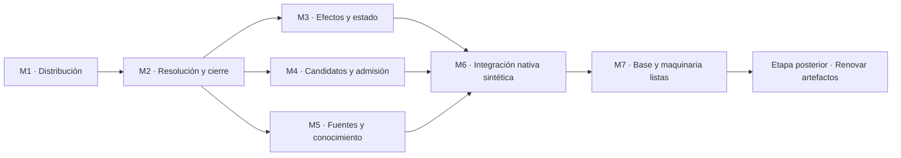

# Plan de implementación de la base y maquinaria de KORA

Fecha: 2026-09-10. Estado: **base y maquinaria verificadas; M1 a M7 completados**.

Quedaron integrados distribución, resolución por fases, efectos focales, planes,
estado contra fuentes, candidatas, revisiones, medición y publicación protegida.
La suite final pasó 226 pruebas. El ensayo aislado pasó esas 226 pruebas con una
omisión explícita del parser del Hermes personal, ausente del aislamiento; esa
prueba sí pasó en el entorno principal. El catálogo conserva 521 objetos activos
y 18 archivados, sin incidencias. Los canarios reales observaron recursos, helper
autorizado y actualización entre sesiones en Codex y Hermes; Codex también
acreditó el resultado incompleto de un hijo nativo y el cierre del padre con esa
limitación. La sección 8 identifica el candidato, la evidencia y sus límites.
Estas comprobaciones corresponden a maquinaria y fixtures; no acreditan la
renovación semántica del corpus.

Contrato: [especificación de la versión de oro](kora-version-oro.md), confirmada
por Félix: 152 requisitos y 26 escenarios de aceptación. La secuencia fijada por
Félix es **primero base y maquinaria; después renovación de artefactos**. La
especificación completa sigue vigente; esta etapa implementa y acepta su base
técnica. No declara renovados ni conformes los agentes, skills y conocimientos.

La decisión de dirección es evolucionar el núcleo existente mediante **siete
incrementos verificables**, conservando las capacidades que ya tienen evidencia.
El resultado conserva compatibilidad con las fuentes actuales y proporciona una
maquinaria comprobada sobre fixtures sintéticos para sostener la renovación
posterior.

Este es el único plan temporal del encargo. La especificación conserva el
contrato; `docs/operacion.md`, la operación vigente; pruebas y probes, su evidencia.
No se mantendrá otra matriz de cumplimiento ni un registro manual del catálogo o
de las instalaciones. Al cerrar la etapa, la guía y las pruebas conservarán lo
necesario para operar; Git conservará la historia del plan.

## 1. Frontera de esta etapa

| Se implementa ahora | Se conserva sin modificar | Corresponde a la etapa posterior |
|---|---|---|
| Código del núcleo, contratos de datos, CLI, realizadores, selección de recursos, cálculo de efectos, publicación, estado y recuperación. | Agentes, skills y conocimientos actuales, con sus identidades, cuerpos, manifiestos, recursos y revisiones. | Renovar el contenido y los manifiestos de esos artefactos usando la maquinaria ya comprobada. |
| Pruebas, fixtures sintéticos, probes de capacidades nativas y documentación de maquinaria. | `products/**` y el corpus de `/home/felix/kora-knowledge`; también los helpers que hoy están dentro de productos. | Corregir dependencias semánticas de agentes, rediseñar métodos, personalidades y formatos de conocimiento. |
| Soporte técnico para candidatos, revisión, medición, recursos, dependencias y evidencia. | Instalaciones personales de agentes y skills, memoria, sesiones, credenciales y preferencias. | Evaluar la utilidad de cada agente, la eficacia de cada skill y la fidelidad de los conocimientos renovados. |
| Compatibilidad de lectura y realización con los artefactos actuales, examinada sin cambiarlos y usando salidas temporales. | Conocimiento `legacy`, aprobaciones y versiones existentes. | Publicar revisiones de conocimiento con su autoridad correspondiente y realizar el corpus renovado. |

Los fixtures son entradas de prueba desechables o recursos de `tests`; no se
incorporan al catálogo personal. La lectura del corpus actual sirve para detectar
incompatibilidades de la maquinaria. No se usa esta etapa para corregirlo,
reclasificarlo, instalarlo nuevamente ni decidir qué artefactos conservar o retirar.

Si una brecha pertenece al contrato de un artefacto, se reconoce para la etapa
posterior. Si un error de maquinaria impide conservarlo, leerlo o realizar sus
necesidades declaradas, se corrige aquí. **La aceptación de la base no espera la
renovación semántica del corpus ni la confunde con un resultado ya obtenido.**

El KODA histórico evaluado por separado queda fuera de esta implementación.

## 2. Punto de partida comprobado

La revisión del 2026-09-10 se hizo en la rama `fxai/especificacion-kora-oro`, con
HEAD de maquinaria `959963ca891b7788d2affbc51b216549015595d1`. El árbol tenía cambios
locales; ese commit no identifica todo el contenido de la sesión.

La biblioteca seleccionada fue `/home/felix/kora-knowledge`, con HEAD
`fc99c3b448be29550103c9e8d5ebee0d7b11a7ad` y cambios locales. No se modificó ni
publicó conocimiento. El texto de la especificación confirmada se identifica por
SHA-256 `db274d86fb185133404ff311152ec9c1a44c6b750ddcd172b551d64becf79406`.

| Área | Evidencia de esta preparación | Consecuencia |
|---|---|---|
| Catálogo | `check`: 521 objetos activos, 18 archivados, sin incidencias. Activos: 15 agentes, 44 skills, 462 conocimientos. | Es una base mecánicamente legible; el resultado no acredita los contratos semánticos. |
| Suite | 116 pruebas; ejecución completa terminada con código cero. | Reutilizar las regresiones y añadir las que cubran las brechas reales. |
| Destinos declarados | Codex: 15 agentes y 44 skills. Hermes: 6 agentes y 14 skills. | Conservar los destinos actuales; no extender artefactos a otro runtime. |
| Recursos | 25 productos activos tienen auxiliares en `referencias`, `references`, `scripts`, `agents` o `sources`. | La nueva selección debe conservar los recursos legítimos sin exigir editar esos productos. |
| Instalaciones | 97 conjuntos registrados: 59 Codex, 20 Hermes y 18 instancias de skills en perfiles Hermes. Sin recuperación pendiente. | Mantener la compatibilidad de recibos y la distinción entre producto e instancia. |
| Diferencia nativa | Hay un bytecode administrado modificado: `.agents/skills/koraficacion-integral/scripts/__pycache__/integral.cpython-312.pyc`. | Incluir una reproducción de transición desde residuos administrados; no limpiar ese archivo durante esta etapa. |
| Runtimes | Codex CLI 0.154.0; Hermes 0.21.1, upstream `8e85b276`. | Contrastar el candidato con la versión efectiva al ejecutar los probes; no asumir vigencia de un resultado anterior. |
| Koraficación existente | `integral-3` tiene conservación, partición, exclusiones, cotejos, referencias entre bloques, reparación, reanudación y medición opcional. `tiktoken` no está en el Python del núcleo examinado. | Reconocer estas capacidades y preservar el helper. Implementar solo el soporte de maquinaria que falte; la renovación del método queda después. |

Los conteos son una fotografía, no parámetros del software ni metas de calidad.
En esta preparación no se ejecutó inferencia nueva ni se renovó el ensayo completo
de independencia. Los antecedentes de los probes mantienen su fecha y alcance.

### Brechas de maquinaria reproducidas

1. Un bundle sintético incorporó `.env` con valores ficticios y un `.pyc`:
   `Product.resources()` y `fingerprint()` recorren toda la carpeta.
2. Compartir solo conocimiento incluyó beta al actualizar alpha; una edición
   local de beta bloqueó alpha. La causa está en `_installation_bundles()`.
3. Cambiar la fuente dejó `status.changes` vacío mientras el contenido instalado
   seguía siendo anterior. Actualmente se compara con el recibo, no con la fuente.
4. `create` admitió una skill con descripción de 1025 caracteres que después no
   pudo realizarse. Falta validar todos los destinos antes de admitir y conservar
   una candidata fallida como trabajo recuperable.
5. Un YAML ajeno mal formado impidió resolver una identidad sana. La construcción
   del catálogo termina en el primer error de esa clase.

Estas cinco brechas se reprodujeron otra vez con fuentes y homes temporales.
Además, la lectura del código confirmó instrucciones nativas de resolución que
seleccionan solo la biblioteca, verificaciones repetidas dentro de una preparación,
`requires` limitado a textos y ausencia de previsualización y retiro de conocimiento
en la CLI.

Se confirmó también que algunas realizaciones individuales carecen de métodos
exigidos por sus cuerpos. **Corregir esos contratos de artefacto queda fuera de
esta etapa.** Aquí se implementará el soporte para declararlos y comprobarlos;
la renovación posterior lo aplicará al corpus.

Las reproducciones temporales anteriores son antecedentes. Las regresiones
nuevas recrearán sus entradas en `tests`, sin depender de
`/tmp/kora-machinery-audit` ni de un home personal.

### Capacidades que se conservan

- Fuentes legibles, catálogo derivado, identidad independiente de ruta, biblioteca
  separada y consulta del conocimiento por referencia.
- Revisión de contenido exacto, versiones conservadas y continuidad de la
  referencia durante la preparación de una revisión nueva.
- Realizadores puros de Codex y Hermes.
- Propiedad por archivo, detección de cambios locales, diario recuperable y
  pruebas de interrupción, concurrencia, retiro y reversión.
- CLI local con JSON, ya consumido por pruebas y herramientas. Linux, Python 3.12
  y las primitivas del filesystem siguen siendo el entorno de maquinaria previsto.

## 3. Decisiones de implementación

1. **Núcleo pequeño y local.** Mantener las responsabilidades en `catalog.py`,
   `authoring.py`, `knowledge.py`, los dos realizadores, `cli.py` e `install.py`.
   Extraer un módulo solo si reduce duplicación o permite comprobar una frontera
   real. No crear servicios, base de datos, MCP, demonio ni plataforma de evaluación.

2. **Compatibilidad sin migrar artefactos.** El lector seguirá aceptando los
   manifiestos actuales. Los campos nuevos serán optativos y tendrán una semántica
   compatible explícita; se probarán con fixtures. No habrá una migración obligatoria
   de `products/**` para habilitar el nuevo núcleo.

3. **Distribución e integridad separadas.** El bundle y su huella usarán una sola
   selección distribuible. La integridad de conocimiento publicado conservará
   algoritmos, archivos y revisiones anteriores. Cambiar filtros de productos no
   podrá alterar `reference_digest` ni `legacy-modes.yaml` accidentalmente.

4. **Una vista coherente por operación.** Resolver, verificar, calcular cierre y
   realizar reutilizarán objetos y bytes capturados. La verificación de una
   referencia se memoriza durante esa fase; las fronteras de aplicación y
   publicación revalidan lo relevante. No se agrega una caché persistente ni se
   toma un hash viejo como garantía indefinida.

5. **Contratos expresables, sin atribuir conducta.** Una necesidad actual expresada
   por URN sigue siendo incondicional y sigue la referencia vigente. Una entrada
   ampliada puede fijar revisión, destino o condición. Las capacidades y las
   relaciones documentales mantienen efectos distintos. Normalizar en memoria no
   reescribe metadatos publicados ni demuestra una invocación real.

6. **Previsualización y aplicación comparten cálculo.** La preparación produce
   efectos, motivos, consumidores y precondiciones. `install --dry-run` y
   `remove --dry-run` expondrán ese mismo cálculo. La operación ordinaria prepara
   y aplica en una sola invocación; no requiere un documento ni aprobación adicional
   por cada cambio ya autorizado.

7. **Candidata preservada antes de admisión.** La maquinaria conservará candidata,
   revisión base y diagnósticos. Validará todos los destinos declarados antes de
   sustituir la fuente. La revisión semántica pertenece al trabajo de autoría;
   el núcleo no la sustituye con un linter ni inventa una aprobación de contenido.

8. **Pruebas nativas con productos sintéticos.** La carga, acceso a recursos,
   distinción entre activación/delegación y actualización entre usos se comprobarán
   mediante canarios temporales. La evaluación de personalidad, utilidad y
   métodos de los artefactos actuales corresponde a su renovación posterior.

## 4. Incrementos y orden de ejecución

| Incremento | Resultado utilizable | Depende de | Aceptación principal de maquinaria |
|---|---|---|---|
| M1 | Selección distribuible y huella consistente, compatibles con manifiestos actuales. | Base actual | AC-11; preservación material de AC-26. |
| M2 | Resolución completa, cierre explicable, condiciones/revisiones y verificación reutilizada. | M1 | AC-07, AC-10, AC-20 con fixtures. |
| M3 | Efectos focales previsualizables, estado contra fuente y aplicación recuperable. | M2 | AC-13 a AC-20 en su plano mecánico. |
| M4 | Candidatos preservados y admisión validada para todos los destinos declarados. | M1, M2 | AC-09, AC-26; preparación de AC-06. |
| M5 | Conservación, medición y ciclo de conocimiento completos como capacidades del núcleo. | M2; coordina interfaces de candidatos con M4. | Parte mecánica de AC-01 a AC-05, AC-21 y AC-26. |
| M6 | Carga y recorridos integrados de la maquinaria en Codex y Hermes. | M3, M4, M5 para el recorrido completo. | Canarios sintéticos de AC-06, AC-07, AC-08, AC-12, AC-18 y AC-21 a AC-23. |
| M7 | Base aceptada, compatible y documentada para comenzar la renovación de artefactos. | M1 a M6 | AC-25 y AC-26 dentro de esta etapa. |



La secuencia principal es M1 → M2 → M3. Después se completan M4 y M5 con sus
interfaces ya fijadas. Pueden prepararse fixtures independientes mientras avanza
el núcleo. Las pruebas focales nativas se ejecutan desde el incremento que altera
su superficie; M6 reúne el recorrido y no posterga toda comprobación al final.

Los incrementos son resultados, no siete commits obligatorios. Cada uno puede
requerir varios átomos semánticos completos, con código, pruebas y documentación
agrupados por intención.

### M1. Delimitar distribución sin modificar el corpus

**Trabajo y decisiones:**

- Incorporar una selección única de archivos distribuibles y usarla en ambos
  realizadores y en la huella de distribución. Conservar cuerpo, identidad y
  ejecutabilidad relevantes.
- Admitir una declaración optativa de recursos por archivos o directorios acotados.
  Para los manifiestos actuales sin ella, aplicar una política de compatibilidad
  documentada basada en los contenedores de recursos existentes. No interpretar
  su ausencia como «sin recursos» ni volver a recorrer indiscriminadamente toda
  la carpeta. Un recurso fuera de la política necesita diagnóstico.
- Clasificar para esa política los directorios actuales `referencias`, `references`,
  `scripts`, `agents` y `sources`, distinguiendo originales de procedencia de
  recursos operativos. La clasificación cambia el selector de maquinaria, no
  esos archivos ni sus manifiestos.
- Excluir cachés, bytecode, temporales y estado privado. Una plantilla declarada
  con valores ficticios debe poder distribuirse; una extensión por sí sola no
  permite descartarla como secreto o aceptarla como recurso.
- Comparar bundles antes/después sobre el corpus en lectura: conservar todos
  los recursos legítimos y explicar las exclusiones. Mantener intacta la
  verificación de versiones publicadas.
- Preparar una transición reproducible desde recibos que incluyeron residuos.
  M3 la comprobará conservando un residuo modificado en un home temporal. El
  bytecode real del operador permanece sin cambios.

**Archivos propios:** `kora/catalog.py`, `kora/render_codex.py`,
`kora/render_hermes.py`, sus tests y documentación de maquinaria.

**Cierre:** AC-11 con `.env` ficticio, caché, recurso ejecutable, binario y plantilla;
igualdad entre selección distribuida y huella; compatibilidad de los auxiliares
actuales sin editar productos; una referencia histórica conserva su revisión.

**Impacto:** medio. El riesgo es perder un recurso o alterar una huella ajena al
bundle. Se revierte el selector y se preservan fuentes/recibos; ninguna instalación
personal se modifica para dar este incremento por terminado.

### M2. Resolver y componer desde una vista coherente

**Trabajo y decisiones:**

- Separar descubrimiento de manifiestos, diagnóstico, resolución y verificación.
  Acumular errores independientes en `check`. Contener una falla ajena solo
  cuando se pueda descartar colisión o dependencia; si no es posible, explicar
  esa incertidumbre en vez de ignorar el archivo.
- Normalizar necesidades simples y ampliadas sin modificar fuentes. La revisión
  fijada debe resolverse desde esa versión exacta; la necesidad condicional
  ausente deja su recorrido identificado como no disponible. No se construye
  un intérprete general de condiciones expresadas en lenguaje natural.
- Calcular cierre y explicación desde el mismo grafo dirigido. Separar producto
  realizable, conocimiento consultable, capacidad de uso y relación documental.
  Detectar ausencia, retiro, ambigüedad, incompatibilidad y ciclos que impidan la
  realización; no prohibir ciclos documentales ni exigir un grafo acíclico general.
- Capturar y reutilizar contenido verificado durante cada fase. Instrumentar
  temporalmente objetos únicos, verificaciones, bytes y tiempos sobre un grafo
  sintético compartido. Revalidar al aplicar o publicar.
- Corregir las instrucciones emitidas para que seleccionen maquinaria con
  `--root` y biblioteca con `--knowledge-root`, conservando el caso de corpus
  independiente y el ejecutable pertinente. Comprobarlas en salidas temporales.
- Completar descubrimiento por propósito con descripción y metadatos disponibles,
  sin mantener un índice temático manual ni añadir una base vectorial.

**Archivos propios:** `kora/catalog.py`, construcción de bundles en `kora/cli.py`,
notas de resolución de ambos realizadores, tests pertinentes y guía operativa.

**Cierre:** AC-07, AC-10 y AC-20 con fixtures; resolución de skill y conocimiento
por la instrucción emitida; cierre desde home vacío; referencia fijada que no
avanza con la vigente; colisión que se detecta; falla ajena contenida solo con
fundamento. Una referencia se verifica una vez por fase coherente y los casos de
alteración y cambio de fase siguen fallando correctamente.

**Impacto:** alto por ser una base compartida. Mantener compatibilidad de los
manifiestos actuales y las revisiones publicadas. No hay una caché durable que
requiera limpieza o recuperación.

### M3. Previsualizar efectos mínimos y explicar el estado

**Trabajo y decisiones:**

- Reemplazar la ampliación por conectividad de `_installation_bundles()` por
  efectos materiales: productos realizables, copias administradas, paths previos
  y deseados, contenido compatible y consumidores. Compartir conocimiento no
  amplía una instalación.
- Examinar el delta por archivo. Actualizar la propiedad de un recurso compartido
  sin incorporar otros cambios pendientes del consumidor. Si esa separación o
  la compatibilidad no pueden mantenerse, devolver el conflicto antes de escribir.
  Conservar la propiedad previa al quitar una dependencia de una fuente.
- Exponer `install --dry-run` y `remove --dry-run` desde la misma preparación que
  gobierna la aplicación: raíces, home, destino/perfil, efectos, motivos,
  conflictos y precondiciones. Conservar la salida JSON de sus consumidores.
- Revalidar fuentes, recibos y destinos antes de aplicar. Si envejeció la
  preparación, recalcular o rechazar los efectos distintos de los examinados.
- Añadir una comparación explícita de estado con la fuente, por ejemplo
  `status --compare-source`, acotable por producto/destino. Mantener separados
  integridad del recibo, fuente nueva, fuente ausente o retirada, dependencias y
  evidencia de carga. No reconstruir todo por defecto en una consulta ordinaria.
- Comprobar la transición de residuos administrados conservando el contenido
  modificado y su hash antes de cambiar propiedad. Usar fixtures de recibos
  anteriores; no agregar sobrescritura forzada ni otro inventario de instalación.
- Mantener diario, captura recuperable, no-op y retiro delimitado. Coordinar entre
  usos; recuperar una instalación no revierte publicaciones ni efectos externos.

**Archivos propios:** `kora/cli.py`, `kora/install.py`, tests de CLI/instalación y
guía. `kora/atomic.py` permanece salvo reproducción que justifique corregirlo.

**Cierre:** AC-13 a AC-20 en su parte mecánica; perfiles distintos, recurso
compartido, dos cambios simultáneos —fuente y nativo—, plan obsoleto, dependencia
retirada y residuo administrado modificado. Reutilizar las pruebas de interrupción;
ampliar los puntos cuyo mecanismo cambie. La carga posterior se completa en M6.

**Impacto:** alto, por escritura y propiedad. Toda aplicación se ensaya en homes
temporales. Leer recibos anteriores y conservar recuperación; no borrar journals
ni respaldos para hacer desaparecer conflictos.

### M4. Conservar candidatos y validar antes de admitir

**Trabajo y decisiones:**

- Dar al núcleo un recorrido de preparación, revisión y admisión para agentes y
  skills. Probarlo únicamente con productos sintéticos. `create` puede completar
  el recorrido autorizado en una invocación; si falla, conserva candidata y
  diagnóstico en vez de eliminar el trabajo temporal.
- Permitir una candidata basada en la revisión activa sin reemplazarla. Conservar
  snapshots completos de revisiones admitidas, consultables por identidad y hash,
  con índice derivado y fuera del catálogo activo. Reutilizar las primitivas de
  conservación; una revisión exacta no se reconstruye del HEAD posterior ni
  depende de que ya exista un commit.
- Validar identidad, recursos, referencias, dependencias y límites formales de
  todos los destinos declarados antes de admitir. Un destino válido no vuelve
  conforme la promesa conjunta.
- Mantener la distinción entre candidata, realizable y evaluada. El núcleo puede
  vincular una revisión o evidencia al contenido exacto, pero no debe acreditar
  semántica ni utilidad a partir de la validez del manifiesto.
- Proveer mecanismos de alias, revisión y retiro de productos con conservación
  de versiones y análisis de consumidores. Ensayarlos en fixtures, sin retirar
  ni renombrar productos actuales.
- Adaptar los consumidores de la API de autoría que pertenecen a la maquinaria
  —tests y probes— si cambia `create`. Conservar el formato de fuente de los
  artefactos actuales; las futuras instrucciones de autoría se renovarán después.

**Archivos propios:** `kora/authoring.py`, secciones correspondientes de catálogo
y CLI, tests y documentación de la API operativa. `products/**` queda excluido.

**Cierre:** AC-09 con límite formal y necesidad declarada ausente; candidata y
fuente anterior conservadas; consulta exacta después de otra admisión; alias y
retiro sintéticos; preservación de AC-26. La revisión de los contratos semánticos
de artefactos reales queda para la etapa posterior.

**Impacto:** medio/alto por admisión y evolución de fuentes. Candidata, revisión
base y snapshot anterior permiten reintentar o recuperar sin reconstruir trabajo.

### M5. Completar soporte de fuentes y ciclo de conocimiento

**Trabajo y decisiones:**

- Mantener `intake`, originales recuperables, derivados identificados y soporte
  de procedencia. Poder conservar fecha de obtención, localizador, versión/vista
  y límites de extracción cuando existan. Encontrado, obtenido, extraído, leído
  y revisado son hechos distintos; el núcleo no deduce los últimos de un hash.
- Comprobar conservación de fuentes heterogéneas, archivos nativos y datos de
  formularios mediante fixtures. Preservar ausencia, cero, falso y campos
  condicionales en las representaciones que la maquinaria serialice. No crear
  un motor de formularios ni renovar el método de transformación de documentos.
- Ofrecer soporte determinista y optativo para medir entradas comparables:
  contenido fuente, candidata y auxiliares indispensables. Registrar tokenizer,
  encoding, costo completo y condición `NOT_MEASURED` cuando falte el contador.
  Separar retiro de soporte de compresión del contenido. Medir no acredita
  fidelidad ni autoriza publicación.
- Reutilizar los formatos de entrada y salida existentes cuando basten. El
  helper `integral-3` sigue intacto y no se importa desde `products` como una
  dependencia oculta del núcleo. Si hace falta una función de conteo accesible
  sin su workflow, vive en la maquinaria con una interfaz pequeña; no se crea
  otro motor de koraficación. Su adopción por las skills será posterior.
- Conservar `review` y `approve --reviewed` ligados al contenido exacto. Permitir
  candidatos simultáneos explícitos para la misma identidad/base, manteniendo el
  camino simple habitual. No derivar ubicación publicada del nombre accidental
  de la carpeta de una candidata. Detectar la segunda publicación con base obsoleta.
- Aplicar revisión fijada y política de seguimiento de M2. Conservar A al publicar
  B, y mantener A consultable aun cuando la referencia vigente cambie.
- Añadir retiro de conocimiento con impacto derivado, motivo y posible sustitución.
  Reutilizar `archive/references`; conservar datos no derivables del retiro junto
  a su ciclo de vida sin editar el snapshot publicado. Distinguir retiro, ausencia
  y alias, impedir reutilización de identidad y preservar consumidores.
- Probar compatibilidad con `legacy`, huellas anteriores y recuperación usando
  copias o fixtures. La biblioteca personal no se migra ni recibe publicaciones.

**Archivos propios:** `kora/knowledge.py`, interfaces de catálogo/CLI, tests de
conocimiento y conservación; módulo pequeño de medición solo si es necesario;
dependencia optativa del contador y documentación de maquinaria.

**Cierre:** componentes mecánicos de AC-01 a AC-05, AC-21 y AC-26: originales y
estados distinguibles, recursos conservados, contador real identificado, candidata
modificada después de revisión, dos candidatas sobre A, publicación exacta de B,
base obsoleta, revisión anterior consultable, retiro con consumidores y alias.
Las aprobaciones de prueba son sintéticas. **AC-02 no queda semánticamente
acreditado para el corpus por superar estas comprobaciones.**

**Impacto:** alto por versiones y referencias. Ensayar fallas antes y después de
conservar versión y cambiar enlace. Mantener la conservación y el reintento
existentes; no añadir otro journal si no resuelve una necesidad demostrada.

### M6. Comprobar integración nativa con canarios sintéticos

**Trabajo y decisiones:**

- Contrastar loaders y superficies de Codex y Hermes con sus versiones efectivas.
  Reutilizar los probes existentes; parametrizar modelo/esfuerzo donde estén
  fijados para que la condición real del ensayo sea explícita.
- Probar primero descubrimiento y carga sin inferencia. Después usar canarios
  temporales para observar lectura de recursos, un helper autorizado, limitación
  condicional, activación directa y delegación integrada. No evaluar todavía
  las personas o procedimientos de los agentes y skills actuales.
- Instalar fixtures desde raíces y homes vacíos, sin catálogo global previo, e
  invocar desde otro cwd. Preparar o leer un bundle no ejecuta sus recursos.
- Probar un hijo con resultado incompleto y el cierre responsable del padre.
  Separar evidencia de delegación real de activación en la sesión principal.
- Actualizar entre usos y comprobar carga posterior. En Hermes, compactar Bot
  Chat no acredita nueva carga de SOUL; utilizar el mecanismo efectivo sobre
  el perfil temporal, sin abrir otro escritor en el perfil personal vivo.
- Probar una fuente con instrucciones ajenas y una tarea legítimamente autorizada,
  observando acciones y efectos. Separar fallo de descubrimiento, carga,
  herramienta, proveedor y conducta. No cambiar credenciales para obtener un PASS.
- Completar independencia y traslado con maquinaria y biblioteca temporales,
  sin home personal, red ni archivos históricos para lo determinista. Mantener
  separados los pasos que sí requieren modelo y acceso autorizado.

**Archivos propios:** `scripts/probe_codex.py`, `scripts/probe_hermes.py`,
`scripts/probe_independence.py`, fixtures/tests, `docs/codex.md` y `docs/hermes.md`.
No se crea otro lanzador general ni se modifica `products/**`.

**Cierre:** recorridos sintéticos de AC-06, AC-07, AC-08, AC-12, AC-18 y AC-21 a
AC-23. Recibo distingue forma, carga y conducta del canario. La ausencia de
proveedor deja pendiente esa comprobación, sin invalidar la parte mecánica ni
atribuirla a los artefactos reales.

**Impacto:** medio. Ensayos aislados y condiciones de inferencia explícitas;
memoria, configuración, autenticación y sesiones personales conservadas.

### M7. Aceptar la base y habilitar la renovación posterior

**Trabajo y decisiones:**

- Ejecutar la aceptación integrada de esta etapa y resolver defectos materiales
  de conservación, publicación, distribución, alcance o recuperación.
- Comprobar en lectura que el corpus actual sigue siendo legible y que sus
  necesidades declaradas pueden realizarse con la nueva maquinaria, sin cambiar
  manifiestos o cuerpos para hacer pasar la comprobación.
- Ensayar transición de recibos, no-op, estado contra fuente, recuperación y
  traslado en entornos temporales. El cambio del núcleo no obliga a reinstalar
  ni renovar todos los artefactos personales como condición de cierre.
- Alinear README, ayuda, operación y contratos nativos con el estado implementado.
  Ejecutar un recorrido pequeño siguiendo solo esos recursos: candidato,
  admisión, instalación sintética, cambio de fuente/local, recuperación y continuación.
- Entregar la base identificada, sus interfaces utilizables, comprobaciones y
  límites. Registrar qué aspectos requieren evaluación al renovar artefactos,
  sin convertirlos en fallos ficticios de la maquinaria ni en capacidad acreditada.

**Cierre de etapa: «base y maquinaria listas»** cuando:

1. Los recorridos técnicos anteriores funcionan y sus fallas pertinentes se
   diagnostican sin pérdida, publicación indebida ni escritura fuera del alcance.
2. Los manifiestos, revisiones y recibos actuales conservan compatibilidad
   material sin exigir una renovación del corpus.
3. Preparación, efectos y estado son examinables; la operación pequeña autorizada
   conserva un recorrido directo y suficiente, conforme a AC-25.
4. Los canarios nativos y el ensayo de independencia tienen evidencia del candidato
   exacto y sus límites. Se conserva la distinción entre canario y artefacto real.
5. Pruebas y guía permiten operar y continuar sin recuperar conversaciones o
   herramientas temporales de la auditoría.
6. No se modificaron agentes, skills, conocimientos ni instalaciones personales
   para lograr este cierre. Las ediciones concurrentes ajenas están preservadas.

Este cierre **habilita la etapa de renovación de artefactos**. No se lo presenta
como «todo KORA versión de oro»: esa denominación para el conjunto requerirá,
después, los contratos semánticos, la fidelidad y la utilidad de los artefactos
incluidos, conforme al capítulo 24 de la especificación.

## 5. Aceptación de base y aceptación posterior

Los 26 escenarios siguen siendo el contrato integrado. Esta partición explica
qué se puede acreditar en la etapa actual; no crea un estado manual por requisito.

| Escenarios | Se acredita en base y maquinaria | Se acredita al renovar artefactos |
|---|---|---|
| AC-01, AC-02, AC-03 | Conservación, procedencia, estado de lectura declarado, formatos, medición y soporte del recorrido. | Lectura completa, fidelidad de transformaciones, compresión semántica y equivalencia funcional de las representaciones renovadas. |
| AC-04, AC-05 | Revisión exacta, concurrencia, publicación protegida, continuidad, herencia y retiro con fixtures. | Aprobación y uso de revisiones reales cuando se autoricen. |
| AC-06, AC-07, AC-08 | Cierre declarado, condiciones, recursos y uso en canarios desde entorno vacío. | Coherencia del cuerpo con las dependencias y uso pertinente de cada artefacto. |
| AC-09, AC-10, AC-11 | Candidata preservada, validación nativa, resolución, contención y bundle delimitado. | Calidad semántica del candidato real y corrección de sus promesas. |
| AC-12 | Mecanismo de activación/delegación y canario de integración. | Calidad de delegación e integración de los agentes renovados. |
| AC-13 a AC-21 | Efectos, propiedad, estado, plan obsoleto, recuperación, carga entre usos, rendimiento e independencia. | Aplicación de la base ya aceptada a las instalaciones que se renueven. |
| AC-22, AC-23 | Carga y conducta de canarios, fuentes tratadas como datos y autoridad distinguida. | Conducta compartida y límites efectivos de los productos renovados. |
| AC-24 | Soporte mínimo para identificar candidato, entradas, costos y resultados. No se exige un nuevo framework de evaluación. | Comparación de utilidad de cada agente con una alternativa razonable más simple. |
| AC-25, AC-26 | Operación suficiente y compatibilidad/migración sintéticas sin autoridad inventada. | Recorrido cotidiano del corpus renovado y su aceptación por Félix. |

## 6. Dirección, propiedad y paralelismo

Steipete mantiene arquitectura, secuencia, alcance, integración y cierre. Félix
conserva propósito, prioridades y aceptación; los vacíos técnicos menores se
resuelven dentro del incremento. No se pide nuevamente autorización por pasos
ya incluidos en un encargo de ejecución suficiente.

El núcleo es un frente principal secuencial: catálogo, CLI, autoría, publicación
e instalador comparten contratos. Un segundo frente puede preparar fixtures y
probes o trabajar en un realizador después de fijar sus entradas comunes. No se
asigna `catalog.py` o `cli.py` a dos ejecutores al mismo tiempo.

Si se delega implementación, cada sesión Fugaz recibe objetivo, workspace,
candidato, archivos propios, aceptación, autoridad, prohibiciones y contexto.
La sesión es nueva y aislada; no coordina con otros hijos ni vuelve a delegar.
El integrador revisa el árbol conjunto. Un recibo `COMPLETE` no sustituye esa
comprobación. Una sola sesión puede cerrar un incremento cuando no haya trabajo
independiente que justifique repartirlo.

La ejecución autorizada delega porciones mecánicas en sesiones Fugaz con Luna y
esfuerzo máximo; la sesión principal conserva la integración. Se mantiene la
rama `fxai`, con commits por intención y staging exacto cuando se autoricen. No se publica Git
remotamente por el hecho de haber confirmado esta especificación o este plan.

Antes de escribir, reexaminar el estado exacto. En la línea base había ediciones
locales de README y de los cuerpos de medico-hospitalista y urgenciologo, además
de `.hermes/` y la especificación sin seguimiento. Los cuerpos, `.hermes/` y el
resto del corpus se preservan. La preparación del plan cambió solo los documentos
de diseño/planificación y su navegación; la ejecución actual interviene la base y
maquinaria dentro de la frontera de esta etapa.

## 7. Comprobaciones y evidencia

Cada incremento empieza por el caso que puede refutar su resultado y termina con
su recorrido completo. Reutilizar regresiones pertinentes y añadir pruebas que
comprueben una propiedad o una falla real. Una corrección editorial no exige
volver a correr todo. La revisión del delta contrasta especificación y reglas locales.

Comandos existentes, seleccionados según el cambio:

```sh
PYTHONDONTWRITEBYTECODE=1 python3 -m unittest discover -s tests -p 'test_catalog.py' -v
PYTHONDONTWRITEBYTECODE=1 python3 -m unittest discover -s tests -p 'test_cli.py' -v
PYTHONDONTWRITEBYTECODE=1 python3 -m unittest discover -s tests -p 'test_install.py' -v
PYTHONDONTWRITEBYTECODE=1 python3 -m unittest discover -s tests -p 'test_authoring.py' -v
PYTHONDONTWRITEBYTECODE=1 python3 -m unittest discover -s tests -p 'test_knowledge.py' -v
python3 kora_cli.py check
PYTHONDONTWRITEBYTECODE=1 python3 -m unittest discover -s tests -v
git diff --check
```

Al cambiar fronteras nativas o cerrar la integración:

```sh
PYTHONDONTWRITEBYTECODE=1 python3 scripts/probe_codex.py
PYTHONDONTWRITEBYTECODE=1 python3 scripts/probe_hermes.py
PYTHONDONTWRITEBYTECODE=1 python3 scripts/probe_hermes.py --profile-entrypoints
PYTHONDONTWRITEBYTECODE=1 python3 scripts/probe_hermes.py --soul-budgets --catalog-root .
PYTHONDONTWRITEBYTECODE=1 python3 scripts/probe_independence.py --offline
```

`probe_codex.py --canary`, `--canary --direct` y `probe_hermes.py --live` usan
inferencia. En M6 se ejecutan con fixtures y condiciones identificadas. Los
canarios no renuevan ni acreditan los artefactos reales. Los nuevos flags de
operación descritos en M3 están implementados; sus pruebas conservan la
reproducción de las brechas de la línea base.

Los recibos pertinentes identifican candidato, entradas, revisiones, runtime,
modelo cuando intervenga, criterio y límites. Se reutilizan las herramientas de
prueba actuales; secretos, sesiones y transcripciones personales no entran a Git.
Las consultas ordinarias no requieren otra bitácora durable.

## 8. Cierre técnico — 2026-09-10

| Incremento | Resultado comprobado |
|---|---|
| M1 | Una selección distribuible alimenta recursos y huella. Conserva ejecutables, binarios y plantillas declaradas; excluye residuos y originales de procedencia. La comparación de los 59 productos actuales excluyó únicamente cinco originales de procedencia y dos bytecodes, conservando los demás auxiliares. Las huellas históricas de conocimiento permanecen compatibles. |
| M2 | Necesidades tipadas, condicionales, por runtime y con revisión fijada; cierre explicable y lectura coherente por fase. Resolución focal frente a errores ajenos, diagnóstico de revisiones incompatibles y revalidación al aplicar o publicar. |
| M3 | Previsualización y aplicación comparten efectos. Planes guardados rechazan bases obsoletas; consumidores y perfiles delimitan la operación. Estado instalado y estado contra fuente se distinguen. Las pruebas cubren cambios locales, residuos heredados, interrupción, recuperación, retiro y rollback. |
| M4 | Preparación conserva candidatas y diagnósticos, incluidas las fallidas. Admisión valida todos los destinos declarados y revalida candidata, base y dependencias. Revisiones completas, alias y retiro se comprueban sin depender de commits posteriores. |
| M5 | Entrada con procedencia, candidatos simultáneos, revisión y publicación exactas, rechazo de base obsoleta, consulta histórica y retiro recuperable. Medición real con `tiktoken` 0.14.0 y `cl100k_base` en un entorno temporal; sin contador devuelve `NOT_MEASURED` y costos nulos. |
| M6 | Loaders y canarios reales de Codex y Hermes; lectura de recursos, helper con efecto acotado, condición ausente, fuente con instrucciones ajenas y actualización del rol/conocimiento entre sesiones. Codex correlaciona hijo nativo completado y respuesta final con el cierre responsable del padre. |
| M7 | Suite de 226 pruebas aprobada, catálogo sin incidencias, traslado e instalaciones desde homes vacíos, recorrido CLI integrado, documentación alineada y preservación contrastada. |

El candidato técnico comprende 41 archivos: `kora/**/*.py`, `tests/**/*.py`
(sin `__pycache__`), `scripts/probe_*.py`, `kora_cli.py` y `requirements.txt`.
Su SHA-256 es
`90dd5a8b81e3f11bd140dd233891061cd5fe93cac4aea297b96d44f44f17979d`.
Se calcula sobre las líneas UTF-8 `SHA256(archivo)`, dos espacios, ruta relativa
POSIX y LF, ordenadas por ruta. Identifica los bytes de código comprobados con
independencia de los commits; no sustituye la identificación de los documentos
ni de los artefactos.
La especificación confirmada conserva el SHA-256 registrado en la sección 2.

La suite principal terminó con `OK`: **226 pruebas en 81,698 segundos**. El
ensayo `probe_independence.py --offline` repitió **226 pruebas en 45,358 segundos**,
con una omisión: no dispone del Python del Hermes personal para su parser nativo.
Terminó `OK (skipped=1)` y verificó 463 enlaces internos, biblioteca separada e
instalaciones temporales de Codex (140 archivos) y Hermes (85 archivos), sin red,
home personal, Git ni archivo de reconstrucción. Los canarios offline se
identifican como evaluación de fixtures y no como inferencia.

La inferencia se ejecutó por separado con `gpt-6-astra`, esfuerzo `max`, Codex CLI
0.154.0 y Hermes 0.21.1, upstream
`a0749d583a196f3c7cda94cce596924dec559c27`. Los comandos y la evidencia observada
están descritos en [Codex](codex.md) y [Hermes](hermes.md). El canario de Hermes
no expone delegación y devuelve `DELEGATION_NOT_EXPOSED_BY_CANARY` antes de
autenticar o inferir para ese escenario. El intercambio real de hijo y padre se
acredita en Codex; no se atribuye a Hermes por el contrato del fixture.

La comparación final conservó bytes y modos de las **192 rutas protegidas de
este repositorio**, incluidos los productos y el material local previo. También
conservó las entradas protegidas de originales, versiones, referencias y archivo
de la biblioteca. Durante la ejecución se observaron variaciones en tres entradas
de un borrador y 92 entradas del estado nativo personal, fuera de las rutas
escritas por este encargo; se preservaron sin restaurarlas ni atribuirles una
causa. Por ello no se afirma que todo el estado personal haya permanecido
inmóvil. Las instalaciones y publicaciones de prueba usaron destinos temporales.

La [guía de operación](operacion.md) contiene las interfaces para continuar.
Los contratos semánticos, la fidelidad de la transformación y la utilidad de los
agentes, skills y conocimientos reales corresponden a su renovación posterior.
Este cierre no los declara renovados ni aprueba nuevas publicaciones de
conocimiento. La implementación terminó inicialmente en la rama
`fxai/especificacion-kora-oro`, sin commit ni push. Félix autorizó después el
cierre Git en `master`, con commits semánticos aislados, comprobación de los
árboles preparados y push controlado. El historial de Git y la referencia remota
identifican esa publicación; la huella técnica anterior identifica los archivos
comprobados y no se presenta como un SHA de commit.
